# Nacos 高可用环境搭建

Nacos 高可用环境 = Nacos 集群 + Nacos 持久化

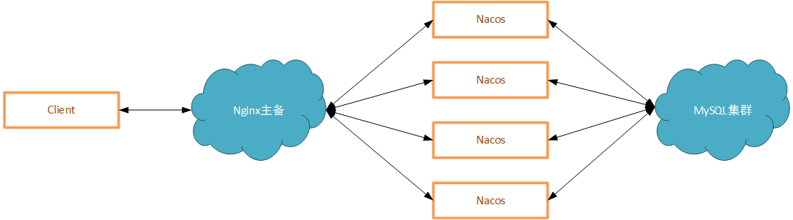

参考：<(￣︶￣)↗[Nacos官网 - 集群部署说明](https://nacos.io/zh-cn/docs/cluster-mode-quick-start.html)

---

[toc]

## 1、创建 Docker 局域网

1.   创建 Docker 局域网

     ```
     PS C:\Users\xiao> docker network create MyNetwork
     56b64b706d69bf2d3b30eb6d63c94bb110c74e16febf96c1b1b0aa687cc3d493
     ```

2.   罗列所有局域网

     ```
     PS C:\Users\xiao> docker network ls
     NETWORK ID     NAME        DRIVER    SCOPE
     56b64b706d69   MyNetwork   bridge    local
     e19f31ab243a   bridge      bridge    local
     09b9f7e52530   host        host      local
     3bb55566e6c5   none        null      local
     ```

3.   查看局域网详情

     ```
     PS C:\Users\xiao> docker network inspect MyNetwork
     [
         {
             "Name": "MyNetwork",
             "Id": "56b64b706d69bf2d3b30eb6d63c94bb110c74e16febf96c1b1b0aa687cc3d493",
             "Created": "2022-01-27T11:58:16.195894307Z",
             "Scope": "local",
             "Driver": "bridge",
             "EnableIPv6": false,
             "IPAM": {
                 "Driver": "default",
                 "Options": {},
                 "Config": [
                     {
                         "Subnet": "172.18.0.0/16",
                         "Gateway": "172.18.0.1"
                     }
                 ]
             },
             "Internal": false,
             "Attachable": false,
             "Ingress": false,
             "ConfigFrom": {
                 "Network": ""
             },
             "ConfigOnly": false,
             "Containers": {},
             "Options": {},
             "Labels": {}
         }
     ]
     ```

     

## 2、创建并启动1个 Nginx 容器，将容器加入局域网

1.   创建并启动 Nginx 容器

     <(￣︶￣)↗[Nginx 实战 - 安装.md](../../服务器相关/Nginx/Nginx 实战 - 安装.md)

2.   将 Nginx 容器加入局域网

     ```
     PS C:\Users\xiao> docker network connect MyNetwork MyNginx
     ```

3.   检查 Nginx 容器是否成功加入局域网

     ```
     PS C:\Users\xiao> docker network inspect MyNetwork
     [
         {
             "Name": "MyNetwork",
             "Id": "56b64b706d69bf2d3b30eb6d63c94bb110c74e16febf96c1b1b0aa687cc3d493",
             "Created": "2022-01-27T11:58:16.195894307Z",
             "Scope": "local",
             "Driver": "bridge",
             "EnableIPv6": false,
             "IPAM": {
                 "Driver": "default",
                 "Options": {},
                 "Config": [
                     {
                         "Subnet": "172.18.0.0/16",
                         "Gateway": "172.18.0.1"
                     }
                 ]
             },
             "Internal": false,
             "Attachable": false,
             "Ingress": false,
             "ConfigFrom": {
                 "Network": ""
             },
             "ConfigOnly": false,
             "Containers": {
                 "9ba1cfa5e902ba3f4cfebb6404d03f8c4cbe1aa418fc4ae682722c5882c88811": {
                     "Name": "MyNginx",
                     "EndpointID": "22e350022928c6e597a0bc217b84270525ab8400bb84d04387d63632f0b028eb",
                     "MacAddress": "02:42:ac:12:00:02",
                     "IPv4Address": "172.18.0.2/16",
                     "IPv6Address": ""
                 }
             },
             "Options": {},
             "Labels": {}
         }
     ]
     ```

     

## 3、创建并启动1个 MySQL 容器，将容器加入局域网

1.   创建并启动 MySQL 容器

     <(￣︶￣)↗[MySQL 实战 - 安装.md](../../数据存储相关/SQL DB/MySQL/MySQL 实战 - 安装.md)

2.   将 MySQL  容器加入局域网

     ```
     PS C:\Users\xiao> docker network connect MyNetwork MyMySQL
     ```

3.   检查 MySQL 容器是否成功加入局域网

     ```
     PS C:\Users\xiao> docker network inspect MyNetwork
     [
         {
             "Name": "MyNetwork",
             "Id": "56b64b706d69bf2d3b30eb6d63c94bb110c74e16febf96c1b1b0aa687cc3d493",
             "Created": "2022-01-27T11:58:16.195894307Z",
             "Scope": "local",
             "Driver": "bridge",
             "EnableIPv6": false,
             "IPAM": {
                 "Driver": "default",
                 "Options": {},
                 "Config": [
                     {
                         "Subnet": "172.18.0.0/16",
                         "Gateway": "172.18.0.1"
                     }
                 ]
             },
             "Internal": false,
             "Attachable": false,
             "Ingress": false,
             "ConfigFrom": {
                 "Network": ""
             },
             "ConfigOnly": false,
             "Containers": {
                 "9ba1cfa5e902ba3f4cfebb6404d03f8c4cbe1aa418fc4ae682722c5882c88811": {
                     "Name": "MyNginx",
                     "EndpointID": "22e350022928c6e597a0bc217b84270525ab8400bb84d04387d63632f0b028eb",
                     "MacAddress": "02:42:ac:12:00:02",
                     "IPv4Address": "172.18.0.2/16",
                     "IPv6Address": ""
                 },
                 "45a4bca256c29842067cb324c67f3288c24b545a61cb796f4df1bfc5b1fcaae6": {
                     "Name": "MyMySQL",
                     "EndpointID": "f80a9fbd1f849a58f18b45d4d7684295e6d8e593c0b308af7215846692e2e57d",
                     "MacAddress": "02:42:ac:12:00:03",
                     "IPv4Address": "172.18.0.3/16",
                     "IPv6Address": ""
                 }
             },
             "Options": {},
             "Labels": {}
         }
     ]
     ```

     

## 4、创建并启动3个 Nacos 容器，将容器加入局域网

1.   创建并启动 Nacos 容器（集群模式）

     <(￣︶￣)↗[Nacos 实战 - 安装与使用.md](./Nacos实战 - 安装与使用.md)

     ```
     docker run -itd -p 8848:8848 --env MODE=cluster --name MyNacos1 nacos/nacos-server
     docker run -itd -p 8849:8848 --env MODE=cluster --name MyNacos2 nacos/nacos-server
     docker run -itd -p 8850:8848 --env MODE=cluster --name MyNacos3 nacos/nacos-server
     ```

2.   将 Nacos 容器加入局域网

     ```
     docker network connect MyNetwork MyNacos1
     docker network connect MyNetwork MyNacos2
     docker network connect MyNetwork MyNacos3
     ```

3.   检查 Nacos 容器是否成功加入局域网

     ```
     PS C:\Users\xiao> docker network inspect MyNetwork
     [
         {
             "Name": "MyNetwork",
             "Id": "56b64b706d69bf2d3b30eb6d63c94bb110c74e16febf96c1b1b0aa687cc3d493",
             "Created": "2022-01-27T11:58:16.195894307Z",
             "Scope": "local",
             "Driver": "bridge",
             "EnableIPv6": false,
             "IPAM": {
                 "Driver": "default",
                 "Options": {},
                 "Config": [
                     {
                         "Subnet": "172.18.0.0/16",
                         "Gateway": "172.18.0.1"
                     }
                 ]
             },
             "Internal": false,
             "Attachable": false,
             "Ingress": false,
             "ConfigFrom": {
                 "Network": ""
             },
             "ConfigOnly": false,
             "Containers": {
                 "9ba1cfa5e902ba3f4cfebb6404d03f8c4cbe1aa418fc4ae682722c5882c88811": {
                     "Name": "MyNginx",
                     "EndpointID": "22e350022928c6e597a0bc217b84270525ab8400bb84d04387d63632f0b028eb",
                     "MacAddress": "02:42:ac:12:00:02",
                     "IPv4Address": "172.18.0.2/16",
                     "IPv6Address": ""
                 },
                 "45a4bca256c29842067cb324c67f3288c24b545a61cb796f4df1bfc5b1fcaae6": {
                     "Name": "MyMySQL",
                     "EndpointID": "f80a9fbd1f849a58f18b45d4d7684295e6d8e593c0b308af7215846692e2e57d",
                     "MacAddress": "02:42:ac:12:00:03",
                     "IPv4Address": "172.18.0.3/16",
                     "IPv6Address": ""
                 },
                 "b2268309c7e072f7212fc10efc773636676243d40067e8f4511324786701aed7": {
                     "Name": "MyNacos1",
                     "EndpointID": "2d0c0db59c5918bac6955bdc24682576d0b8301ea67097110d5a4f6a8557966e",
                     "MacAddress": "02:42:ac:12:00:04",
                     "IPv4Address": "172.18.0.4/16",
                     "IPv6Address": ""
                 },
                 "a07e465b71cd19c54caa26aeb58aad9714d03945d029648ec65e61affc3b1796": {
                     "Name": "MyNacos2",
                     "EndpointID": "0a5a371b04e2eb4087836a817785edaf86a356b1ad100f164328d6481a17b190",
                     "MacAddress": "02:42:ac:12:00:05",
                     "IPv4Address": "172.18.0.5/16",
                     "IPv6Address": ""
                 },
                 "d29eceb1c4b5d6071a8e11d75dce038f27eae5e8800cafc7cbeb97429c3d5d95": {
                     "Name": "MyNacos3",
                     "EndpointID": "79cb067cd0d3c267fc51614fc794c31d8922e334132a3ae3efaabf4dd3bb7e60",
                     "MacAddress": "02:42:ac:12:00:06",
                     "IPv4Address": "172.18.0.6/16",
                     "IPv6Address": ""
                 }
             },
             "Options": {},
             "Labels": {}
         }
     ]
     ```

     


## 5、验证上述容器能否相互 ping 通

>   注意：ping: command not found
>   解决：apt-get update + apt-get install iputils-ping

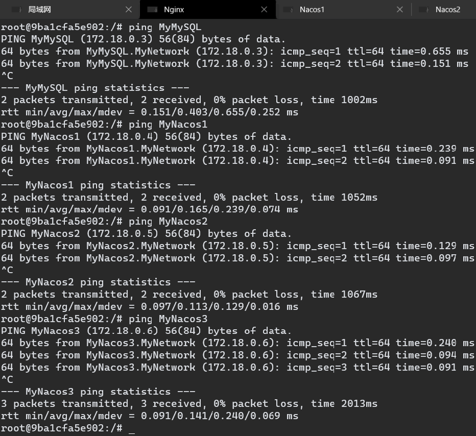


## 6、配置 Nacos 持久化、集群

<(￣︶￣)↗[Nacos实战 - 持久化.md](./Nacos实战 - 持久化.md)

1.   从 Nacos 官网获取[ Nacos 数据库构建脚本](https://github.com/alibaba/nacos/blob/develop/config/src/main/resources/META-INF/nacos-db.sql)，MySQL 执行脚本搭建 Nacos 数据库

     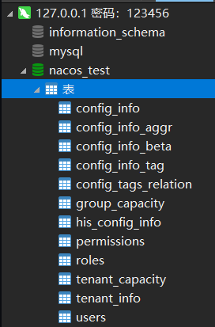

2.   进入 Nacos 实例，修改 /conf/application.properties 文件，配置 Nacos 持久化

     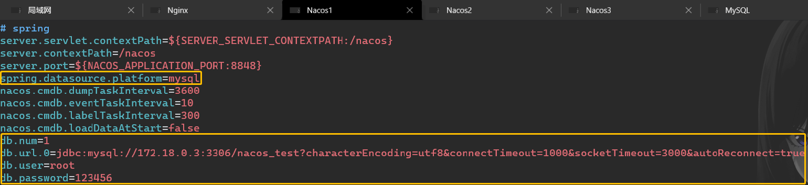

3.   修改 /conf/cluster.conf 配置文件，配置 Nacos 集群

     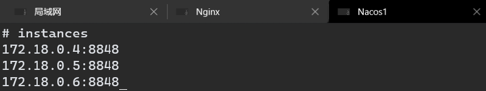

     

## 7、验证 Nacos 持久化是否生效

1.   重启所有 Nacos 实例

2.   打开任意一个 Nacos 实例的控制面板，创建若干配置信息

     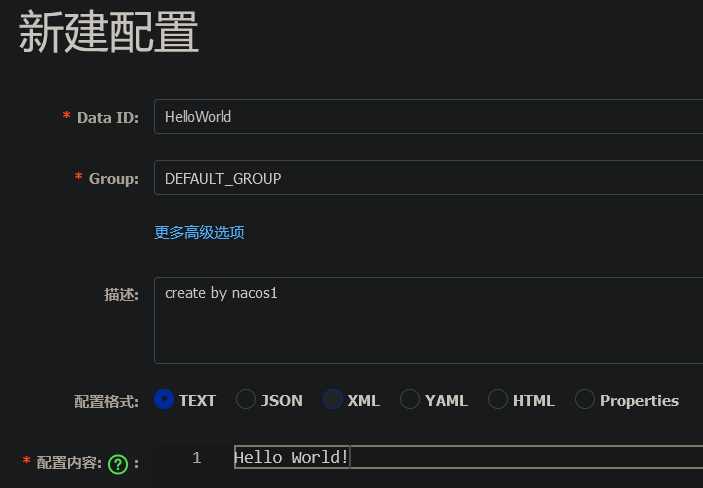

     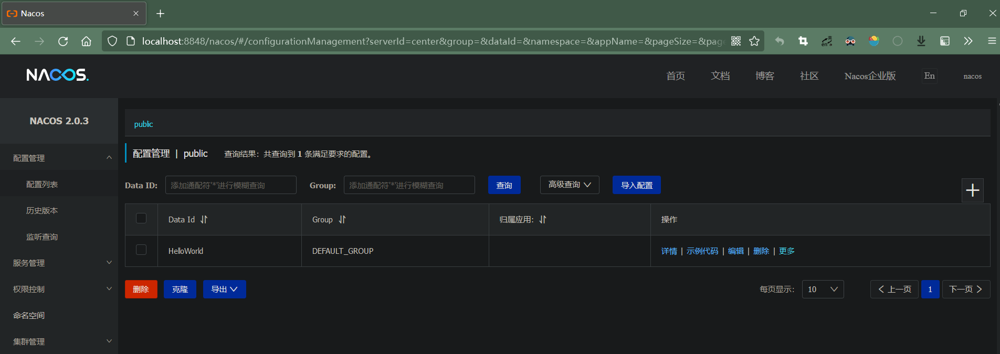

3.   检查配置信息是否存入数据库

     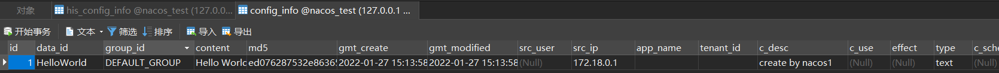

     

4.   打开其他 Nacos 实例的控制面板，检查是否获取到相同的配置信息

     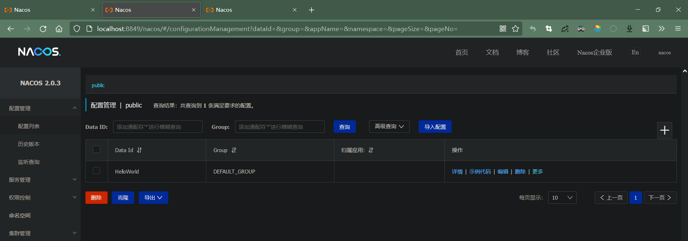

     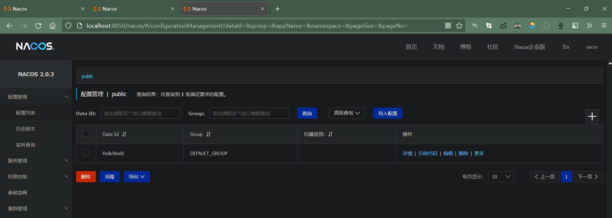

     

## 8、配置 Nginx 对 Nacos 的负载均衡

<(￣︶￣)↗[Nginx 实战 - 负载均衡.md](../../服务器相关/Nginx/Nginx 实战 - 负载均衡.md)

进入 Nginx 容器，配置自定义配置文件 /etc/nginx/conf.d/nacosLoadBalance.conf

```conf
upstream serverInstance {
    # ip_hash;
    server 172.18.0.4:8848  weight=1;
    server 172.18.0.5:8848  weight=1;
    server 172.18.0.6:8848  weight=1;
}

server {
    listen       80;
    server_name  127.0.0.1;
    
    location ~ /nacos/ {
        proxy_pass http://serverInstance;
        proxy_connect_timeout 10;
    }
}
```

## 9、验证 Nginx 负载均衡是否生效

1.   修改 Nginx 配置文件，改变日志格式

     ```
     log_format  main  '$remote_addr --"$request"--> $http_host--> $upstream_addr [$status  $request_time]';
     ```

2.   重启 Nginx

3.   通过 Nginx 访问 Nacos 控制面板

     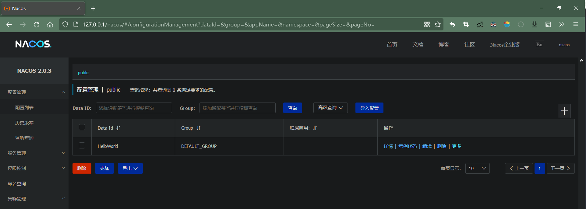

4.   刷新若干次后查看日志文件

     ```
     172.18.0.1 --"GET /nacos/ HTTP/1.1"--> 127.0.0.1--> 172.18.0.4:8848 [200  0.012]
     
     172.18.0.1 --"GET /nacos/ HTTP/1.1"--> 127.0.0.1--> 172.18.0.5:8848 [304  0.010]
     
     172.18.0.1 --"GET /nacos/ HTTP/1.1"--> 127.0.0.1--> 172.18.0.6:8848 [304  0.009]
     
     172.18.0.1 --"GET /nacos/ HTTP/1.1"--> 127.0.0.1--> 172.18.0.4:8848 [200  0.010]
     
     172.18.0.1 --"GET /nacos/ HTTP/1.1"--> 127.0.0.1--> 172.18.0.5:8848 [200  0.010]
     
     172.18.0.1 --"GET /nacos/ HTTP/1.1"--> 127.0.0.1--> 172.18.0.6:8848 [304  0.010]
     ```

