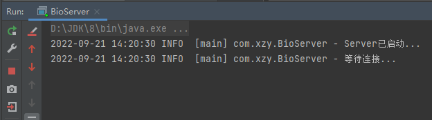
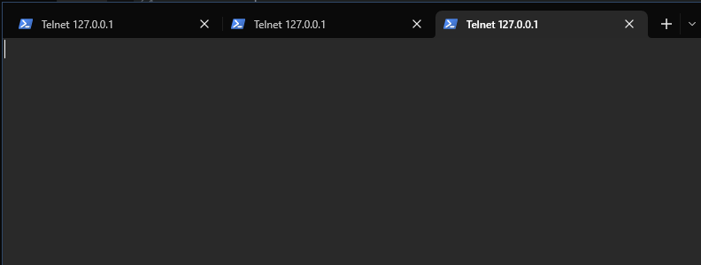
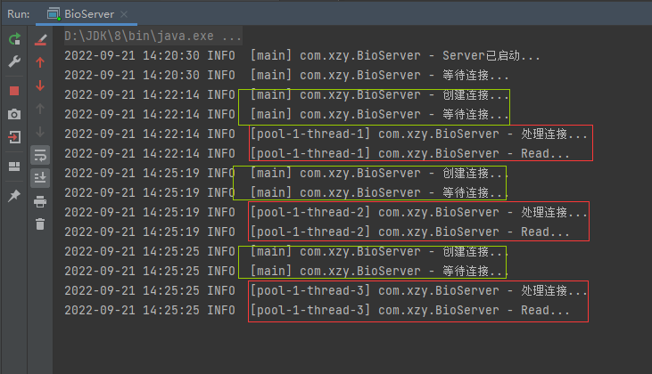
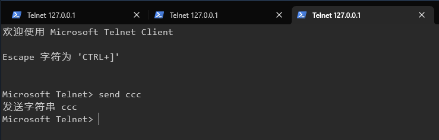
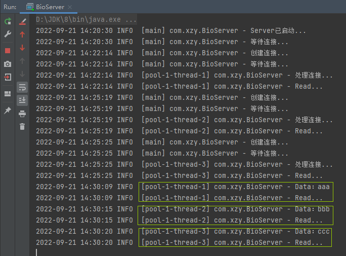

# BIO - HelloWorld

>   使用 BIO 模式搭建简单的 Server，加深对 BIO 模式的理解：同步 + 阻塞

[toc]


## 代码

```java
import org.slf4j.Logger;
import org.slf4j.LoggerFactory;

import java.io.IOException;
import java.io.InputStream;
import java.net.ServerSocket;
import java.net.Socket;
import java.util.concurrent.ExecutorService;
import java.util.concurrent.Executors;

/**
 * 基于BIO模式开发的Server
 *
 * <ol>
 *     <li>Server为每个Connect提供一个Thread，该Thread专门处理这个Connect</li>
 *     <li>Connect不可能时时都有数据传输，因此Thread存在空闲时间</li>
 * </ol>
 *
 * @author xzy.xiao
 * @date 2022/9/21  11:24
 */
public class BioServer {
    private final Logger logger = LoggerFactory.getLogger(BioServer.class);

    /**
     * 启动Server，开始监听连接请求
     *
     * @param port 端口
     */
    public void start(int port) throws IOException {
        ExecutorService threadPool = Executors.newCachedThreadPool();
        ServerSocket serverSocket = new ServerSocket(port);
        logger.info("Server已启动...");

        while (true) {
            logger.info("等待连接...");
            Socket socket = serverSocket.accept(); // NOTE：阻塞

            logger.info("创建连接...");
            threadPool.submit(() -> handler(socket));
        }
    }

    /**
     * 处理连接
     *
     * @param socket 连接
     */
    private void handler(Socket socket) {
        try {
            byte[] bytes = new byte[1024];
            InputStream socketInputStream = socket.getInputStream();
            logger.info("处理连接...");

            while (true) {

                logger.info("Read...");
                int length = socketInputStream.read(bytes); // NOTE：阻塞
                if (length != -1) {
                    logger.info("Data：{}", new String(bytes, 0, length));
                } else {
                    break;
                }
            }
        } catch (Exception e) {
            e.printStackTrace();
        }
    }

    public static void main(String[] args) throws IOException {
        new BioServer().start(8081);
    }
}
```


## 验证

1.   启动 Server

     

     从控制台信息可以印证，serverSocket.accept() 确实会导致阻塞

     

2.   使用 Telnet 创建多个连接

     ```shell
     telnet 127.0.0.1 8081
     ```

     

     Server 打印的信息：

     

     可以获得印证：

     -   监听连接和处理连接的是不同的线程：一个线程专门负责监听连接，监听到连接后将连接交个一个 Thread 进行处理
     -   每个被未托的 Thread 专注于指派的连接，即使连接暂时是空闲的
     -   socketInputStream.read(bytes) 确实会导致阻塞

     

3.   使用 Telnet 发送消息

     

     Server 打印的信息：

     

     再次印证：

     -   一个 Thread 会专注于负责一个连接
     -   socketInputStream.read(bytes) 会导致阻塞


## 总结

1.   BIO 模式很简单但很消耗资源
2.   BIO 模式适合连接数量有限，且固定的应用场景