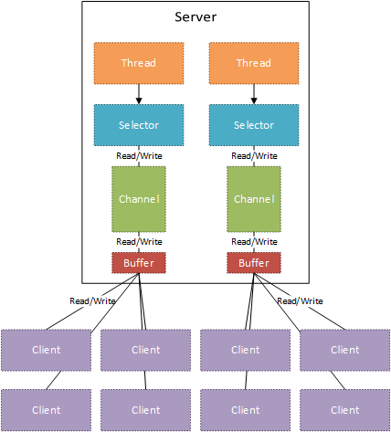
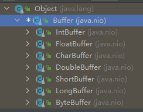
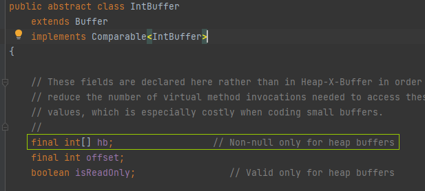
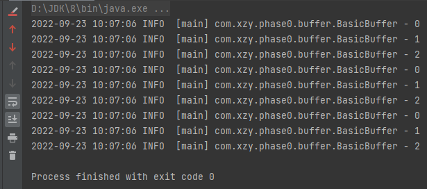

# NIO - Buffer 基础使用

[toc]

## 理论说明



1.   Java NIO 的三个核心：<u>Buffer</u>、Channel、Selector

     

2.   Buffer 是 java.nio 包下的一个抽象类，java.nio 的子包下存在它的很多实现类

     

     IntBuffer 专门存储整数数据，FloatBuffer 专门存储浮点数据......ByteBuffer 专门存储字节数据。网络中基本所有数据都可以转换为字节进行传输，所以 ByteBuffer 用的比较多。

     

3.   Buffer 的底层是数组，以 IntBuffer 为例：

     


## 实战验证

### 代码

```java
import org.slf4j.Logger;
import org.slf4j.LoggerFactory;

import java.nio.IntBuffer;

/**
 * Java NIO 的 Buffer 的基本使用
 *
 * @author xzy.xiao
 * @date 2022/9/21  16:14
 */
public class BasicBuffer {
    private static final Logger logger = LoggerFactory.getLogger(BasicBuffer.class);

    /**
     * 以下注释来自 {@link java.nio.Buffer} 的类说明
     *
     * <ul>
     *
     *   <li><p> {@link java.nio.Buffer#clear} makes a buffer ready for a new sequence of
     *   channel-read or relative <i>put</i> operations: It sets the limit to the
     *   capacity and the position to zero.  </p></li>
     *
     *   <li><p> {@link java.nio.Buffer#flip} makes a buffer ready for a new sequence of
     *   channel-write or relative <i>get</i> operations: It sets the limit to the
     *   current position and then sets the position to zero.  </p></li>
     *
     *   <li><p> {@link  java.nio.Buffer#rewind} makes a buffer ready for re-reading the data that
     *   it already contains: It leaves the limit unchanged and sets the position
     *   to zero.  </p></li>
     *
     * </ul>
     */
    public static void main(String[] args) {
        // 创建一个存储int数据的，容量为3的buffer
        IntBuffer intBuffer = IntBuffer.allocate(3);

        for (int i = 0; i < 3; i++) {

            // 向buffer添加数据
            for (int j = 0; j < 3; j++) {
                intBuffer.put(j);
            }
            intBuffer.flip(); // 切换buffer到“读”状态

            // 从buffer读取数据
            while (intBuffer.hasRemaining()) {
                logger.info(String.valueOf(intBuffer.get()));
            }
            intBuffer.clear(); // 切换buffer到“写”状态
        }
    }

}
```

Buffer 中有几个重要的方法

-   clear
-   flip
-   rewind


### 效果

