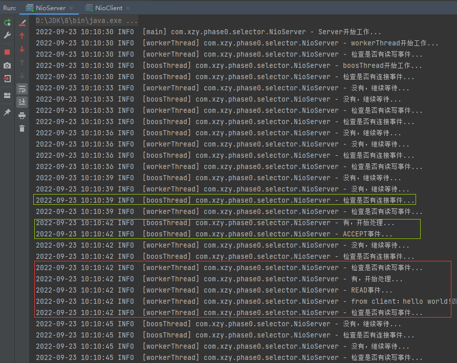
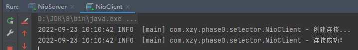

# NIO - Selector 基础使用

[toc]

## 代码

Server：

```java
package com.xzy.phase0.selector;

import org.slf4j.Logger;
import org.slf4j.LoggerFactory;

import java.io.IOException;
import java.net.InetSocketAddress;
import java.nio.ByteBuffer;
import java.nio.channels.*;
import java.util.Iterator;
import java.util.Set;

/**
 * 基于 NIO 搭建简单的 Server，同时了解 Selector 的基本使用
 *
 * @author xzy.xiao
 * @date 2022/9/22  14:19
 */
public class NioServer {

    private final Logger logger = LoggerFactory.getLogger(NioServer.class);

    // 使用一个Selector处理所有事件
    private void serverV1() throws IOException {
        // 1.创建 Selector
        Selector selector = Selector.open();

        // 2.创建 ServerSocketChannel
        ServerSocketChannel serverSocketChannel = ServerSocketChannel.open();
        serverSocketChannel.socket().bind(new InetSocketAddress(8081)); // 设置 Server 监听的端口号
        serverSocketChannel.configureBlocking(false); // 非阻塞模式

        // 3.注册 ServerSocketChannel
        serverSocketChannel.register(selector, SelectionKey.OP_ACCEPT); // serverSocketChannel 关心 ACCEPT 事件

        // 4.监听 Selector
        logger.info("Server开始工作...");
        while (true) {

            // 4.1 检查是否有事件发生
            logger.info("检查是否有事件发生...");
            if (selector.select(3000) < 1) {
                logger.info("没有，继续等待...");
                continue;
            }
            logger.info("有，开始处理...");

            // 4.2 获取所有发生事件的 Channel：每个注册到 Selector 的 Channel 都会有一个与之关联的 SelectionKey
            Set<SelectionKey> selectionKeys = selector.selectedKeys();

            // 4.3 遍历 Channel，检查各个 Channel 发生的到底是什么事件，然后进行相应的处理
            Iterator<SelectionKey> selectionKeyIterator = selectionKeys.iterator();
            while (selectionKeyIterator.hasNext()) {
                SelectionKey selectionKey = selectionKeyIterator.next();

                // 4.3.1 处理事件
                if (selectionKey.isAcceptable()) {
                    logger.info("ACCEPT事件...");
                    /*
                     * NOTE：
                     * 1、当前案例中，只有 serverSocketChannel 关心 ACCEPT 事件
                     * 2、accept()方法是阻塞的，但是这里不会发生阻塞，原因：NIO是基于事件通知的，代码之所以执行到这里正是因为已经知道有 accept 请求，所以 accept 方法最终不会阻塞
                     */

                    // 创建客户端通道
                    SocketChannel socketChannel = serverSocketChannel.accept();

                    // 配置客户端通道
                    socketChannel.configureBlocking(false); // 非阻塞模式

                    // 将客户端通道也注册到 Selector
                    socketChannel.register(selector, SelectionKey.OP_READ, ByteBuffer.allocate(30)); // 只关心 READ 事件，并指定一个 Buffer

                } else if (selectionKey.isReadable()) {
                    logger.info("READ事件...");

                    // 获取发生事件的 Channel
                    SocketChannel socketChannel = (SocketChannel) selectionKey.channel(); // 放心的进行类型转换，因为本案例中只有 SocketChannel 关心 READ 事件

                    // 获取该 Channel 关联的 buffer
                    ByteBuffer byteBuffer = (ByteBuffer) selectionKey.attachment();

                    // 把客户端上传的数据放到 buffer
                    socketChannel.read(byteBuffer);
                    logger.info("from client：{}", new String(byteBuffer.array()));

                } else {
                    logger.info("其他事件...");
                }

                // 4.3.2 IMPORTANT：移除已经处理过的事件，避免重复处理
                selectionKeyIterator.remove();
            }

        }
    }

    // 使用不同的Selector处理不同的事件
    private void serverV2() throws IOException {
        // 1.创建 Selector
        Selector boosSelector = Selector.open(); // 只负责监听连接请求 + 创建连接
        Selector workerSelector = Selector.open(); // 真正负责处理连接的读写等事件

        // 2.创建 ServerSocketChannel
        ServerSocketChannel serverSocketChannel = ServerSocketChannel.open();
        serverSocketChannel.socket().bind(new InetSocketAddress(8081)); // 设置 Server 监听的端口号
        serverSocketChannel.configureBlocking(false); // 非阻塞模式

        // 3.注册 ServerSocketChannel
        serverSocketChannel.register(boosSelector, SelectionKey.OP_ACCEPT); // serverSocketChannel 关心 ACCEPT 事件

        // 4.监听 Selector
        logger.info("Server开始工作...");
        Thread boosThread = new Thread(() -> {
            logger.info("boosThread开始工作...");
            while (true) {
                try {

                    // 等待连接事件
                    logger.info("检查是否有连接事件...");
                    if (boosSelector.select(3000) < 1) {
                        logger.info("没有，继续等待...");
                        continue;
                    }
                    logger.info("有，开始处理...");

                    // 处理连接事件
                    Set<SelectionKey> selectionKeys = boosSelector.selectedKeys();
                    Iterator<SelectionKey> selectionKeyIterator = selectionKeys.iterator();
                    while (selectionKeyIterator.hasNext()) {
                        SelectionKey selectionKey = selectionKeyIterator.next();

                        if (selectionKey.isAcceptable()) {
                            logger.info("ACCEPT事件...");

                            // 创建客户端通道
                            SocketChannel socketChannel = serverSocketChannel.accept();

                            // 配置客户端通道
                            socketChannel.configureBlocking(false); // 非阻塞模式

                            // 将客户端通道也注册到 Selector
                            socketChannel.register(workerSelector, SelectionKey.OP_READ, ByteBuffer.allocate(30)); // 只关心 READ 事件，并指定一个 Buffer

                        } else {
                            logger.info("其他事件...");
                        }

                        // IMPORTANT：移除已经处理过的事件，避免重复处理
                        selectionKeyIterator.remove();
                    }

                } catch (Exception e) {
                    e.printStackTrace();
                }
            }
        }, "boosThread");
        
        Thread workerThread = new Thread(() -> {
            logger.info("workerThread开始工作...");
            while (true) {
                try {

                    // 等待读写事件
                    logger.info("检查是否有读写事件...");
                    if (workerSelector.select(3000) < 1) {
                        logger.info("没有，继续等待...");
                        continue;
                    }
                    logger.info("有，开始处理...");

                    // 处理读写事件
                    Set<SelectionKey> selectionKeys = workerSelector.selectedKeys();
                    for (SelectionKey selectionKey : selectionKeys) {
                        if (selectionKey.isReadable()) {
                            logger.info("READ事件...");

                            // 获取发生事件的 Channel
                            SocketChannel socketChannel = (SocketChannel) selectionKey.channel(); // 放心的进行类型转换，因为本案例中只有 SocketChannel 关心 READ 事件

                            // 获取该 Channel 关联的 buffer
                            ByteBuffer byteBuffer = (ByteBuffer) selectionKey.attachment();

                            // 把客户端上传的数据放到 buffer
                            socketChannel.read(byteBuffer);
                            logger.info("from client：{}", new String(byteBuffer.array()));

                        } else if (selectionKey.isWritable()) {
                            logger.info("WRITE事件...");

                        } else {
                            logger.info("其他事件...");
                        }
                    }

                } catch (Exception e) {
                    e.printStackTrace();
                }
            }
        }, "workerThread");
        boosThread.start();
        workerThread.start();

        while (true) {}
    }

    public static void main(String[] args) throws IOException {
        NioServer nioServer = new NioServer();
        nioServer.serverV2();
    }
}
```

Client：

```java
package com.xzy.phase0.selector;

import org.slf4j.Logger;
import org.slf4j.LoggerFactory;

import java.io.IOException;
import java.net.InetSocketAddress;
import java.nio.ByteBuffer;
import java.nio.channels.SocketChannel;

/**
 * 基于 NIO 搭建简单的 Client，同时了解 Selector 的基本使用
 *
 * @author xzy.xiao
 * @date 2022/9/22  16:41
 */
public class NioClient {

    private final static Logger logger = LoggerFactory.getLogger(NioClient.class);

    public static void main(String[] args) throws IOException {
        // 1.创建Channel
        SocketChannel socketChannel = SocketChannel.open();
        socketChannel.configureBlocking(false);

        // 2.创建连接
        logger.info("创建连接...");
        if (!socketChannel.connect(new InetSocketAddress("127.0.0.1", 8081))) { // connect 方法是非阻塞的
            while (!socketChannel.finishConnect()) {
                logger.info("连接中...");
            }
        }
        logger.info("连接成功！");

        // 3.发送数据
        String msg = "hello world!";
        ByteBuffer byteBuffer = ByteBuffer.wrap(msg.getBytes());
        socketChannel.write(byteBuffer);

        while (true) {

        }
    }

}
```

## 效果



