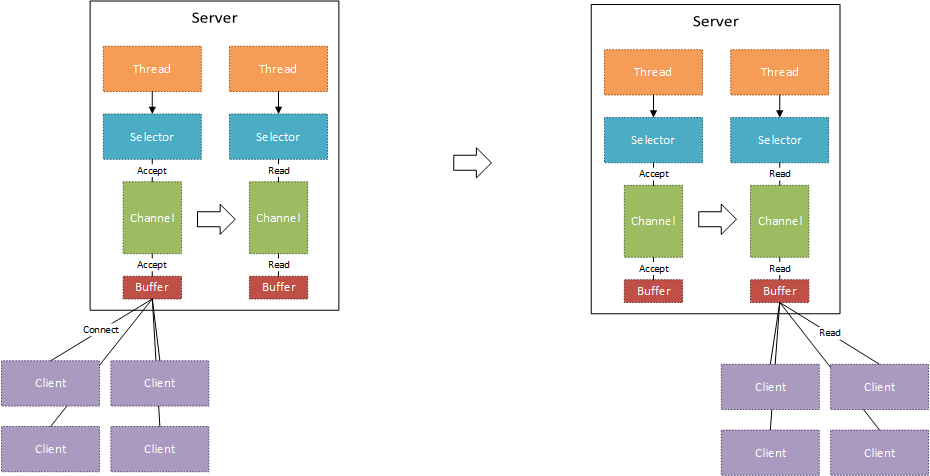
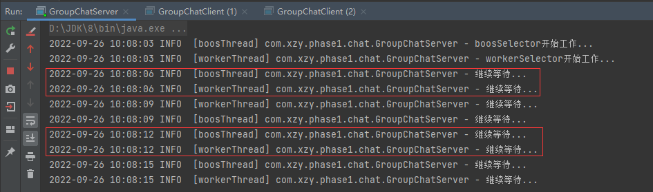
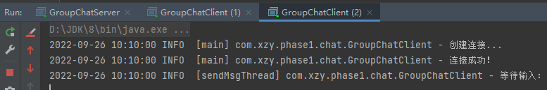
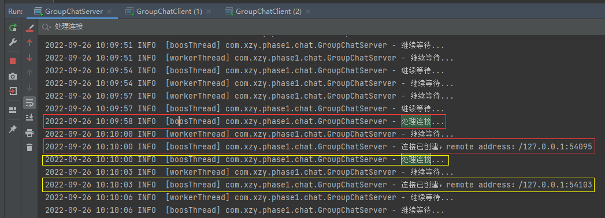
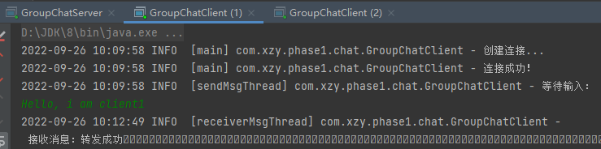
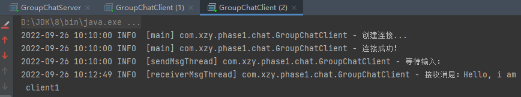
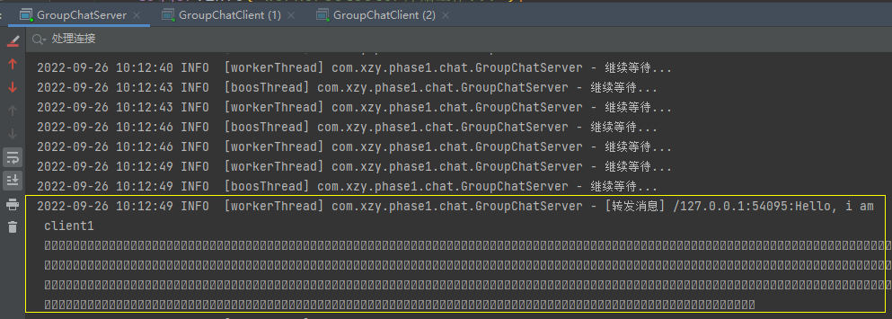

# 基于 Java NIO 搭建的简单群聊系统

[toc]


## 架构说明



如上系统架构图所示：

-   创建两个 Selector，两个 Thread，每个 Thread 负责一个 Selector
-   一个 Selector 专门存储 ServerSocketChannel，这些 ServerSocketChannel 只关心 ACCEPT 事件；一个 Selector 专门存储 SocketChannel，这些 SocketChannel 只关心 Read 事件；
-   Selector 监听到 ACCEPT 事件后，基于 ServerSocketChannel::accept() 方法获取 SocketChannel（其实就是创建客户端连接）并将 SocketChannel 注册到另一个 Selector；
-   Selector 监听到 READ 事件后，从 SocketChannel 取出消息，然后向 Selector 中其他 SocketChannel 转发该消息，最后向当前 SocketChannel 返回一个消息转发完成的提示信息；


## 代码

### 服务端

```java
package com.xzy.phase1.chat;

import org.slf4j.Logger;
import org.slf4j.LoggerFactory;

import java.io.IOException;
import java.net.InetSocketAddress;
import java.nio.ByteBuffer;
import java.nio.channels.*;
import java.util.Iterator;
import java.util.Set;

/**
 * 群聊系统服务端
 *
 * @author xzy.xiao
 * @date 2022/9/23  10:28
 */
public class GroupChatServer {
    private final Logger logger = LoggerFactory.getLogger(GroupChatServer.class);

    /**
     * 服务端监听的端口
     */
    private final int port;
    /**
     * 存储 ServerSocketChannel，处理客户端连接请求
     */
    private final Selector boosSelector;
    /**
     * 存储 SocketChannel，处理客户端读写请求
     */
    private final Selector workerSelector;

    public GroupChatServer(int port) throws IOException {
        this.port = port;
        this.boosSelector = Selector.open();
        this.workerSelector = Selector.open();
    }

    public void start() {
        new Thread(() -> {
            try {
                connectionHandler();
            } catch (IOException e) {
                e.printStackTrace();
            }
        }, "boosThread").start();
        new Thread(() -> {
            try {
                msgHandler();
            } catch (IOException e) {
                e.printStackTrace();
            }
        }, "workerThread").start();
    }

    /**
     * 监听客户端连接请求，创建客户端连接
     */
    private void connectionHandler() throws IOException {
        // 1.创建处理ACCEPT事件的Channel，并加入boosSelector
        ServerSocketChannel serverSocketChannel = ServerSocketChannel.open();
        serverSocketChannel.socket().bind(new InetSocketAddress(this.port));
        serverSocketChannel.configureBlocking(false);
        serverSocketChannel.register(boosSelector, SelectionKey.OP_ACCEPT);

        // 2.监听
        logger.info("boosSelector开始工作...");
        while (true) {

            // 等待连接事件
            if (boosSelector.select(3000) < 1) {
                logger.info("继续等待...");
                continue;
            }

            // 处理连接事件
            logger.info("处理连接...");
            Set<SelectionKey> boosSelectedKeys = boosSelector.selectedKeys();
            Iterator<SelectionKey> boosSelectedKeysIterator = boosSelectedKeys.iterator();
            while (boosSelectedKeysIterator.hasNext()) {
                /*
                 * NOTE：
                 * boosSelector中实际上只有一个ServerSocketChannel，并且它只关心ACCEPT事件，在此前提之下，才能
                 * 采用后面的实现方式（不需要额外判断事件类型，不需要通过SelectionKey获取Channel）
                 */

                // 创建连接
                SocketChannel socketChannel = serverSocketChannel.accept();
                socketChannel.configureBlocking(false);
                socketChannel.register(workerSelector, SelectionKey.OP_READ);
                logger.info("连接已创建，remote address：{}", socketChannel.getRemoteAddress());

                // 移除已经处理的Channel，避免重复处理
                boosSelectedKeysIterator.next();
                boosSelectedKeysIterator.remove();
            }
        }
    }

    /**
     * 监听客户端读写请求，转发客户端消息
     */
    private void msgHandler() throws IOException {
        logger.info("workerSelector开始工作...");
        while (true) {

            // 等待读写事件
            if (workerSelector.select(3000) < 1) {
                logger.info("继续等待...");
                continue;
            }

            // 处理读写事件
            Set<SelectionKey> workerSelectionKeys = workerSelector.keys(); // 所有的客户端
            Set<SelectionKey> workerSelectedKeys = workerSelector.selectedKeys(); // 产生事件的客户端
            Iterator<SelectionKey> workerSelectedKeysIterator = workerSelectedKeys.iterator();
            while (workerSelectedKeysIterator.hasNext()) {

                SelectionKey workerSelectedKey = workerSelectedKeysIterator.next();
                if (workerSelectedKey.isReadable()) {
                    // 1.获取消息
                    SocketChannel currentUserChannel = (SocketChannel) workerSelectedKey.channel();
                    ByteBuffer byteBuffer = ByteBuffer.allocate(1024);
                    int count = currentUserChannel.read(byteBuffer);
                    if (count < 1) {
                        continue;
                    }
                    String msg = new String(byteBuffer.array());
                    logger.info("[转发消息] {}:{}", currentUserChannel.getRemoteAddress(), msg);

                    // 2.转发消息
                    for (SelectionKey workerSelectionKey : workerSelectionKeys) {
                        // 跳过自己
                        if (workerSelectionKey == workerSelectedKey) {
                            continue;
                        }

                        // 转发消息
                        SocketChannel otherUserChannel = (SocketChannel) workerSelectionKey.channel();
                        otherUserChannel.write(ByteBuffer.wrap(msg.getBytes()));
                    }

                    // 2.汇报结果
                    currentUserChannel.write(ByteBuffer.wrap("转发成功".getBytes()));

                } else {
                    // TODO:
                    logger.info("其他事件，暂不处理");
                }

                // 避免重复处理
                workerSelectedKeysIterator.remove();
            }
        }
    }

    public static void main(String[] args) throws IOException {
        new GroupChatServer(8081).start();

        while (true) {

        }
    }
}
```

### 客户端

```java
package com.xzy.phase1.chat;

import org.slf4j.Logger;
import org.slf4j.LoggerFactory;

import java.io.IOException;
import java.net.InetSocketAddress;
import java.nio.ByteBuffer;
import java.nio.channels.SelectionKey;
import java.nio.channels.Selector;
import java.nio.channels.SocketChannel;
import java.util.Iterator;
import java.util.Scanner;
import java.util.Set;

/**
 * 群聊系统客户端
 *
 * @author xzy.xiao
 * @date 2022/9/23  10:29
 */
public class GroupChatClient {
    private final Logger logger = LoggerFactory.getLogger(GroupChatClient.class);

    private final String host;
    private final int port;
    private final Selector selector;
    private final SocketChannel socketChannel;

    public GroupChatClient(String host, int port) throws IOException {
        this.host = host;
        this.port = port;
        this.selector = Selector.open();
        this.socketChannel = SocketChannel.open();
        this.socketChannel.configureBlocking(false);
        this.socketChannel.register(selector, SelectionKey.OP_READ);
    }

    public void connect() throws IOException {
        // 创建连接
        logger.info("创建连接...");
        if (!socketChannel.connect(new InetSocketAddress(host, port))) { // connect 方法是非阻塞的
            while (!socketChannel.finishConnect()) {
                logger.info("连接中...");
            }
        }
        logger.info("连接成功！");

        // 发送消息、接收消息
        new Thread(() -> {
            try {
                sendMsgHandler();
            } catch (IOException e) {
                e.printStackTrace();
            }
        }, "sendMsgThread").start();

        new Thread(() -> {
            try {
                receiverMsgHandler();
            } catch (IOException e) {
                e.printStackTrace();
            }
        }, "receiverMsgThread").start();
    }

    private void sendMsgHandler() throws IOException {
        logger.info("等待输入：");
        Scanner scanner = new Scanner(System.in);
        while (true) {
            String msg = scanner.nextLine();
            ByteBuffer byteBuffer = ByteBuffer.wrap(msg.getBytes());
            socketChannel.write(byteBuffer);
        }
    }

    private void receiverMsgHandler() throws IOException {
        ByteBuffer byteBuffer = ByteBuffer.allocate(1024);
        while (true) {
            // 等待数据
            if (selector.select(1000) < 1) {
                continue;
            }

            Set<SelectionKey> selectionKeys = selector.selectedKeys();
            Iterator<SelectionKey> selectionKeyIterator = selectionKeys.iterator();
            while (selectionKeyIterator.hasNext()) {
                // 处理数据
                int count = socketChannel.read(byteBuffer);
                if (count > 0) {
                    logger.info("接收消息：{}", new String(byteBuffer.array()));
                }
                byteBuffer.clear();

                // 避免重复处理
                selectionKeyIterator.next();
                selectionKeyIterator.remove();
            }
        }
    }

    public static void main(String[] args) throws IOException {
        new GroupChatClient("127.0.0.1", 8081).connect();

        while (true) {

        }
    }
}
```

## 效果

1.   启动服务端

     

     从日志可以看出，负责两个Selector的线程成功启动，且开始监听事件

     

2.   启动两个客户端

     

     

3.   客户端1发送消息

     

     

     