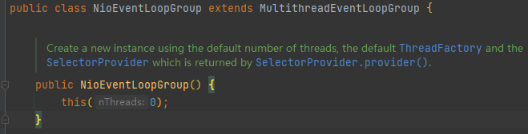
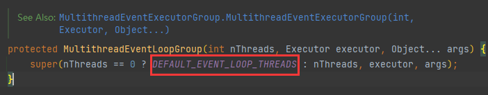
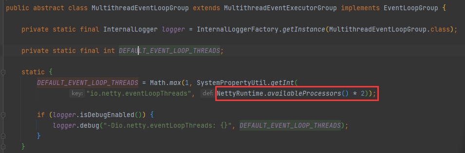
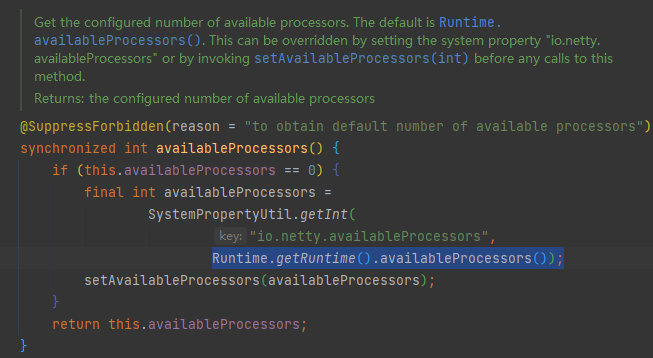
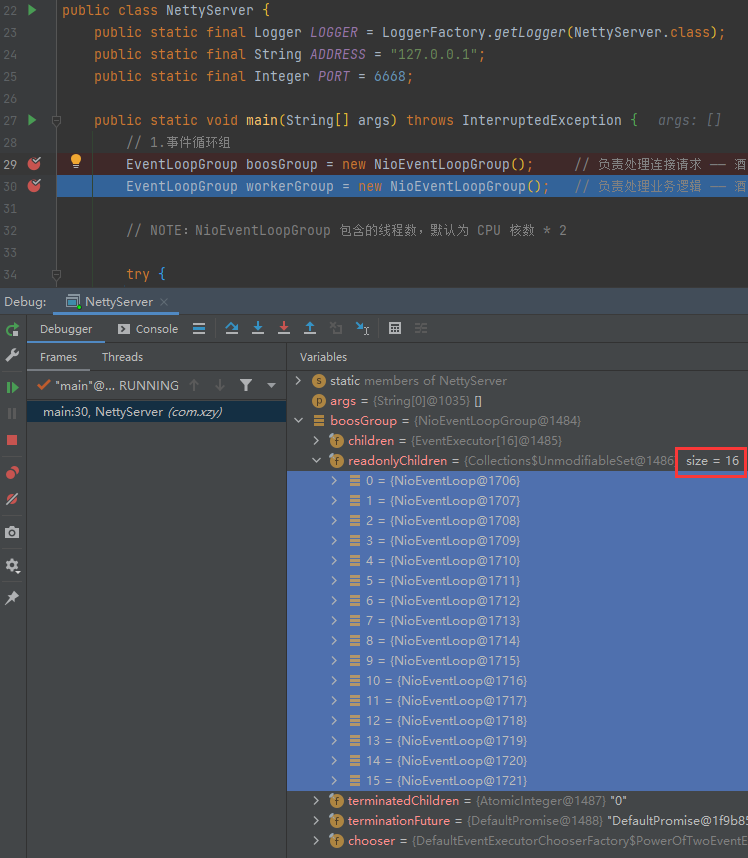
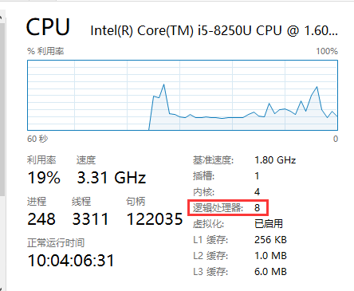
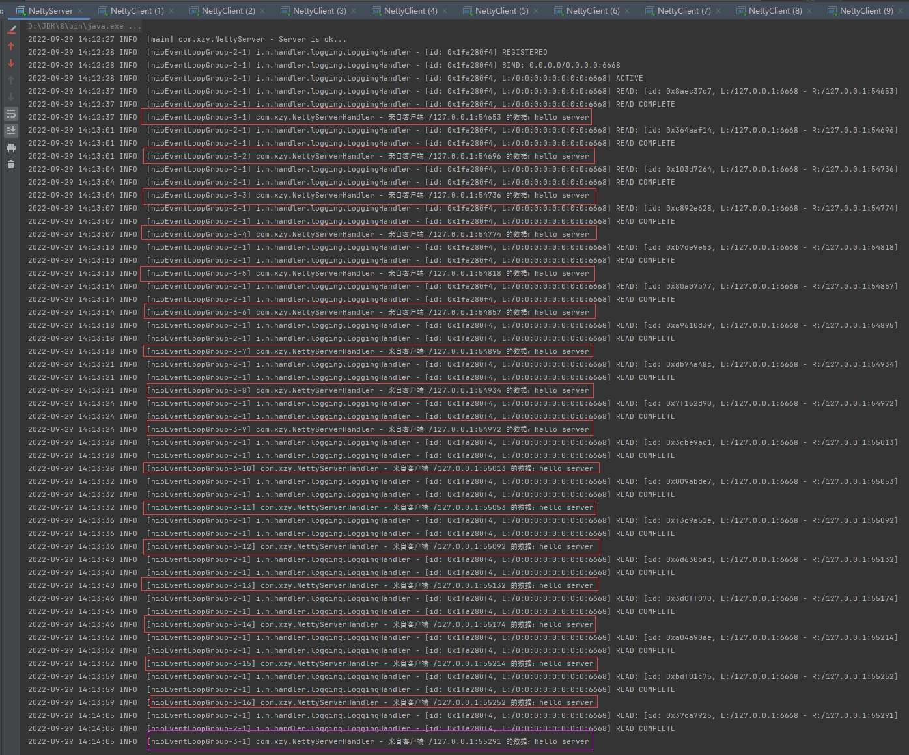

# 基于 Netty 搭建简单的 Server

[TOC]


## 代码

### Maven

```xml
<?xml version="1.0" encoding="UTF-8"?>
<project xmlns = "http://maven.apache.org/POM/4.0.0"
         xmlns:xsi = "http://www.w3.org/2001/XMLSchema-instance"
         xsi:schemaLocation = "http://maven.apache.org/POM/4.0.0 http://maven.apache.org/xsd/maven-4.0.0.xsd">
    <modelVersion>4.0.0</modelVersion>
    
    <groupId>org.xzy</groupId>
    <artifactId>netty-demo</artifactId>
    <version>1.0-SNAPSHOT</version>
    
    <properties>
        <!--环境参数：开发、编译-->
        <java.version>1.8</java.version>
        <project.build.sourceEncoding>UTF-8</project.build.sourceEncoding>
        <build.plugins.plugin.version>2.3.7.RELEASE</build.plugins.plugin.version>
        <maven.compiler.plugin>3.8.1</maven.compiler.plugin>
        <!--依赖参数：版本-->
        <netty-all-version>4.1.65.Final</netty-all-version>
    </properties>
    
    <dependencies>
        <!--netty-->
        <dependency>
            <groupId>io.netty</groupId>
            <artifactId>netty-all</artifactId>
            <version>${netty-all-version}</version>
        </dependency>
        <!--logback-->
        <dependency>
            <groupId>ch.qos.logback</groupId>
            <artifactId>logback-classic</artifactId>
            <version>1.2.10</version>
        </dependency>
    </dependencies>
    
    <build>
        <plugins>
            <plugin>
                <groupId>org.springframework.boot</groupId>
                <artifactId>spring-boot-maven-plugin</artifactId>
                <version>${build.plugins.plugin.version}</version>
                <configuration>
                    <fork>true</fork>
                    <addResources>true</addResources>
                </configuration>
            </plugin>
            <plugin>
                <groupId>org.apache.maven.plugins</groupId>
                <artifactId>maven-compiler-plugin</artifactId>
                <version>${maven.compiler.plugin}</version>
                <configuration>
                    <source>1.8</source>
                    <target>1.8</target>
                </configuration>
            </plugin>
        </plugins>
    </build>
</project>
```


### 服务端

```java
package com.xzy;

import io.netty.bootstrap.ServerBootstrap;
import io.netty.channel.ChannelFuture;
import io.netty.channel.ChannelInitializer;
import io.netty.channel.ChannelOption;
import io.netty.channel.EventLoopGroup;
import io.netty.channel.nio.NioEventLoopGroup;
import io.netty.channel.socket.SocketChannel;
import io.netty.channel.socket.nio.NioServerSocketChannel;
import io.netty.handler.logging.LogLevel;
import io.netty.handler.logging.LoggingHandler;
import org.slf4j.Logger;
import org.slf4j.LoggerFactory;

/**
 * 服务端
 *
 * @author xzy.xiao
 * @date 2022/8/22  15:39
 */
public class NettyServer {
    public static final Logger LOGGER = LoggerFactory.getLogger(NettyServer.class);
    public static final String ADDRESS = "127.0.0.1";
    public static final Integer PORT = 6668;

    public static void main(String[] args) throws InterruptedException {
        // 1.事件循环组
        EventLoopGroup boosGroup = new NioEventLoopGroup();     // 负责处理连接请求 —— 酒店前台（多个）
        EventLoopGroup workerGroup = new NioEventLoopGroup();   // 负责处理业务逻辑 —— 酒店接待员（多个）

        try {

            // 2.服务端启动器
            ServerBootstrap serverBootstrap = new ServerBootstrap();
            serverBootstrap
                    .group(boosGroup, workerGroup)
                    .handler(new LoggingHandler(LogLevel.INFO)) // boosGroup的channel处理器
                    .channel(NioServerSocketChannel.class) // 通道实现类
                    .option(ChannelOption.SO_BACKLOG, 128) // 阻塞数量
                    .childOption(ChannelOption.SO_KEEPALIVE, true)
                    .childHandler(new ChannelInitializer<SocketChannel>() { // workerGroup的channel处理器
                        // This method will be called once the {@link Channel} was registered.
                        @Override
                        protected void initChannel(SocketChannel ch) throws Exception {
                            ch.pipeline().addLast(new NettyServerHandler()); // 自定义的处理器
                        }
                    });

            // 3.启动服务端，开始监听
            LOGGER.info("Server is ok...");
            ChannelFuture channelFuture = serverBootstrap.bind(PORT).sync();

            // 4.关闭
            channelFuture.channel().closeFuture().sync();

        } finally {

            boosGroup.shutdownGracefully();
            workerGroup.shutdownGracefully();

        }
    }
}

```

```java
package com.xzy;

import io.netty.buffer.ByteBuf;
import io.netty.buffer.Unpooled;
import io.netty.channel.ChannelHandlerContext;
import io.netty.channel.ChannelInboundHandlerAdapter;
import org.slf4j.Logger;
import org.slf4j.LoggerFactory;

import java.net.SocketAddress;
import java.nio.charset.StandardCharsets;

/**
 * 服务端处理器
 *
 * @author xzy.xiao
 * @date 2022/8/22  16:19
 */
public class NettyServerHandler extends ChannelInboundHandlerAdapter {

    public static final Logger LOGGER = LoggerFactory.getLogger(NettyServerHandler.class);

    /**
     * 读取客户端发送的数据
     *
     * @param ctx -
     * @param msg 客户端发送的数据
     * @throws Exception -
     */
    @Override
    public void channelRead(ChannelHandlerContext ctx, Object msg) throws Exception {
        SocketAddress remoteAddress = ctx.channel().remoteAddress();
        ByteBuf msgByteBuf = (ByteBuf) msg;
        LOGGER.info("来自客户端 {} 的数据：{}", remoteAddress, msgByteBuf.toString(StandardCharsets.UTF_8));
    }

    /**
     * 向客户端返回数据
     *
     * @param ctx -
     * @throws Exception -
     */
    @Override
    public void channelReadComplete(ChannelHandlerContext ctx) throws Exception {
        ByteBuf msgByteBuf = Unpooled.copiedBuffer("hello client", StandardCharsets.UTF_8);
        ctx.writeAndFlush(msgByteBuf);
    }

    /**
     * 处理异常
     *
     * @param ctx   -
     * @param cause -
     * @throws Exception -
     */
    @Override
    public void exceptionCaught(ChannelHandlerContext ctx, Throwable cause) throws Exception {
        cause.printStackTrace();
        ctx.close();
    }
}
```

### 客户端

```java
package com.xzy;

import io.netty.bootstrap.Bootstrap;
import io.netty.channel.ChannelFuture;
import io.netty.channel.ChannelInitializer;
import io.netty.channel.EventLoopGroup;
import io.netty.channel.nio.NioEventLoopGroup;
import io.netty.channel.socket.SocketChannel;
import io.netty.channel.socket.nio.NioSocketChannel;
import org.slf4j.Logger;
import org.slf4j.LoggerFactory;

import static com.xzy.NettyServer.ADDRESS;
import static com.xzy.NettyServer.PORT;

/**
 * 客户端
 *
 * @author xzy.xiao
 * @date 2022/8/22  15:40
 */
public class NettyClient {

    public static final Logger LOGGER = LoggerFactory.getLogger(NettyClient.class);

    public static void main(String[] args) throws InterruptedException {
        // 1.事件循环组
        EventLoopGroup eventLoopGroup = new NioEventLoopGroup();

        try {

            // 2.客户端启动器
            Bootstrap clientBootStrap = new Bootstrap();
            clientBootStrap
                    .group(eventLoopGroup)
                    .channel(NioSocketChannel.class) // 通道实现类
                    .handler(new ChannelInitializer<SocketChannel>() {
                        // This method will be called once the {@link Channel} was registered.
                        @Override
                        protected void initChannel(SocketChannel ch) throws Exception {
                            ch.pipeline().addLast(new NettyClientHandler());// 处理器
                        }
                    });

            // 3.启动客户端，开始连接
            LOGGER.info("Client is ok...");
            ChannelFuture channelFuture = clientBootStrap.connect(ADDRESS, PORT).sync();

            // 4.关闭
            channelFuture.channel().closeFuture().sync();

        } finally {

            eventLoopGroup.shutdownGracefully();

        }
    }
}
```

```java
package com.xzy;

import io.netty.buffer.ByteBuf;
import io.netty.buffer.Unpooled;
import io.netty.channel.ChannelHandlerContext;
import io.netty.channel.ChannelInboundHandlerAdapter;
import org.slf4j.Logger;
import org.slf4j.LoggerFactory;

import java.net.SocketAddress;
import java.nio.charset.StandardCharsets;

/**
 * 客户端处理器
 *
 * @author xzy.xiao
 * @date 2022/8/22  17:36
 */
public class NettyClientHandler extends ChannelInboundHandlerAdapter {

    public static final Logger LOGGER = LoggerFactory.getLogger(NettyClientHandler.class);

    /**
     * 向服务端发送数据
     *
     * @param ctx -
     */
    @Override
    public void channelActive(ChannelHandlerContext ctx) throws Exception {
        ByteBuf msgByteBuf = Unpooled.copiedBuffer("hello server", StandardCharsets.UTF_8);
        ctx.writeAndFlush(msgByteBuf);
    }

    /**
     * 读取服务端发送的数据
     *
     * @param ctx -
     * @param msg 服务端发送的数据
     */
    @Override
    public void channelRead(ChannelHandlerContext ctx, Object msg) throws Exception {
        SocketAddress remoteAddress = ctx.channel().remoteAddress();
        ByteBuf msgByteBuf = (ByteBuf) msg;
        LOGGER.info("来自服务端 {} 的数据：{}", remoteAddress, msgByteBuf.toString(StandardCharsets.UTF_8));
    }

    /**
     * 处理异常
     *
     * @param ctx   -
     * @param cause -
     */
    @Override
    public void exceptionCaught(ChannelHandlerContext ctx, Throwable cause) throws Exception {
        cause.printStackTrace();
        ctx.close();
    }
}
```

## 演示


### 演示1：NioEventLoopGroup

>   默认情况下，NioEventLoopGroup 包含的线程数数 =  处理器数量 * 2
>
>   源码追踪：
>
>   1.   
>   2.   
>   3.   
>   4.   

启动 Server：



当前设备处理器数量：




### 演示2：基础功能

启动 Server + 启动 Client（17个）：



从 Server 的日志信息可以看出，EventLoopGroup 以轮训的方式将客户端请求交给内部的 16 个 EventLoop 去处理