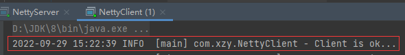
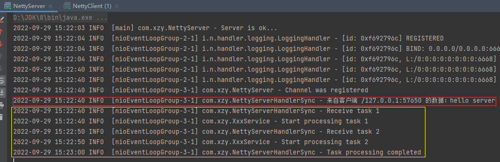

# 以同步、异步、定时的方式处理客户端请求

[toc]

## 代码


### 服务端

启动器：

```java
package com.xzy;

import io.netty.bootstrap.ServerBootstrap;
import io.netty.channel.ChannelFuture;
import io.netty.channel.ChannelInitializer;
import io.netty.channel.ChannelOption;
import io.netty.channel.EventLoopGroup;
import io.netty.channel.nio.NioEventLoopGroup;
import io.netty.channel.socket.SocketChannel;
import io.netty.channel.socket.nio.NioServerSocketChannel;
import io.netty.handler.logging.LogLevel;
import io.netty.handler.logging.LoggingHandler;
import org.slf4j.Logger;
import org.slf4j.LoggerFactory;

/**
 * 服务端
 *
 * @author xzy.xiao
 * @date 2022/8/22  15:39
 */
public class NettyServer {
    public static final Logger LOGGER = LoggerFactory.getLogger(NettyServer.class);
    public static final String ADDRESS = "127.0.0.1";
    public static final Integer PORT = 6668;

    public static void main(String[] args) throws InterruptedException {
        // 1.事件循环组
        EventLoopGroup boosGroup = new NioEventLoopGroup();     // 负责处理连接请求 —— 酒店前台（多个）
        EventLoopGroup workerGroup = new NioEventLoopGroup();   // 负责处理业务逻辑 —— 酒店接待员（多个）

        try {

            // 2.服务端启动器
            ServerBootstrap serverBootstrap = new ServerBootstrap();
            serverBootstrap
                    .group(boosGroup, workerGroup)
                    .handler(new LoggingHandler(LogLevel.INFO)) // boosGroup的channel处理器
                    .channel(NioServerSocketChannel.class) // 通道实现类
                    .option(ChannelOption.SO_BACKLOG, 128) // 阻塞数量
                    .childOption(ChannelOption.SO_KEEPALIVE, true)
                    .childHandler(new ChannelInitializer<SocketChannel>() { // workerGroup的channel处理器
                        // This method will be called once the {@link Channel} was registered.
                        @Override
                        protected void initChannel(SocketChannel ch) throws Exception {
                            LOGGER.info("Channel was registered");

                            // ch.pipeline().addLast(new NettyServerHandlerSync()); // 处理器（同步）
                            // ch.pipeline().addLast(new NettyServerHandlerAsync()); // 处理器（异步）
                            ch.pipeline().addLast(new NettyServerHandlerScheduled()); // 处理器（定时）
                        }
                    });

            // 3.启动服务端，开始监听
            LOGGER.info("Server is ok...");
            ChannelFuture channelFuture = serverBootstrap.bind(PORT).sync();

            // 4.关闭
            channelFuture.channel().closeFuture().sync();

        } finally {

            boosGroup.shutdownGracefully();
            workerGroup.shutdownGracefully();

        }
    }
}
```

处理器（同步）：

```java
package com.xzy;

import io.netty.buffer.ByteBuf;
import io.netty.buffer.Unpooled;
import io.netty.channel.ChannelHandlerContext;
import io.netty.channel.ChannelInboundHandlerAdapter;
import org.slf4j.Logger;
import org.slf4j.LoggerFactory;

import java.net.SocketAddress;
import java.nio.charset.StandardCharsets;

/**
 * 服务端处理器（同步）
 *
 * <br><br>
 * 以同步的方式处理客户端请求的大致过程：
 * <ol>
 *     <li>接收任务1，处理任务1</li>
 *     <li>接收任务2，处理任务2</li>
 *     <li>返回完成信息</li>
 * </ol>
 *
 * @author xzy.xiao
 * @date 2022/8/22  16:19
 */
public class NettyServerHandlerSync extends ChannelInboundHandlerAdapter {

    public static final Logger LOGGER = LoggerFactory.getLogger(NettyServerHandlerSync.class);

    /**
     * 读取客户端发送的数据
     *
     * @param ctx -
     * @param msg 客户端发送的数据
     * @throws Exception -
     */
    @Override
    public void channelRead(ChannelHandlerContext ctx, Object msg) throws Exception {
        SocketAddress remoteAddress = ctx.channel().remoteAddress();
        ByteBuf msgByteBuf = (ByteBuf) msg;
        LOGGER.info("来自客户端 {} 的数据：{}", remoteAddress, msgByteBuf.toString(StandardCharsets.UTF_8));

        // 以同步（阻塞）的方式处理客户端请求
        LOGGER.info("Receive task 1");
        XxxService.lazyTask("task 1", 10 * 1000, () -> ctx.writeAndFlush(Unpooled.copiedBuffer("[Result1]", StandardCharsets.UTF_8)));

        LOGGER.info("Receive task 2");
        XxxService.lazyTask("task 2", 10 * 1000, () -> ctx.writeAndFlush(Unpooled.copiedBuffer("[Result2]", StandardCharsets.UTF_8)));
    }

    /**
     * 向客户端返回数据
     *
     * @param ctx -
     * @throws Exception -
     */
    @Override
    public void channelReadComplete(ChannelHandlerContext ctx) throws Exception {
        LOGGER.info("Task processing completed");
        ByteBuf msgByteBuf = Unpooled.copiedBuffer("[Done]", StandardCharsets.UTF_8);
        ctx.writeAndFlush(msgByteBuf);
    }

    /**
     * 处理异常
     *
     * @param ctx   -
     * @param cause -
     * @throws Exception -
     */
    @Override
    public void exceptionCaught(ChannelHandlerContext ctx, Throwable cause) throws Exception {
        cause.printStackTrace();
        ctx.close();
    }
}
```

处理器（异步）：

```java
package com.xzy;

import io.netty.buffer.ByteBuf;
import io.netty.buffer.Unpooled;
import io.netty.channel.ChannelHandlerContext;
import io.netty.channel.ChannelInboundHandlerAdapter;
import org.slf4j.Logger;
import org.slf4j.LoggerFactory;

import java.net.SocketAddress;
import java.nio.charset.StandardCharsets;

/**
 * 服务端处理器（异步）
 *
 * <br><br>
 * 以异步的方式处理客户端请求的大致过程：
 * <ol>
 *     <li>接收任务1，接收任务2</li>
 *     <li>返回完成信息</li>
 *     <li>处理任务1，处理任务2</li>
 * </ol>
 *
 * @author xzy.xiao
 * @date 2022/8/22  16:19
 */
public class NettyServerHandlerAsync extends ChannelInboundHandlerAdapter {

    public static final Logger LOGGER = LoggerFactory.getLogger(NettyServerHandlerAsync.class);

    /**
     * 读取客户端发送的数据
     *
     * @param ctx -
     * @param msg 客户端发送的数据
     * @throws Exception -
     */
    @Override
    public void channelRead(ChannelHandlerContext ctx, Object msg) throws Exception {
        SocketAddress remoteAddress = ctx.channel().remoteAddress();
        ByteBuf msgByteBuf = (ByteBuf) msg;
        LOGGER.info("来自客户端 {} 的数据：{}", remoteAddress, msgByteBuf.toString(StandardCharsets.UTF_8));

        // 以异步（非阻塞）的方式处理客户端请求
        LOGGER.info("Receive task 1");
        ctx.channel().eventLoop().execute(
                () -> XxxService.lazyTask("task 1", 10 * 1000, () -> ctx.writeAndFlush(Unpooled.copiedBuffer("[Result1]", StandardCharsets.UTF_8)))
        );

        LOGGER.info("Receive task 2");
        ctx.channel().eventLoop().execute(
                () -> XxxService.lazyTask("task 2", 10 * 1000, () -> ctx.writeAndFlush(Unpooled.copiedBuffer("[Result2]", StandardCharsets.UTF_8)))
        );
    }

    /**
     * 向客户端返回数据
     *
     * @param ctx -
     * @throws Exception -
     */
    @Override
    public void channelReadComplete(ChannelHandlerContext ctx) throws Exception {
        LOGGER.info("Task processing completed");
        ByteBuf msgByteBuf = Unpooled.copiedBuffer("[Done]", StandardCharsets.UTF_8);
        ctx.writeAndFlush(msgByteBuf);
    }

    /**
     * 处理异常
     *
     * @param ctx   -
     * @param cause -
     * @throws Exception -
     */
    @Override
    public void exceptionCaught(ChannelHandlerContext ctx, Throwable cause) throws Exception {
        cause.printStackTrace();
        ctx.close();
    }
}
```

处理器（定时）：

```java
package com.xzy;

import io.netty.buffer.ByteBuf;
import io.netty.buffer.Unpooled;
import io.netty.channel.ChannelHandlerContext;
import io.netty.channel.ChannelInboundHandlerAdapter;
import org.slf4j.Logger;
import org.slf4j.LoggerFactory;

import java.net.SocketAddress;
import java.nio.charset.StandardCharsets;
import java.util.concurrent.TimeUnit;

/**
 * 服务端处理器（定时任务）
 *
 * <br><br>
 * 处理定时任务的大致过程：
 * <ol>
 *     <li>接收定时任务，等待时机</li>
 *     <li>处理其他任务</li>
 *     <li>时机达成，处理定时任务</li>
 * </ol>
 *
 * @author xzy.xiao
 * @date 2022/8/22  16:19
 */
public class NettyServerHandlerScheduled extends ChannelInboundHandlerAdapter {

    public static final Logger LOGGER = LoggerFactory.getLogger(NettyServerHandlerScheduled.class);

    /**
     * 读取客户端发送的数据
     *
     * @param ctx -
     * @param msg 客户端发送的数据
     * @throws Exception -
     */
    @Override
    public void channelRead(ChannelHandlerContext ctx, Object msg) throws Exception {
        SocketAddress remoteAddress = ctx.channel().remoteAddress();
        ByteBuf msgByteBuf = (ByteBuf) msg;
        LOGGER.info("来自客户端 {} 的数据：{}", remoteAddress, msgByteBuf.toString(StandardCharsets.UTF_8));

        // 定时任务
        LOGGER.info("Receive task 0");
        ctx.channel().eventLoop().schedule(
                () -> XxxService.lazyTask("task 0", 10 * 1000, () -> ctx.writeAndFlush(Unpooled.copiedBuffer("[Result0]", StandardCharsets.UTF_8))), 30, TimeUnit.SECONDS
        );

        // 以异步（非阻塞）的方式处理客户端请求
        LOGGER.info("Receive task 1");
        ctx.channel().eventLoop().execute(
                () -> XxxService.lazyTask("task 1", 10 * 1000, () -> ctx.writeAndFlush(Unpooled.copiedBuffer("[Result1]", StandardCharsets.UTF_8)))
        );

        LOGGER.info("Receive task 2");
        ctx.channel().eventLoop().execute(
                () -> XxxService.lazyTask("task 2", 10 * 1000, () -> ctx.writeAndFlush(Unpooled.copiedBuffer("[Result2]", StandardCharsets.UTF_8)))
        );
    }

    /**
     * 向客户端返回数据
     *
     * @param ctx -
     * @throws Exception -
     */
    @Override
    public void channelReadComplete(ChannelHandlerContext ctx) throws Exception {
        LOGGER.info("Task processing completed");
        ByteBuf msgByteBuf = Unpooled.copiedBuffer("[Done]", StandardCharsets.UTF_8);
        ctx.writeAndFlush(msgByteBuf);
    }

    /**
     * 处理异常
     *
     * @param ctx   -
     * @param cause -
     * @throws Exception -
     */
    @Override
    public void exceptionCaught(ChannelHandlerContext ctx, Throwable cause) throws Exception {
        cause.printStackTrace();
        ctx.close();
    }
}
```

```java
package com.xzy;

import org.slf4j.Logger;
import org.slf4j.LoggerFactory;

/**
 * @author xzy.xiao
 * @date 2022/8/23  11:18
 */
public class XxxService {
    public static final Logger LOGGER = LoggerFactory.getLogger(XxxService.class);

    public static void lazyTask(String workName, long workTime, Runnable workContent) {
        try {
            LOGGER.info("Start processing {}", workName);
            Thread.sleep(workTime);
            workContent.run();
        } catch (InterruptedException e) {
            e.printStackTrace();
        }
    }
}
```

### 客户端

```java
package com.xzy;

import io.netty.bootstrap.Bootstrap;
import io.netty.channel.ChannelFuture;
import io.netty.channel.ChannelInitializer;
import io.netty.channel.EventLoopGroup;
import io.netty.channel.nio.NioEventLoopGroup;
import io.netty.channel.socket.SocketChannel;
import io.netty.channel.socket.nio.NioSocketChannel;
import org.slf4j.Logger;
import org.slf4j.LoggerFactory;

import static com.xzy.NettyServer.ADDRESS;
import static com.xzy.NettyServer.PORT;

/**
 * 客户端
 *
 * @author xzy.xiao
 * @date 2022/8/22  15:40
 */
public class NettyClient {

    public static final Logger LOGGER = LoggerFactory.getLogger(NettyClient.class);

    public static void main(String[] args) throws InterruptedException {
        // 1.事件循环组
        EventLoopGroup eventLoopGroup = new NioEventLoopGroup();

        try {

            // 2.客户端启动器
            Bootstrap clientBootStrap = new Bootstrap();
            clientBootStrap
                    .group(eventLoopGroup)
                    .channel(NioSocketChannel.class) // 通道实现类
                    .handler(new ChannelInitializer<SocketChannel>() {
                        // This method will be called once the {@link Channel} was registered.
                        @Override
                        protected void initChannel(SocketChannel ch) throws Exception {
                            ch.pipeline().addLast(new NettyClientHandler());// 处理器
                        }
                    });

            // 3.启动客户端，开始连接
            LOGGER.info("Client is ok...");
            ChannelFuture channelFuture = clientBootStrap.connect(ADDRESS, PORT).sync();

            // 4.关闭
            channelFuture.channel().closeFuture().sync();

        } finally {

            eventLoopGroup.shutdownGracefully();

        }
    }
}
```

```java
package com.xzy;

import io.netty.buffer.ByteBuf;
import io.netty.buffer.Unpooled;
import io.netty.channel.ChannelHandlerContext;
import io.netty.channel.ChannelInboundHandlerAdapter;
import org.slf4j.Logger;
import org.slf4j.LoggerFactory;

import java.net.SocketAddress;
import java.nio.charset.StandardCharsets;

/**
 * 客户端处理器
 *
 * @author xzy.xiao
 * @date 2022/8/22  17:36
 */
public class NettyClientHandler extends ChannelInboundHandlerAdapter {

    public static final Logger LOGGER = LoggerFactory.getLogger(NettyClientHandler.class);

    /**
     * 向服务端发送数据
     *
     * @param ctx -
     */
    @Override
    public void channelActive(ChannelHandlerContext ctx) throws Exception {
        ByteBuf msgByteBuf = Unpooled.copiedBuffer("hello server", StandardCharsets.UTF_8);
        ctx.writeAndFlush(msgByteBuf);
    }

    /**
     * 读取服务端发送的数据
     *
     * @param ctx -
     * @param msg 服务端发送的数据
     */
    @Override
    public void channelRead(ChannelHandlerContext ctx, Object msg) throws Exception {
        SocketAddress remoteAddress = ctx.channel().remoteAddress();
        ByteBuf msgByteBuf = (ByteBuf) msg;
        LOGGER.info("来自服务端 {} 的数据：{}", remoteAddress, msgByteBuf.toString(StandardCharsets.UTF_8));
    }

    /**
     * 处理异常
     *
     * @param ctx   -
     * @param cause -
     */
    @Override
    public void exceptionCaught(ChannelHandlerContext ctx, Throwable cause) throws Exception {
        cause.printStackTrace();
        ctx.close();
    }
}
```

## 演示

### 同步处理

1.   启动 Server

     

2.   启动 Client

     Client 向 Server 发送请求：

     

     Server 以同步的方式执行 task1、task2：

     

     Client 依次接收到 task1、task2 返回的信息：

     

### 异步处理

1.   启动 Server

     

2.   启动 Client

     

     可以看到，Server 很快就返回了 Done，之后以异步的方式执行 task1 和 task2，然后返回


### 定时处理

1.   启动 Server

     

2.   启动 Client

     

     可以看到，task0 延时了 30秒 才开始执行，又花费 10秒 执行完成后才向客户端返回结果