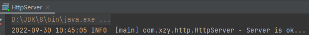
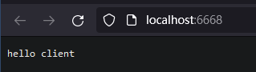
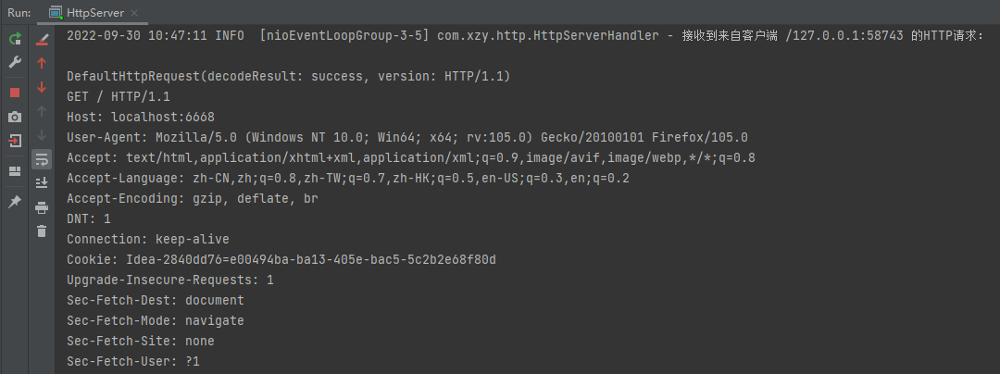

# 基于 Netty 搭建简单 Http 服务器

[TOC]

## 代码

```java
package com.xzy.http;

import io.netty.bootstrap.ServerBootstrap;
import io.netty.channel.ChannelFuture;
import io.netty.channel.EventLoopGroup;
import io.netty.channel.nio.NioEventLoopGroup;
import io.netty.channel.socket.nio.NioServerSocketChannel;
import org.slf4j.Logger;
import org.slf4j.LoggerFactory;

/**
 * 基于 Netty 实现 Http 服务
 *
 * @author xzy.xiao
 * @date 2022/8/24  9:31
 */
public class HttpServer {
    public static final Logger LOGGER = LoggerFactory.getLogger(HttpServer.class);
    public static final String ADDRESS = "127.0.0.1";
    public static final Integer PORT = 6668;


    /**
     * <ol>
     *     <li>启动HttpServer</li>
     *     <li>使用浏览器或Postman等测试工具访问： （请求方式不限）
     *         <ol>
     *              <li>http://localhost:6668</li>
     *              <li>http://localhost:6668/abc</li>
     *              <li>http://localhost:6668/abc/123</li>
     *         </ol>
     * <ol>
     */

    public static void main(String[] args) throws InterruptedException {
        // 1.事件循环组
        EventLoopGroup boosGroup = new NioEventLoopGroup();     // 负责处理连接请求 —— 酒店前台（多个）
        EventLoopGroup workerGroup = new NioEventLoopGroup();   // 负责处理业务逻辑 —— 酒店接待员（多个）

        try {

            // 2.服务端启动器
            ServerBootstrap serverBootstrap = new ServerBootstrap();
            serverBootstrap
                    .group(boosGroup, workerGroup)
                    .channel(NioServerSocketChannel.class) // 通道实现类
                    .childHandler(new HttpServerChannelInitializer()); // 管道处理器

            // 3.启动服务端，开始监听
            LOGGER.info("Server is ok...");
            ChannelFuture channelFuture = serverBootstrap.bind(PORT).sync();

            // 4.关闭
            channelFuture.channel().closeFuture().sync();

        } finally {

            boosGroup.shutdownGracefully();
            workerGroup.shutdownGracefully();

        }
    }
}
```

```java
package com.xzy.http;

import io.netty.channel.Channel;
import io.netty.channel.ChannelHandlerContext;
import io.netty.channel.ChannelInitializer;
import io.netty.channel.ChannelPipeline;
import io.netty.channel.socket.SocketChannel;
import io.netty.handler.codec.http.HttpServerCodec;

/**
 * 配置 Handler
 *
 * @author xzy.xiao
 * @date 2022/8/24  9:31
 */
public class HttpServerChannelInitializer extends ChannelInitializer<SocketChannel> {

    /**
     * This method will be called once the {@link Channel} was registered. After the method returns this instance will be removed from the {@link ChannelPipeline} of the {@link Channel}.
     *
     * @param ch the {@link Channel} which was registered.
     * @throws Exception is thrown if an error occurs. In that case it will be handled by {@link #exceptionCaught(ChannelHandlerContext, Throwable)} which will by default close the {@link Channel}.
     */
    @Override
    public void initChannel(SocketChannel ch) throws Exception {

        ch.pipeline()
                .addLast("MyHttpServerCodec", new HttpServerCodec()) // HTTP编解码处理器
                .addLast("MyHttpServerHandler", new HttpServerHandler()); // 自定义的HTTP处理器
    }
}
```

```java
package com.xzy.http;

import io.netty.buffer.ByteBuf;
import io.netty.buffer.Unpooled;
import io.netty.channel.ChannelHandlerContext;
import io.netty.channel.SimpleChannelInboundHandler;
import io.netty.handler.codec.http.*;
import org.slf4j.Logger;
import org.slf4j.LoggerFactory;

import java.net.SocketAddress;
import java.nio.charset.StandardCharsets;

/**
 * Http 处理器
 *
 * @author xzy.xiao
 * @date 2022/8/24  9:32
 */
public class HttpServerHandler extends SimpleChannelInboundHandler<HttpObject> {

    public static final Logger LOGGER = LoggerFactory.getLogger(HttpServerHandler.class);

    /**
     * Is called for each message of type {@link HttpObject}.
     *
     * @param ctx the {@link ChannelHandlerContext} which this {@link SimpleChannelInboundHandler} belongs to
     * @param msg the message to handle
     * @throws Exception is thrown if an error occurred
     */
    @Override
    protected void channelRead0(ChannelHandlerContext ctx, HttpObject msg) throws Exception {
        /*
         * TODO：每一个Client连接Server时，Server会单独创建Pipeline以及Handler，可使用使用下列语句打印当前Pipeline和Handler的哈希码进行验证
         *         LOGGER.info("Pipeline：{}    Handler：{}", ctx.channel().pipeline().hashCode(), this.hashCode());
         */

        // 处理非 HTTP 请求
        SocketAddress remoteAddress = ctx.channel().remoteAddress();
        if (!(msg instanceof HttpRequest)) {
            LOGGER.info("接收到来自客户端 {} 的非HTTP请求", remoteAddress);
            return;
        }

        // 打印 HTTP 请求
        HttpRequest httpRequest = (HttpRequest) msg;
        LOGGER.info("接收到来自客户端 {} 的HTTP请求：\n\n{}\n", remoteAddress, httpRequest);

        /*
         * TODO：按照当前的实现方式，将对所有 HTTP 请求返回相同的信息。后续可以根据请求类型、请求地址、请求参数返回不同的信息，例如：
         *         HttpMethod method = httpRequest.method();
         *         String uri = httpRequest.uri();
         *         if(...){}
         */

        // 设置 HTTP 响应
        ByteBuf content = Unpooled.copiedBuffer("hello client", StandardCharsets.UTF_8);
        HttpResponse httpResponse = new DefaultFullHttpResponse(HttpVersion.HTTP_1_0, HttpResponseStatus.OK, content);
        httpResponse.headers()
                .set(HttpHeaderNames.CONTENT_TYPE, "text/plain")
                .set(HttpHeaderNames.CONTENT_LENGTH, content.readableBytes());

        // 发送 HTTP 响应
        ctx.writeAndFlush(httpResponse);
    }
}
```

## 演示

1.   启动 Server

     

2.   通过浏览器向 Server 发送一个 HTTP 请求

     

     