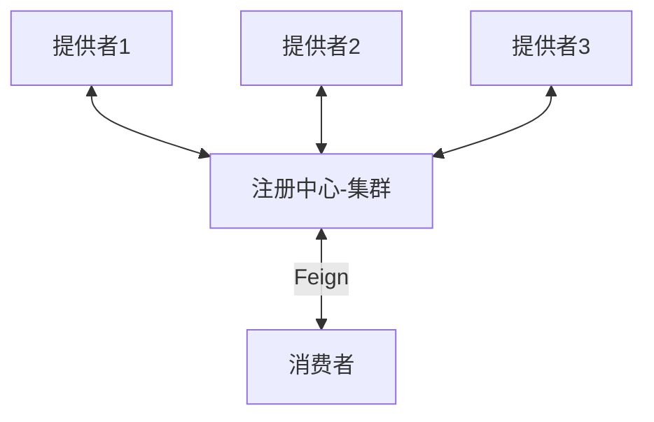

# OpenFeign 基本使用

[toc]




## 服务提供方

### 配置文件

```yaml
server:
  port: 8001

spring:
  application:
    name: cloud-user-service

eureka:
  instance:
    instance-id: cloud-user-service8001
    prefer-ip-address: true
  client:
    register-with-eureka: true # 是否向注册中心注册自己
    fetch-registry: true # 是否需要检索服务
    service-url:
      defaultZone: http://eureka-register1:7001/eureka/,http://eureka-register2:7002/eureka/,http://eureka-register3:7003/eureka/
```

### 对外接口

```java
@RestController
@RequestMapping("/user/user")
@Slf4j
public class UserController {
    @Value("${server.port}")
    private String serverPort;
    
    @Autowired
    private final UserService userService;

    /**
     * 根据主键查询用户信息
     */
    @GetMapping("/{id}")
    public MessageBox<UserEntity> findByPrimaryKey(@PathVariable("id") Long id) {
        String msg = "Server port：" + serverPort + "  UUID：" + UUID.randomUUID().toString();
        return MessageBox.ok(msg, userService.findByPrimaryKey(id));
    }
}
```


## 服务消费方 ⭐

### 依赖文件

```xml
<?xml version="1.0" encoding="UTF-8"?>
<project xmlns = "http://maven.apache.org/POM/4.0.0"
         xmlns:xsi = "http://www.w3.org/2001/XMLSchema-instance"
         xsi:schemaLocation = "http://maven.apache.org/POM/4.0.0 http://maven.apache.org/xsd/maven-4.0.0.xsd">
    <parent>
        <artifactId>spring-cloud-demo-2020</artifactId>
        <groupId>org.xzy</groupId>
        <version>1.0-SNAPSHOT</version>
    </parent>
    
    <modelVersion>4.0.0</modelVersion>
    <artifactId>cloud-service-payment</artifactId>
    <description>支付服务</description>
    
    <dependencies>
        <!--other module-->
        <dependency>
            <groupId>org.xzy</groupId>
            <artifactId>cloud-api-common</artifactId>
            <version>1.0-SNAPSHOT</version>
        </dependency>
        <!--spring-->
        <dependency>
            <groupId>org.springframework.boot</groupId>
            <artifactId>spring-boot-starter-web</artifactId>
        </dependency>
        <dependency>
            <groupId>org.springframework.boot</groupId>
            <artifactId>spring-boot-starter-actuator</artifactId>
        </dependency>
        <!--spring-boot-tools-->
        <dependency>
            <groupId>org.springframework.boot</groupId>
            <artifactId>spring-boot-devtools</artifactId>
            <scope>runtime</scope>
            <optional>true</optional>
        </dependency>
        <!--spring-boot-configuration-processor-->
        <dependency>
            <groupId>org.springframework.boot</groupId>
            <artifactId>spring-boot-configuration-processor</artifactId>
        </dependency>
        <!--lombok-->
        <dependency>
            <groupId>org.projectlombok</groupId>
            <artifactId>lombok</artifactId>
        </dependency>
        <!--eureka-client-->
        <dependency>
            <groupId>org.springframework.cloud</groupId>
            <artifactId>spring-cloud-starter-netflix-eureka-client</artifactId>
        </dependency>
        
        <!--openFeign-->
        <dependency>
            <groupId>org.springframework.cloud</groupId>
            <artifactId>spring-cloud-starter-openfeign</artifactId>
        </dependency>
        
    </dependencies>

</project>
```

### 配置文件

```yaml
server:
  port: 9001

spring:
  application:
    name: cloud-payment-service

eureka:
  instance:
    instance-id: cloud-payment-service9001
    prefer-ip-address: true
  client:
    register-with-eureka: true # 是否向注册中心注册自己
    fetch-registry: true # 是否需要检索服务
    service-url:
      defaultZone: http://eureka-register1:7001/eureka/,http://eureka-register2:7002/eureka/,http://eureka-register3:7003/eureka/
```

### 主启动类

```java
@SpringBootApplication
@EnableEurekaClient
@EnableDiscoveryClient
@EnableFeignClients
public class PaymentApplication {
    public static void main(String[] args) {
        SpringApplication.run(PaymentApplication.class, args);
    }
}
```

配置 @EnableFeignClients 注解后，Spring Cloud 应用在启动后会扫描标有 @FeignClient 注解的接口，生成代理，并注册到 Spring 容器。

### 服务接口绑定

```java
@Component
@FeignClient("cloud-user-service")
public interface UserControllerFeign {

    /**
     * 根据主键查询用户信息
     *
     * @param id 主键
     * @return 用户信息
     */
    @GetMapping("/user/user/{id}") // 注意这个地址！
    MessageBox<UserEntity> findByPrimaryKey(@PathVariable("id") Long id);
}
```

进行服务接口绑定时需要注意2点：

1.   @FeignClient 注解的 value 属性用于配置服务提供者的服务名，即服务提供者配置项 `spring.application.name` 的值
2.   接口中定义的每个方法与服务提供者的 Controller 中定义的服务方法对应

### 服务接口调用

```java
/**
 * 支付Controller
 *
 * @author xzy
 * @date 2022/1/4 15:51
 */
@RestController
@RequestMapping(path = "/payment/payment")
public class PaymentController {
    private final UserControllerFeign userControllerFeign;

    @Autowired
    public PaymentController(UserControllerFeign userControllerFeign) {
        this.userControllerFeign = userControllerFeign;
    }

    @GetMapping("/get_user_info")
    public MessageBox<UserEntity> getUserInfo(@RequestParam("user_id") Long userId) {
        return userControllerFeign.findByPrimaryKey(userId); // 服务接口调用
    }
}
```


## 测试

1.   启动多个 Eureka 实例，搭建注册中心集群
2.   启动多个 Provider 实例
3.   启动 Consumer 实例
4.   调用 Consumer 接口多次，根据返回信息判断 Provider 接口是否调用成功，并且是否实现负载均衡