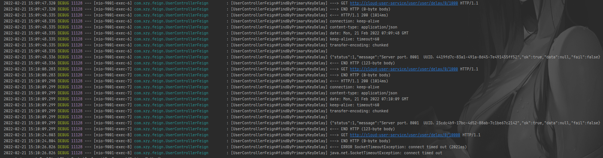

# OpenFeign 日志增强

OpenFeign 提供了日志打印功能，我们可以通过配置调整日志级别，来了解请求的细节。Feign 为每一个 FeignClient 都提供了一个 feign.Logger 实例，通过它可以对 OpenFeign 服务绑定接口的调用情况进行监控。

OpenFeign 日志打印功能的开启方式比较简单，下面我们就通过一个实例进行演示：

## 1、调整 Spring 日志输出等级

```yaml
logging:
  level:
    xxx: debug
```

-   loggin.level 用于控制应用输出哪些日志内容
-   xxx 可以是标注了 @FeignClient 的接口的完整类名，也可以是部分路径

## 2、调整 OpenFeign 日志输出等级

```java
@Configuration
public class FeignConfig {

    @Bean
    Logger.Level feignLoggerLevel() {
        return Logger.Level.FULL;
    }
}
```

-   Logger.Level 用于控制 OpenFeign 输出哪些日志内容
-   Logger.Level 的具体级别如下
    -   NONE：不记录任何信息
    -   BASIC：仅记录请求方法、URL 以及响应状态码和执行时间
    -   HEADERS：除了记录 BASIC 级别的信息外，还会记录请求和响应的头信息
    -   FULL：记录所有请求与响应的明细，包括头信息、请求体、元数据等等


日志效果：


