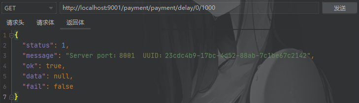
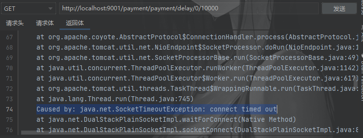

# OpenFeign 超时控制

[toc]

## 配置

由于 OpenFeign 集成了 `Ribbon`，其服务调用以及负载均衡在底层都是依靠 Ribbon 实现的，因此 OpenFeign 的超时控制也是通过 Ribbon 来实现的：（OpenFeign 默认的超时时间是 1 s）

```yaml
ribbon:
  ReadTimeout: xxxx # 建立连接所用的时间，适用于网络状况正常的情况下，两端两端连接所用的时间（毫秒）
  ConnectionTimeout: xxxx # 建立连接后，服务器读取到可用资源的时间（毫秒）
```


## 测试

在 [OpenFeign 实战 - 基本使用.md](./OpenFeign 实战 - 基本使用.md) 的基础上修改项目：

1.   服务提供者新增接口

     ```java
     /**
      * 根据主键查询用户信息（带有延时）
      *
      * @param id    主键
      * @param delay 延时时间（毫秒）
      * @return 用户信息
      */
     @GetMapping("/delay/{id}/{delay}")
     public MessageBox<UserEntity> findByPrimaryKeyDelay(@PathVariable("id") Long id, @PathVariable("delay") Long delay) {
     
         try {
             log.info("延时{}毫秒", delay);
             TimeUnit.MILLISECONDS.sleep(delay);
         } catch (InterruptedException e) {
             e.printStackTrace();
         }
     
         log.info("延时结束");
         String msg = "Server port：" + serverPort + "  UUID：" + UUID.randomUUID().toString();
         return MessageBox.ok(msg, userService.findByPrimaryKey(id));
     }
     ```

2.   服务消费者新增接口绑定

     ```java
     @Service
     @FeignClient("cloud-user-service")
     public interface UserControllerFeign {
     
         /**
          * 根据主键查询用户信息（带有延时）
          *
          * @param id    主键
          * @param delay 延时时间（毫秒）
          * @return 用户信息
          */
         @GetMapping("/user/user/delay/{id}/{delay}")
         MessageBox<UserEntity> findByPrimaryKeyDelay(@PathVariable("id") Long id, @PathVariable("delay") Long delay);
     }
     ```

3.   服务消费者修改配置，设置超时时间

     ```yaml
     ribbon:
       ReadTimeout: 3000 # 建立连接所用的时间，适用于网络状况正常的情况下，两端两端连接所用的时间（毫秒）
       ConnectionTimeout: 3000 # 建立连接后，服务器读取到可用资源的时间（毫秒）
     ```

4.   启动注册中心、启动服务提供者、启动服务消费者，根据不同的延时时间调用服务提供者：

     1000毫秒：

     

     10000毫秒：

     
