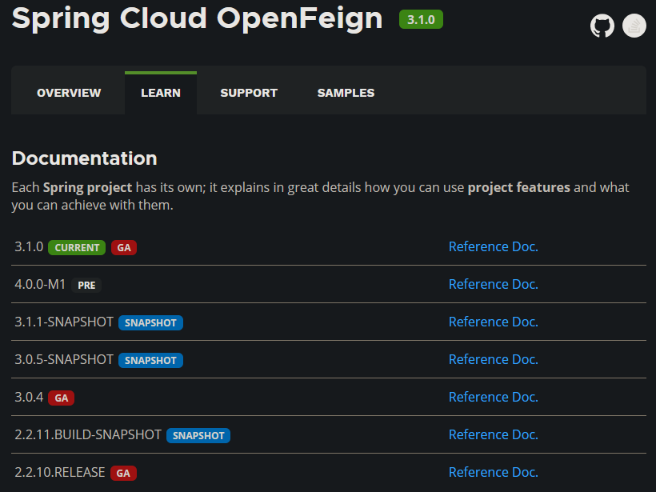

# OpenFeign 理论

[toc]

## 资料

<(￣︶￣)↗[Spring 官网](https://spring.io/projects/spring-cloud-openfeign)

<(￣︶￣)↗[Github 项目](https://github.com/OpenFeign/feign)

<(￣︶￣)↗[相关博客](http://c.biancheng.net/springcloud/open-feign.html)

OpenFeign 各版本的官方教程：

## Feign

Feign 是 Netflix 公司发布的一种实现服务调用的开源组件。Spring Cloud 将其与 Netflix 发布的其他开源组件（例如，Eureka、Ribbon、Hystrix）一起整合进了 Spring Cloud Netflix 模块中，整合后的全称为 Spring Cloud Netflix Feign

<u>Feign 集成了 Ribbon，利用 Ribbon 维护了一份可用服务清单，并通过 Ribbon 实现客户端负载均衡。</u>

Feign 是一种<u>声明式的服务调用组件</u>，它在 RestTemplate 的基础上做了进一步的封装。<u>通过 Feign，我们只需要先声明一个接口，然后通过注解进行简单的配置，即可实现对 HTTP 接口的绑定。通过 Feign，客户端可以像调用本地方法一样调用远程服务，并且完全感觉不到这是在进行远程调用。</u>（类比使用 Mybatis 时，只需要在 Dao 接口上添加 @Mapper 注解，就可以通过 Dao 接口进行数据库操作）

Feign 支持多种注解，例如 Feign 自带的注解以及 JAX-RS 注解等，<u>但遗憾的是 Feign 本身并不支持 Spring MVC 注解</u>，这无疑会给广大 Spring 用户带来不便。

2019 年 Netflix 公司宣布 Feign 组件正式进入停更维护状态，于是 Spring 官方便推出了一个名为 OpenFeign 的组件作为 Feign 的替代方案。

## OpenFeign

<u>OpenFeign 全称 Spring Cloud OpenFeign，它是 Spring 官方推出的一种声明式服务调用与负载均衡组件，它的出现就是为了替代进入停更维护状态的 Feign</u>。

OpenFeign 是 Spring Cloud 对 Feign 的<u>二次封装</u>，它具有 Feign 的所有功能，<u>并在 Feign 的基础上增加了对 Spring MVC 注解的支持</u>，例如 @RequestMapping、@GetMapping 和 @PostMapping 等。

使用 OpenFegin 进行远程服务调用时，常用注解如下表：

| 注解                                         | 说明                                                         |
| -------------------------------------------- | ------------------------------------------------------------ |
| @FeignClient        | 该注解用于通知 OpenFeign 组件对 @RequestMapping 注解下的接口进行解析，并通过动态代理的方式产生实现类，实现负载均衡和服务调用。 |
| @EnableFeignClients | 该注解用于开启 OpenFeign 功能，当 Spring Cloud 应用启动时，OpenFeign 会扫描标有 @FeignClient 注解的接口，生成代理并注册到 Spring 容器中。 |
| @RequestMapping                              | Spring MVC 注解，在 Spring MVC 中使用该注解映射请求，通过它来指定控制器（Controller）可以处理哪些 URL 请求，相当于 Servlet 中 web.xml 的配置。 |
| @GetMapping                                  | Spring MVC 注解，用来映射 GET 请求，它是一个组合注解，相当于 @RequestMapping(method = RequestMethod.GET) 。 |
| @PostMapping                                 | Spring MVC 注解，用来映射 POST 请求，它是一个组合注解，相当于 @RequestMapping(method = RequestMethod.POST) 。 |

>   Spring Cloud Finchley 及以上版本一般使用 OpenFeign 作为其服务调用组件。由于 OpenFeign 是在 2019 年 Feign 停更进入维护后推出的，因此大多数 2019 年及以后的新项目使用的都是 OpenFeign，而 2018 年以前的项目一般使用 Feign。

