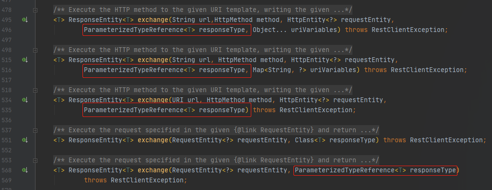

# RestTemplate 实战 - 接收泛型数据

**服务提供方：**

```java
@RequestMapping(path = "...")
public MessageBox<Map<String, Object>> testReceive(...) {...}
```

请求类型、接口地址以及接口内部逻辑都不重要，重要的是接口返回的是泛型数据 `MessageBox<Map<String, Object>>`


**服务调用方：**

```java
@PostMapping("...")
public void dealWithGenericData(...) {
    ...
        
    String url = ...;
    HttpEntity<String> fromEntity = ...;
    
    // 处理泛型数据 ⭐
    ParameterizedTypeReference<MessageBox<Map<String, Object>>> typeReference = new ParameterizedTypeReference<MessageBox<Map<String, Object>>>() {};
   
    // 发送请求 
    ResponseEntity<MessageBox<Map<String, Object>>> responseEntity = restTemplate.exchange(url, HttpMethod.POST, fromEntity, typeReference);

    // 处理响应信息
    MessageBox<Map<String, Object>> body = responseEntity.getBody();
    log.info(String.valueOf(body));
}
```


**相关源码：**



>   The given ParameterizedTypeReference <font color = red>is used to pass generic type information</font>：
>
>   ```java
>   ParameterizedTypeReference<List<MyBean>> myBean = new ParameterizedTypeReference<List<MyBean>>() {};
>   ResponseEntity<List<MyBean>> response = template.exchange("http://example.com",HttpMethod.GET, null, myBean);
>   ```

