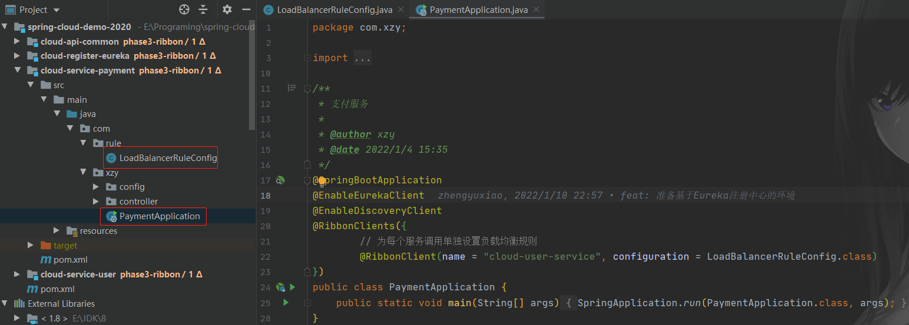
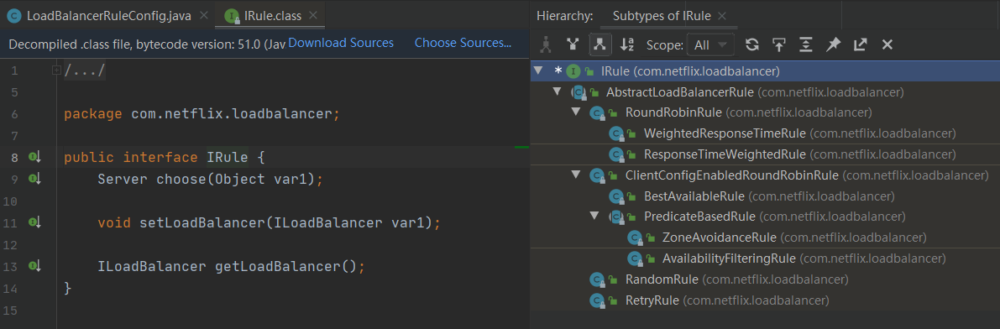

# 配置 Ribbon 负载均衡规则

调整 Ribbon 的负载均衡规则，操作起来其实非常简单：

1.   创建配置类：

     ```java
     @Configuration
     public class LoadBalancerRuleConfig {
         /**
          * Ribbon自带的负载均衡实现类（部分）：
          * -- RoundRobinRule：在现有服务实例之间轮询分配流量
          * -- WeightedResponseTimeRule：拓展自RoundRobinRule，分配流量时偏向平均响应时间短的服务实例
          * -- RandomRule：在现有服务实例之间随机分配流量
          * -- RetryRule：拓展自RoundRobinRule，如果获取服务失败则在指定时间内进行重试，获取可用服务实例
          * -- BestAvailableRule：先过滤掉由于多次访问故障而处于断路器跳闸状态的实例，然后选择一个并发量最小的实例
          * -- AvailabilityFilteringRule：先过滤掉故障实例，再选择并发较小的实例
          * -- ZoneAvoidanceRule：（默认规则）综合判断实例的性能和可用性。
          */
         @Bean
         public IRule iRule() {
             return new RandomRule();
         }
     }
     ```

2.   修改主启动类：

     ```java
     @SpringBootApplication
     @EnableEurekaClient
     @RibbonClients({
             @RibbonClient(name = "cloud-user-service", configuration = LoadBalancerRuleConfig.class)
     })
     public class PaymentApplication {
         public static void main(String[] args) {
             SpringApplication.run(PaymentApplication.class, args);
         }
     }
     ```


虽然操作非常简单，但是需要关注一些细节：

1. 官方文档给出了警告 ⚠：设置负载均衡的配置类不要放在 @ComponentScan 所扫描的包下面，否则这个配置就是被所有 Ribbon 客户端所共享的，就达不到为不同 Ribbon 客户端单独设置负载均衡规则的目的。

    再来看看我们的工程结构：

    

2. 官方提供了许多负载均衡策略

    

    -   RoundRobinRule：在现有服务实例之间轮询分配流量（<font color = red>默认</font>）
    -   WeightedResponseTimeRule：拓展自 RoundRobinRule，分配流量时偏向平均响应时间短的服务实例
    -   RandomRule：在现有服务实例之间随机分配流量
    -   RetryRule：拓展自 RoundRobinRule，如果获取服务失败则在指定时间内进行重试，获取可用服务实例
    -   BestAvailableRule：先过滤掉由于多次访问故障而处于断路器跳闸状态的实例，然后选择一个并发量最小的实例
    -   AvailabilityFilteringRule：先过滤掉故障实例，再选择并发较小的实例
    -   ZoneAvoidanceRule：（默认规则）综合判断实例的性能和可用性。

    

    <u>如果官方的负载均衡策略不能满足我们的使用需求，可用通过实现 IRule 接口来自定义负载均衡策略。</u>

    ```java
    package com.netflix.loadbalancer;
    
    public interface IRule {
        Server choose(Object var1);
    
        void setLoadBalancer(ILoadBalancer var1);
    
        ILoadBalancer getLoadBalancer();
    }
    ```

