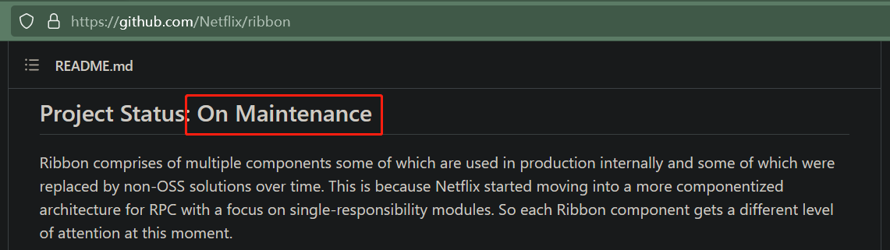

# Ribbon 理论

<(￣︶￣)↗[项目地址](https://github.com/Netflix/ribbon)

## 1、是什么？

Ribbon 是 Netflix 公司搞出来的一个开源项目，它的主要功能是提供<u>客户端的软件负载均衡</u>算法以及服务调用。

遗憾的是，Ribbon 目前已经进入维护状态，未来的替代方案是 Spring Cloud Loadbalancer ：

>   简单的说，负载均衡就是将客户端请求分发到不同的服务器，用多个服务器来分担系统压力，从而实现系统的高可用。
>
>   负载均衡的分类：
>
>   -   **软件负载均衡 vs 硬件负载均衡**：常见的负载均衡软件有 Nginx、LVS，常见的负载均衡硬件有 F5
>
>   -   **客户端负载均衡 vs 服务端负载均衡**：Nginx 就是服务端负载均衡，所有客户端请求会先发到 Nginx，然后由 Nginx 负责将请求分配到不同的服务端。Ribbon 就是客户端负载均衡，客户端会先从注册中心获取到所有服务端的信息，然后自行决定需要将请求发送给哪个客户端。

## 2、能干嘛？

[官方说明](https://github.com/Netflix/ribbon)

Ribbon is a client side IPC library that is battle-tested in cloud. It provides the following features

-   <u>Load balancing</u>
-   Fault tolerance
-   Multiple protocol (HTTP, TCP, UDP) support in an asynchronous and reactive model
-   Caching and batching

其实最核心的还是 Load balancing

