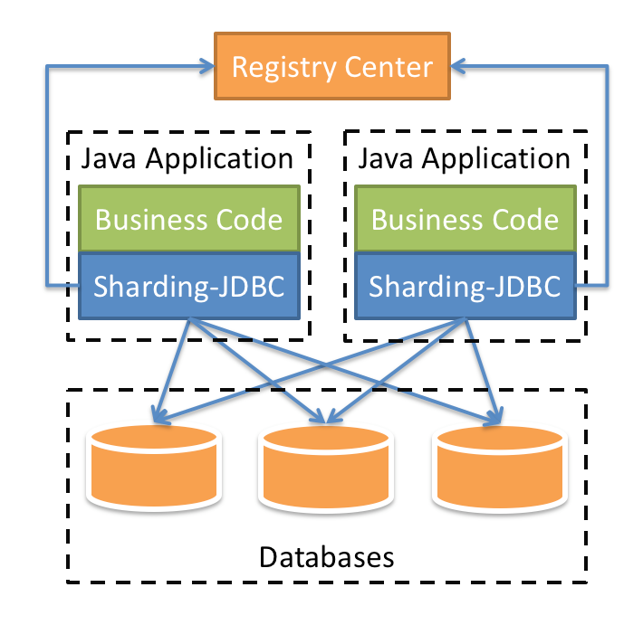

# Sharding JDBC

>   官方文档：https://shardingsphere.apache.org/document/legacy/4.x/document/cn/overview/

>   ### Sharding Sphere
>
>   ShardingSphere 是一套开源的分布式数据库中间件解决方案组成的生态圈，它由 Sharding-JDBC、Sharding-Proxy 和 Sharding-Sidecar（计划中）这3款相互独立的产品组成。 他们均提供标准化的`数据分片`、`分布式事务`和`数据库治理`功能，可适用于如 Java 同构、异构语言、云原生等各种多样化的应用场景。
>
>   ShardingSphere 的定位是**关系型数据库中间件**，旨在充分合理地在分布式的场景下利用关系型数据库的计算和存储能力，而并非实现一个全新的关系型数据库。 它与NoSQL和NewSQL是并存而非互斥的关系。
>
>   2020年4月16日，ShardingSphere 从[Apache孵化器](http://incubator.apache.org/projects/shardingsphere.html)毕业，成为 Apache 顶级项目。
>
>   

Sharding JDBC 的定位是轻量级 Java 框架，在  Java 的 JDBC 层的基础上提供额外的服务。它使用客户端直连数据库，以 jar 包形式提供服务，无需额外部署和依赖，可理解为<u>增强版的 JDBC 驱动</u>，完全兼容 JDBC 和各种 ORM 框架。

-   适用于任何基于 JDBC 的 ORM 框架，如：JPA, Hibernate, Mybatis, Spring JDBC Template或直接使用JDBC。
-   支持任何第三方的数据库连接池，如：DBCP, C3P0, BoneCP, Druid, HikariCP等。
-   支持任意实现 JDBC 规范的数据库。目前支持MySQL，Oracle，SQLServer，PostgreSQL以及任何遵循SQL92标准的数据库。

