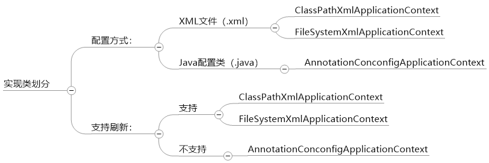
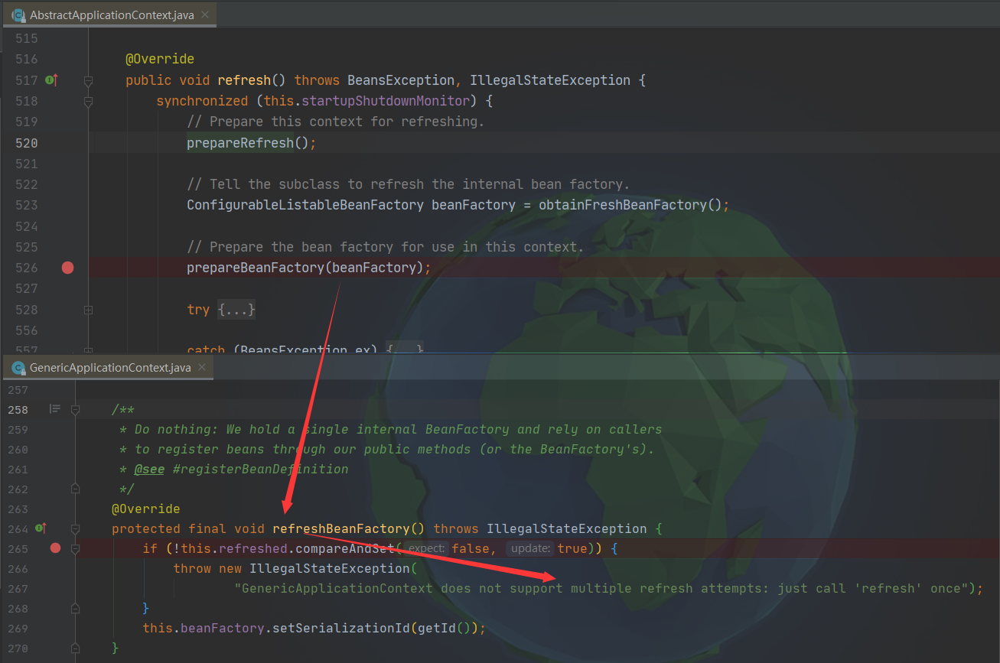
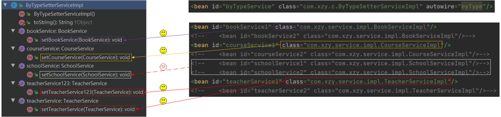

[TOC]

# 一、你知道几种定义Bean的方式？

>    JavaBean、SpringBean、对象
>
>   1.   无论是JavaBean还是SpringBean，首先，它们肯定都是对象
>   2.   JavaBean是满足特定规范的类的对象：①所有属性都是private ②通过getter和setter访问属性
>   3.   SpringBean是由Spring框架生成的对象

## 1、\<bean>

1.   创建XML文件，在XML文件中通过<bean>标签定义Bean

     ```xml
     <?xml version="1.0" encoding="UTF-8"?>
     <beans xmlns="http://www.springframework.org/schema/beans"
            xmlns:xsi="http://www.w3.org/2001/XMLSchema-instance"
            xsi:schemaLocation="http://www.springframework.org/schema/beans http://www.springframework.org/schema/beans/spring-beans.xsd">
     
         <!--通过XML文件中的bean标签定义Bean-->
         <bean id="userServiceXml" class="com.xzy.a.UserServiceImpl"/>
     
     </beans>
     ```

2.   Spring容器读取XML文件，根据Bean定义信息创建Bean

     ```java
     public class Main {
         public static void main(String[] args) {
             ClassPathXmlApplicationContext applicationContext = new ClassPathXmlApplicationContext("spring.xml");
             UserService userServiceXml = applicationContext.getBean("userServiceXml", UserService.class);
             System.out.println(userServiceXml);
         }
     }
     ```

     

## 2、@Bean

1.   创建配置类，在配置类中通过@Bean定义Bean

     ```java
     public class StudentConfig {
     
         /*
          * 比较通过XML和配置类定义Bean：
          * 1、XML 《==》 配置类
          * 2、<bean> 《==》 @Bean
          */
     
         /*
          * 相比于<bean>，使用@Bean定义Bean更有优势：
          * 1、可以灵活的控制Bean的创建
          * 2、解析XML文件性能更差
          */
     
         /**
          * Bean的ID等于方法名
          */
         @Bean
         public StudentService studentService() {
             // do something to make bean
             return new StudentServiceImpl();
         }
     }
     ```

2.   Spring容器读取配置类，根据Bean定义信息创建Bean

     ```java
     public static void method1() {
         AnnotationConfigApplicationContext applicationContext = new AnnotationConfigApplicationContext();
         applicationContext.register(StudentConfig.class);
         applicationContext.refresh();
         
         StudentService studentService = applicationContext.getBean(StudentService.class);
         System.out.println(studentService);
     }
     
     public static void method2() {
         AnnotationConfigApplicationContext applicationContext = new AnnotationConfigApplicationContext(StudentConfig.class);
         
         StudentService studentService = applicationContext.getBean(StudentService.class);
         System.out.println(studentService);
     }
     ```

     

## 3、@Component

1.   使用@Component注解标注目标类

     ```java
     @Component
     public class TeacherServiceImpl implements TeacherService {
     }
     ```

2.   通过XML或者配置类设置组件扫描

3.   Spring容器读取XML或配置类，根据设置进行组件扫描，获取Bean定义信息，创建Bean

     xml：

     ```java
     <?xml version="1.0" encoding="UTF-8"?>
     <beans xmlns="http://www.springframework.org/schema/beans"
            xmlns:xsi="http://www.w3.org/2001/XMLSchema-instance"
            xmlns:context="http://www.springframework.org/schema/context"
            xsi:schemaLocation="http://www.springframework.org/schema/beans http://www.springframework.org/schema/beans/spring-beans.xsd http://www.springframework.org/schema/context https://www.springframework.org/schema/context/spring-context.xsd">
     
         <!--组件扫描-->
         <context:component-scan base-package="com.xzy.c"/>
     </beans>
     ```

     配置类：

     ```java
     @ComponentScan(basePackages = "com.xzy.c")
     public class TeacherConfig {
     }
     ```

     Spring容器：

     ```java
     public static void method1() {
         ClassPathXmlApplicationContext applicationContext = new ClassPathXmlApplicationContext("scan.xml");
         TeacherService teacherService = applicationContext.getBean(TeacherService.class);
         System.out.println(teacherService);
     }
     
     public static void method2() {
         AnnotationConfigApplicationContext applicationContext = new AnnotationConfigApplicationContext(TeacherConfig.class);
         TeacherService teacherService = applicationContext.getBean(TeacherService.class);
         System.out.println(teacherService);
     }
     ```


## 4、BeanDefinition ⚠

>   大部分框架的使用方式可以分为2类：声明式、编程式。上面3种定义Bean的方式都属于声明式，本节要说明的BeanDefinitoin则属于编程式。另外，上面3种Bean定义方式的底层都是基于BeanDefinition实现的。
>
>   BeanDefinition包含了Bean的所有描述信息：
>
>   


```java
public static void method0() {
    // 1、通过BeanDefinition定义Bean
    AbstractBeanDefinition beanDefinition = BeanDefinitionBuilder.genericBeanDefinition().getBeanDefinition();
    beanDefinition.setBeanClass(HumanServiceImpl.class);

    // 2、将BeanDefinition注册到Spring容器
    AnnotationConfigApplicationContext applicationContext = new AnnotationConfigApplicationContext();
    applicationContext.registerBeanDefinition("humanServiceImpl", beanDefinition);
    applicationContext.refresh();

    // 3、Spring容器依据BeanDefinition创建Bean
    HumanService bean = applicationContext.getBean(HumanService.class);
    System.out.println(bean);
}

public static void method1() {
    AnnotationConfigApplicationContext applicationContext = new AnnotationConfigApplicationContext();
    // 查看registerBean方法的源码可以发现，最终还是通过BeanDefinition定义Bean
    applicationContext.registerBean(HumanServiceImpl.class);
    applicationContext.refresh();

    HumanService bean = applicationContext.getBean(HumanService.class);
    System.out.println(bean);
}
```


## 5、FactoryBean ⚠

1.   创建实现FactoryBean接口的类

     ```java
     public class PersonFactoryBean implements FactoryBean<PersonService> {
         /**
          * Return an instance (possibly shared or independent) of the object
          * managed by this factory.
          * <p>As with a {@link BeanFactory}, this allows support for both the
          * Singleton and Prototype design pattern.
          * <p>If this FactoryBean is not fully initialized yet at the time of
          * the call (for example because it is involved in a circular reference),
          * throw a corresponding {@link FactoryBeanNotInitializedException}.
          * <p>As of Spring 2.0, FactoryBeans are allowed to return {@code null}
          * objects. The factory will consider this as normal value to be used; it
          * will not throw a FactoryBeanNotInitializedException in this case anymore.
          * FactoryBean implementations are encouraged to throw
          * FactoryBeanNotInitializedException themselves now, as appropriate.
          *
          * @return an instance of the bean (can be {@code null})
          * @throws Exception in case of creation errors
          * @see FactoryBeanNotInitializedException
          */
         @Override
         public PersonService getObject() throws Exception {
             // do something ...
             return new PersonServiceImpl();
         }
     
         /**
          * Return the type of object that this FactoryBean creates,
          * or {@code null} if not known in advance.
          * <p>This allows one to check for specific types of beans without
          * instantiating objects, for example on autowiring.
          * <p>In the case of implementations that are creating a singleton object,
          * this method should try to avoid singleton creation as far as possible;
          * it should rather estimate the type in advance.
          * For prototypes, returning a meaningful type here is advisable too.
          * <p>This method can be called <i>before</i> this FactoryBean has
          * been fully initialized. It must not rely on state created during
          * initialization; of course, it can still use such state if available.
          * <p><b>NOTE:</b> Autowiring will simply ignore FactoryBeans that return
          * {@code null} here. Therefore it is highly recommended to implement
          * this method properly, using the current state of the FactoryBean.
          *
          * @return the type of object that this FactoryBean creates,
          * or {@code null} if not known at the time of the call
          * @see ListableBeanFactory#getBeansOfType
          */
         @Override
         public Class<?> getObjectType() {
             return PersonServiceImpl.class;
         }
     }
     ```

2.   向Spring容器传入FactoryBean的定义

     ```java
     public static void main(String[] args) {
         // 1、通过BeanDefinition定义FactoryBean
         AbstractBeanDefinition beanDefinition = BeanDefinitionBuilder.genericBeanDefinition().getBeanDefinition();
         beanDefinition.setBeanClass(PersonFactoryBean.class);
     
         // 2、向Spring容器注册BeanDefinition
         AnnotationConfigApplicationContext applicationContext = new AnnotationConfigApplicationContext();
         applicationContext.registerBeanDefinition("person", beanDefinition);
         applicationContext.refresh();
     
         // 3、从Spring容器获取Bean
         PersonService personService = (PersonService) applicationContext.getBean("person");
         PersonFactoryBean personFactoryBean = (PersonFactoryBean) applicationContext.getBean("&person");
     
     
         /*
          * FactoryBean是非常特殊的Bean：Spring容器会根据FactoryBean的BeanDefinition创建两个Bean，
          * 一个是FactoryBean本身，一个是FactoryBean中getObject()方法返回的Bean。
          */
         System.out.println(personService);
         System.out.println(personFactoryBean);
     
         System.out.println(applicationContext.getBean(PersonService.class));
         System.out.println(applicationContext.getBean(PersonFactoryBean.class));
     }
     ```

     FactoryBean非常特殊：表明看传入Spring容器的只有FactoryBean的定义，但是，Spring容器最终会创建两个Bean——FactoryBean本身 + FactoryBean内getObject()方法返回的Bean（挂羊头卖狗肉、明修栈道暗度陈仓、借壳上市）

     >   需要注意：
     >
     >   1.   向Spring容器传入Bean定义的时候，如果没有指定beanName，默认采用首字母小写后的类名
     >   2.   如果没有指定FactoryBean的beanName，需要注意通过FactoryBean首字母小写后的类名获取到的Bean的类型！

     

## 6、Suppiler

```java
public static void method0() {
    AnnotationConfigApplicationContext applicationContext = new AnnotationConfigApplicationContext();
    applicationContext.registerBean(Cat.class);
    applicationContext.refresh();

    // Cat的属性都是空的
    Cat cat = applicationContext.getBean(Cat.class);
    System.out.println(cat);
}

public static void method1() {
    AnnotationConfigApplicationContext applicationContext = new AnnotationConfigApplicationContext();
    applicationContext.registerBean(Cat.class, new Supplier<Cat>() {
        @Override
        public Cat get() {
            // 自定义创建Cat的过程
            Cat cat = new Cat();
            cat.setName("Tom");
            return cat;
        }
    });
    applicationContext.refresh();

    // 由于自定义了填充Cat的过程，因此Cat的属性不是空的
    Cat cat = applicationContext.getBean(Cat.class);
    System.out.println(cat);
}
```


# 二、Spring容器到底是什么鬼？

## 1、单例池、BeanFactory、ApplicationContext

### 1.1 单例模式、单例Bean、单例池

什么是单例模式？

>   简单的说就是通过一些手段使得==某个类在全局只存在一个对象==


什么是单例 Bean ？

>   简单的说就是通过一些手段使得==某个类具有某给名称的对象在 Spring 容器内只有一个==
>
>   ⚠ 单例Bean ≠ 单例模式：简单的说，单例模式更加严格，因为它直接将类的构造方法 private 了，没法手动创建对象；单例Bean则宽松很多——除了由 Spring 容器创建并管理对象，还可以手动创建对象。


什么是单例池？

>   ==单例池存在的意义就是实现单例 Bean==。
>
>   Spring 中单例池的实现：
>
>   ```java
>   ConcurrentHashMap<String,Object> singletonObject; // beanName->singletonBean
>   ```
>
>   单例池添加单例 Bean 的时机：
>
>   -   懒加载单例 Bean —— 初次使用的时候创建并添加
>   -   非懒加载单例 Bean —— Spring 启动的时候创建并添加


### 1.2 BeanFactory

BeanFactory 相当于一个容器 —— 装有 Bean 定义信息（BeanDefiniton）、Bean（单例池）


### 1.3 ApplicationContext

ApplicationContext 间接继承了 BeanFactory，同时还继承了很多其他接口，因此，ApplicationContext 可以替换 BeanFactory，但 ApplicationContext 比 BeanFactory 强大


## 2、ApplicationContext 实现类的划分





### 划分角度：配置方式

```java
public static void method1() {
    // 基于classpath的相对路径
    ClassPathXmlApplicationContext applicationContext = new ClassPathXmlApplicationContext("beanConfig.xml");
    System.out.println(applicationContext.getBean(UserService.class));
}

public static void method2() {
    // 基于工程的相对路径
    FileSystemXmlApplicationContext applicationContext1 = new FileSystemXmlApplicationContext("demo2\\src\\main\\resources\\beanConfig.xml");
    System.out.println(applicationContext1.getBean(UserService.class));


    // 文件系统绝对路径
    FileSystemXmlApplicationContext applicationContext2 = new FileSystemXmlApplicationContext("E:\\Programing\\spring-learning\\spring-zhouyu\\demo2\\src\\main\\resources\\beanConfig.xml");
    System.out.println(applicationContext2.getBean(UserService.class));
}

public static void method3() {
    // 基于Java配置类
    AnnotationConfigApplicationContext applicationContext = new AnnotationConfigApplicationContext(BeanConfig.class);
    System.out.println(applicationContext.getBean(UserService.class));
}
```

>   什么是classpath？
>
>   
>
>   
>
>   什么是工程路径？什么是工程相对路径？
>
>   


### 划分角度：是否支持刷新（refresh）

```java
/**
 * 支持刷新与不支持刷新的Spring容器
 */
private static void method1() {
    // 支持刷新
    ClassPathXmlApplicationContext classPathXmlApplicationContext = new ClassPathXmlApplicationContext("beanConfig.xml");
    classPathXmlApplicationContext.refresh();

    // 不支持刷新
    AnnotationConfigApplicationContext annotationConfigApplicationContext = new AnnotationConfigApplicationContext(BeanConfig.class);
    annotationConfigApplicationContext.refresh();

    /*
     * 比较两个类的继承体系：
     *     ClassPathXmlApplicationContext        -> (...) -> AbstractRefreshableApplicationContext -> (...) -> AbstractApplicationContext
     *     AnnotationConfigApplicationContext    -> GenericApplication                                      -> AbstractApplicationContext
     *
     * 查看源码可以发现：
     *     1. refresh() 定义于 AbstractApplicationContext
     *     2. refresh() 调用 refreshBeanFactory() 来刷新 Spring 容器
     *     3. refreshBeanFactory() 是一个抽象方法，交由子类实现
     *     4. GenericApplication 在 refreshBeanFactory() 中禁用了刷新功能；AbstractRefreshableApplicationContext 在 refreshBeanFactory() 中支持了刷新功能
     */
}

/**
 * Spring容器支持刷新会有什么用处？
 */
private static void method2() {
    ClassPathXmlApplicationContext applicationContext = new ClassPathXmlApplicationContext("beanConfig.xml");

    // 可以观察到刷新后从Spring容器中获取到的单例Bean变了（底层原理：单例池被重新创建）
    System.out.println(applicationContext.getBean(UserService.class));
    System.out.println(applicationContext.getBean(UserService.class));
    System.out.println(applicationContext.getBean(UserService.class));
    applicationContext.refresh();
    System.out.println(applicationContext.getBean(UserService.class));
    System.out.println(applicationContext.getBean(UserService.class));
    System.out.println(applicationContext.getBean(UserService.class));

    /*
     * 更高级一些的功能：在程序的运行过程中，修改XML文件中的Bean定义，然后刷新Spring容器...
     */
}
```

AnnotationConfigApplicationContext 与 ClassPathXmlApplicationContext 的继承体系：


从源码层面解释 AnnotationConfigApplicationContext 为什么不支持刷新：



# 三、Spring的生命周期


# 四、Spring有几种依赖注入的方式？

## 1、 手动注入


### A. \<property/> + Setter

通过<bean/>标签的<property/>子标签配合Java类的Set方法来实现依赖注入的手动设置

java类：

```java
/**
 * 依赖注入的方式：<property/> + set方法
 *
 * @author xzy
 * @date 2021/12/6 21:50
 */
@Slf4j
@ToString
public class AaaServiceImpl {

    /*
     * 通过<property>标签能够为Bean的属性手动设置注入的值：
     *
     * <bean id="xxx" class="xxx">
     *     <property name="xxx" ref="xxx">
     * </bean>
     *
     */

    private BookService bookService;
    private CourseService courseService;
    private SchoolService schoolService;
    private TeacherService teacherService;

    /*
     * 工作过程：
     *     Spring容器根据<property>标签中的name属性到Bean中寻找Set方法——方法名为setXxx()且参数个数为1，
     *     然后调用set方法将<property>标签中ref属性指定的依赖注入Bean。如果没有找到符合条件的set方法则抛出
     *     异常。
     *
     */

    public AaaServiceImpl() {
        log.info("实例化 => AaaServiceImpl()");
    }

    public void setBookService(BookService bookService) {
        this.bookService = bookService;
        log.info("依赖注入 -> {}", bookService);
    }

    public void setCourseService(CourseService courseService) {
        this.courseService = courseService;
        log.info("依赖注入 -> {}", courseService);
    }

    public void setSchoolService(SchoolService schoolService) {
        this.schoolService = schoolService;
        log.info("依赖注入 -> {}", schoolService);
    }

    public void setTeacherService(TeacherService teacherService) {
        this.teacherService = teacherService;
        log.info("依赖注入 -> {}", teacherService);
    }
}
```

```java
/**
 * 依赖注入的方式：<property/> + set方法
 *
 * @author xzy
 * @date 2021/12/6 11:00
 */
@Slf4j
public class Main {
    public static void main(String[] args) {
        ClassPathXmlApplicationContext applicationContext = new ClassPathXmlApplicationContext("a/beanWired.xml");
        System.out.println(applicationContext.getBean(AaaServiceImpl.class));
    }
}
```

xml文件：

```xml
<?xml version="1.0" encoding="UTF-8"?>
<beans xmlns="http://www.springframework.org/schema/beans"
       xmlns:xsi="http://www.w3.org/2001/XMLSchema-instance"
       xsi:schemaLocation="http://www.springframework.org/schema/beans http://www.springframework.org/schema/beans/spring-beans.xsd">

    <bean id="bookService" class="com.xzy.service.impl.BookServiceImpl"/>
    <bean id="bookService2" class="com.xzy.service.impl.BookServiceImpl"/>
    <bean id="courseService" class="com.xzy.service.impl.CourseServiceImpl"/>
    <bean id="courseService2" class="com.xzy.service.impl.CourseServiceImpl"/>
    <bean id="schoolService" class="com.xzy.service.impl.SchoolServiceImpl"/>
    <bean id="schoolService2" class="com.xzy.service.impl.SchoolServiceImpl"/>
    <bean id="teacherService" class="com.xzy.service.impl.TeacherServiceImpl"/>
    <bean id="teacherService2" class="com.xzy.service.impl.TeacherServiceImpl"/>

    <!--
    通过<property>标签能够手动为指定的Bean属性设置注入的值。Spring容器会根据<property>标签的name属性寻找
    对应的Set方法：方法名为setXxx()，且参数只有一个。然后将手动设置的值通过set方法注入Bean
    -->
    <bean id="aaaService" class="com.xzy.a.AaaServiceImpl">
        <property name="bookService" ref="bookService"/>
        <property name="courseService" ref="courseService2"/>
        <property name="schoolService" ref="schoolService"/>
        <property name="teacherService" ref="teacherService2"/>
    </bean>

</beans>
```

结构示意图：


工作流程图：


测试：

1.   正常执行

     根据上文配置运行代码

     

2.   Set方法不存在

     移除Set方法，然后运行代码

     

3.   依赖的Bean不存在

     配置不存在的Bean，然后运行代码

     


### B. \<constructor-arg/> + Constructor

通过<bean/>标签的<constructor-arg/>子标签配合Java类的构造方法来实现依赖注入的手动设置

java类：

```java
/**
 * 依赖注入的方式：<constructor-arg/> + 构造方法
 *
 * @author xzy
 * @date 2021/12/6  22:17
 */
@Slf4j
public class BbbServiceImpl {
    private BookService bookService;
    private CourseService courseService;
    private SchoolService schoolService;
    private TeacherService teacherService;

    /**
     * Spring容器根据 <constructor-arg/>标签到Bean容器中寻找构造方法，
     * 如果找不到则抛出异常，如果找得到则调用构造方法注入指定的依赖
     */

    public BbbServiceImpl() {
        log.info("实例化 => BbbServiceImpl()");
    }

    public BbbServiceImpl(BookService bookService, CourseService courseService) {
        this.bookService = bookService;
        this.courseService = courseService;
        log.info("实例化 => BbbServiceImpl({}, {}})", bookService, courseService);
    }

    public void setSchoolService(SchoolService schoolService) {
        this.schoolService = schoolService;
        log.info("依赖注入 --> setSchoolService({})", schoolService);
    }

    public void setTeacherService(TeacherService teacherService) {
        this.teacherService = teacherService;
        log.info("依赖注入 --> setTeacherService({})", teacherService);
    }
}
```

```java
public class Main {
    public static void main(String[] args) {
        ClassPathXmlApplicationContext applicationContext = new ClassPathXmlApplicationContext("b/beanWired.xml");
        System.out.println(applicationContext.getBean(BbbServiceImpl.class));
    }
}
```

xml文件：

```xml
<?xml version="1.0" encoding="UTF-8"?>
<beans xmlns="http://www.springframework.org/schema/beans"
       xmlns:xsi="http://www.w3.org/2001/XMLSchema-instance"
       xsi:schemaLocation="http://www.springframework.org/schema/beans http://www.springframework.org/schema/beans/spring-beans.xsd">

    <bean id="bookService1" class="com.xzy.service.impl.BookServiceImpl"/>
    <bean id="bookService2" class="com.xzy.service.impl.BookServiceImpl"/>
    <bean id="courseService1" class="com.xzy.service.impl.CourseServiceImpl"/>
    <bean id="courseService2" class="com.xzy.service.impl.CourseServiceImpl"/>
    <bean id="schoolService1" class="com.xzy.service.impl.SchoolServiceImpl"/>
    <bean id="schoolService2" class="com.xzy.service.impl.SchoolServiceImpl"/>
    <bean id="teacherService1" class="com.xzy.service.impl.TeacherServiceImpl"/>
    <bean id="teacherService2" class="com.xzy.service.impl.TeacherServiceImpl"/>

    <!--
    通过<constructor-arg>标签手动设置调用Bean的构造方法时注入的依赖
    -->
    <bean id="bbbService" class="com.xzy.b.BbbServiceImpl">
        <constructor-arg index="0" ref="bookService1"/>
        <constructor-arg index="1" ref="courseService2"/>
        <property name="teacherService" ref="teacherService1"/>
        <property name="schoolService" ref="schoolService2"/>
    </bean>

</beans>
```

结构示意图：


工作流程图：


测试：

1.   正常执行

     根据上文配置运行代码

     

2.   找不到匹配的构造方法

     

3.   找不到匹配的依赖

     

## 2、 自动注入


### A. \<bean autowire = “xxx”>

通过<bean/>标签的autowire属性配合Java类的Set方法、构造方法来实现依赖自动注入

#### a. byType + Set方法

java类：

```java
/**
 * 依赖注入的方式：<bean autowire="byType"/> + set方法
 *
 * @author xzy
 * @date 2021/12/6  22:35
 */
@Slf4j
@ToString
public class ByTypeSetterServiceImpl {
    private BookService bookService;
    private CourseService courseService;
    private SchoolService schoolService;
    private TeacherService teacherService;

    public ByTypeSetterServiceImpl() {
        log.info("实例化 => ByTypeSetterServiceImpl()");
    }

    /*
     * byType + Setter：
     *     1、遍历Bean中的所有Setter
     *     2、尝试根据Setter参数的类型从容器中寻找依赖
     *     3、如果能够找到唯一的一个Bean，调用Setter完成依赖注入；如果能够找到多个Bean，抛出异常
     */

    public void setBookService(BookService bookService) {
        this.bookService = bookService;
        log.info("依赖注入 --> setBookService({})", bookService);
    }

    public void setCourseService(CourseService courseService) {
        this.courseService = courseService;
        log.info("依赖注入 --> setCourseService({})", courseService);
    }

    public void setSchoolService(SchoolService schoolService) {
        this.schoolService = schoolService;
        log.info("依赖注入 --> setSchoolService({})", schoolService);
    }

    public void setTeacherService(TeacherService teacherService) {
        this.teacherService = teacherService;
        log.info("依赖注入 --> setTeacherService({})", teacherService);
    }

    /*
     * Spring会将满足下列条件的方法视为Setter；
     *     1.方法名setXxx()  2.有且只有一个参数
     *
     * 因此，是要能够在容器中找到唯一的TeacherService类的Bean，下面的方法就会被调用
     */

    public void setTeacherService123(TeacherService teacherService) {
        this.teacherService = teacherService;
        log.info("依赖注入 --> setTeacherService123({})", teacherService);
    }
}
```

```java
public class Main {
    public static void main(String[] args) {
        ClassPathXmlApplicationContext applicationContext = new ClassPathXmlApplicationContext("c/byTypeBeanWired.xml");
        System.out.println(applicationContext.getBean(ByTypeSetterServiceImpl.class));
    }
}
```

xml文件：

```xml
<?xml version="1.0" encoding="UTF-8"?>
<beans xmlns="http://www.springframework.org/schema/beans"
       xmlns:xsi="http://www.w3.org/2001/XMLSchema-instance"
       xsi:schemaLocation="http://www.springframework.org/schema/beans http://www.springframework.org/schema/beans/spring-beans.xsd">

    <bean id="bookService1" class="com.xzy.service.impl.BookServiceImpl"/>
    <!--    <bean id="bookService2" class="com.xzy.service.impl.BookServiceImpl"/>-->
    <bean id="courseService1" class="com.xzy.service.impl.CourseServiceImpl"/>
    <!--    <bean id="courseService2" class="com.xzy.service.impl.CourseServiceImpl"/>-->
    <!--    <bean id="schoolService1" class="com.xzy.service.impl.SchoolServiceImpl"/>-->
    <!--    <bean id="schoolService2" class="com.xzy.service.impl.SchoolServiceImpl"/>-->
    <bean id="teacherService1" class="com.xzy.service.impl.TeacherServiceImpl"/>
    <!--    <bean id="teacherService2" class="com.xzy.service.impl.TeacherServiceImpl"/>-->

    <bean id="byTypeService" class="com.xzy.c.ByTypeSetterServiceImpl" autowire="byType"/>

</beans>
```

结构示意图：

（匹配到唯一的Bean、匹配不到Bean）



（匹配到多个Bean）


工作流程图：


测试：

1.   找不到Bean、找到唯一的Bean

     根据上文配置运行代码

     

     可以看到，只要是能够根据参数类型找到唯一Bean的Set方法都会被调用，没有找到Bean的Set方法不会被调用。

2.   找到多个Bean

     修改XML配置，然后运行代码

     ```xml
     <beans xmlns="http://www.springframework.org/schema/beans"
            xmlns:xsi="http://www.w3.org/2001/XMLSchema-instance"
            xsi:schemaLocation="http://www.springframework.org/schema/beans http://www.springframework.org/schema/beans/spring-beans.xsd">
     
         <bean id="bookService1" class="com.xzy.service.impl.BookServiceImpl"/>
         <!--    <bean id="bookService2" class="com.xzy.service.impl.BookServiceImpl"/>-->
         <bean id="courseService1" class="com.xzy.service.impl.CourseServiceImpl"/>
         <bean id="courseService2" class="com.xzy.service.impl.CourseServiceImpl"/>
         <!--    <bean id="courseService2" class="com.xzy.service.impl.CourseServiceImpl"/>-->
         <!--    <bean id="schoolService1" class="com.xzy.service.impl.SchoolServiceImpl"/>-->
         <!--    <bean id="schoolService2" class="com.xzy.service.impl.SchoolServiceImpl"/>-->
         <bean id="teacherService1" class="com.xzy.service.impl.TeacherServiceImpl"/>
         <!--    <bean id="teacherService2" class="com.xzy.service.impl.TeacherServiceImpl"/>-->
     
         <bean id="byTypeService" class="com.xzy.c.ByTypeSetterServiceImpl" autowire="byType"/>
     
     </beans>
     ```

     

#### b. byName + Set方法

java类：

```java
@Slf4j
@ToString
public class ByNameSetterServiceImpl {
    private BookService bookService;
    private CourseService courseService;
    private SchoolService schoolService;
    private TeacherService teacherService;

    public ByNameSetterServiceImpl() {
        log.info("实例化 => ByNameSetterServiceImpl()");
    }

    /*
     * byName + setter：
     *     1. 遍历Bean中所有的set方法
     *     2. 解析set方法的名称，获取需要注入的bean的beanName
     *     3. 尝试根据beanName从容器中寻找Bean。如果找不到Bean，放弃调用set方法；如果能够找到Bean，调用set方法完成依赖注入；
     */

    /**
     * beanName：bookService1
     *
     */
    public void setBookService1(BookService bookService) {
        this.bookService = bookService;
        log.info("依赖注入 --> setBookService({})", bookService);
    }

    /**
     * beanName：courseService2
     *
     */
    public void setCourseService2(CourseService courseService) {
        this.courseService = courseService;
        log.info("依赖注入 --> setCourseService({})", courseService);
    }

    /**
     * beanName：schoolService1
     *
     */
    public void setSchoolService1(SchoolService schoolService) {
        this.schoolService = schoolService;
        log.info("依赖注入 --> setSchoolService({})", schoolService);
    }

    /**
     * beanName：teacherService2
     *
     */
    public void setTeacherService2(TeacherService teacherService) {
        this.teacherService = teacherService;
        log.info("依赖注入 --> setTeacherService({})", teacherService);
    }

    /**
     * beanName：teacherService123
     *
     */
    public void setTeacherService123(TeacherService teacherService) {
        this.teacherService = teacherService;
        log.info("依赖注入 --> setTeacherService123");
    }
}
```

```java
public class Main {
    public static void main(String[] args) {
        ClassPathXmlApplicationContext applicationContext = new ClassPathXmlApplicationContext("c/byNameBeanWired.xml");
        System.out.println(applicationContext.getBean(ByNameSetterServiceImpl.class));
    }
}
```

xml文件：

```xml
<?xml version="1.0" encoding="UTF-8"?>
<beans xmlns="http://www.springframework.org/schema/beans"
       xmlns:xsi="http://www.w3.org/2001/XMLSchema-instance"
       xsi:schemaLocation="http://www.springframework.org/schema/beans http://www.springframework.org/schema/beans/spring-beans.xsd">

    <bean id="bookService1" class="com.xzy.service.impl.BookServiceImpl"/>
    <bean id="bookService2" class="com.xzy.service.impl.BookServiceImpl"/>
    <bean id="courseService1" class="com.xzy.service.impl.CourseServiceImpl"/>
    <bean id="courseService2" class="com.xzy.service.impl.CourseServiceImpl"/>
    <bean id="schoolService1" class="com.xzy.service.impl.SchoolServiceImpl"/>
    <bean id="schoolService2" class="com.xzy.service.impl.SchoolServiceImpl"/>
    <bean id="teacherService1" class="com.xzy.service.impl.TeacherServiceImpl"/>
    <bean id="teacherService2" class="com.xzy.service.impl.TeacherServiceImpl"/>

    <bean id="byNameService" class="com.xzy.c.ByNameSetterServiceImpl" autowire="byName"/>

</beans>
```

结构示意图：


工作流程图：


测试：

以上文配置运行代码


#### c. constructor + 构造方法

java类：

```java
/**
 * 自动依赖注入的方式：<bean autowire="constructor"/> + 构造方法
 *
 * @author xzy
 * @date 2021/12/711:39
 */
@Slf4j
public class ConsServiceImpl {
    private BookService bookService;
    private CourseService courseService;
    private SchoolService schoolService;
    private TeacherService teacherService;

    /*
     * <bean autowire="constructor"/> + 构造方法 ：
     *     1.遍历Bean的构造方法：参数列表长的先遍历
     *     2.根据参数列表中参数的类型到Spring容器中寻找Bean
     *         如果每个参数都能找到唯一的Bean，那么调用当前构造方法完成依赖注入，
     *         否则跳过当前构造方法，检查下一个构造方法，直到无参构造方法（如果没有无参构造方法则抛出异常）
     */

    public ConsServiceImpl() {
        log.info("实例化 => ConsServiceImpl()");
    }

    public ConsServiceImpl(BookService bookService) {
        this.bookService = bookService;
        log.info("实例化 => \n\tConsServiceImpl(\n\t\t{}\n\t)", bookService);
    }

    public ConsServiceImpl(BookService bookService, CourseService courseService) {
        this.bookService = bookService;
        this.courseService = courseService;
        log.info("实例化 => \n\tConsServiceImpl(\n\t\t{},\n\t\t{}\n\t)", bookService, courseService);
    }

    public ConsServiceImpl(BookService bookService, CourseService courseService, SchoolService schoolService) {
        this.bookService = bookService;
        this.courseService = courseService;
        this.schoolService = schoolService;
        log.info("实例化 => \n\tConsServiceImpl(\n\t\t{},\n\t\t{},\n\t\t{}\n\t)", bookService, courseService, schoolService);
    }

    public ConsServiceImpl(BookService book, CourseService course, SchoolService school, TeacherService teacher) {
        this.bookService = book;
        this.courseService = course;
        this.schoolService = school;
        this.teacherService = teacher;
        log.info("实例化 => \n\tConsServiceImpl(\n\t\t{},\n\t\t{},\n\t\t{},\n\t\t{}\n\t)", book, course, school, teacher);
    }
}
```

```java
/**
 * 自动依赖注入的方式：<bean autowire="constructor"/> + 构造方法
 *
 * @author xzy
 * @date 2021/12/7 11:38
 */
public class Main {
    public static void main(String[] args) {
        ClassPathXmlApplicationContext applicationContext = new ClassPathXmlApplicationContext("d/beanWired.xml");
        System.out.println(applicationContext.getBean(ConsServiceImpl.class));
    }
}
```

xml文件：

```xml
<?xml version="1.0" encoding="UTF-8"?>
<beans xmlns="http://www.springframework.org/schema/beans"
       xmlns:xsi="http://www.w3.org/2001/XMLSchema-instance"
       xsi:schemaLocation="http://www.springframework.org/schema/beans http://www.springframework.org/schema/beans/spring-beans.xsd">

    <bean id="bookService1" class="com.xzy.service.impl.BookServiceImpl"/>
    <!--    <bean id="bookService2" class="com.xzy.service.impl.BookServiceImpl"/>-->
    <bean id="courseService1" class="com.xzy.service.impl.CourseServiceImpl"/>
    <!--    <bean id="courseService2" class="com.xzy.service.impl.CourseServiceImpl"/>-->
    <bean id="schoolService1" class="com.xzy.service.impl.SchoolServiceImpl"/>
    <!--    <bean id="schoolService2" class="com.xzy.service.impl.SchoolServiceImpl"/>-->
    <bean id="teacherService1" class="com.xzy.service.impl.TeacherServiceImpl"/>
    <!--    <bean id="teacherService2" class="com.xzy.service.impl.TeacherServiceImpl"/>-->

    <bean id="byTypeService" class="com.xzy.d.ConsServiceImpl" autowire="constructor"/>

</beans>
```

工作流程图：


测试：

以上文配置运行代码


### B. @Autowired


配置类：

```java
public class BeanConfig {

    @Bean
    public BookService bookService1() { return new BookServiceImpl("bookService1");    }

    @Bean
    public BookService bookService2() { return new BookServiceImpl("bookService2");    }

    @Bean
    public CourseService courseService1() { return new CourseServiceImpl("courseService1");    }

    @Bean
    public CourseService courseService2() { return new CourseServiceImpl("courseService2");    }

    @Bean
    public SchoolService schoolService1() { return new SchoolServiceImpl("schoolService1");    }

    @Bean
    public SchoolService schoolService2() { return new SchoolServiceImpl("schoolService2");    }

    @Bean
    public StudentService studentService1() { return new StudentServiceImpl("studentService1");    }

    @Bean
    public StudentService studentService2() { return new StudentServiceImpl("studentService2");   }

    @Bean
    public TeacherService teacherService1() { return new TeacherServiceImpl("teacherService1");    }

    @Bean
    public TeacherService teacherService2() { return new TeacherServiceImpl("teacherService2");    }
}
```

java类：

```java
package com.xzy.e;

import com.xzy.service.*;
import lombok.ToString;
import lombok.extern.slf4j.Slf4j;
import org.springframework.beans.factory.annotation.Autowired;

/**
 * 自动依赖注入的方式：@Autowired + 属性|方法
 *
 * @author xzy
 * @date 2021/12/7  21:54
 */
@Slf4j
@ToString
public class AutowiredServiceImpl {

    /*
     * 自动依赖注入的方式：@Autowired + 属性|方法
     *
     * @Autowired + 属性：Spring先根据[属性类型]到容器中寻找Bean（byType），如果找到多个Bean则根据[属性名称]进一步筛选（byName）
     * @Autowired + 方法：Spring先根据[参数类型]到容器中寻找Bean（byType），如果找到多个Bean则根据[参数名称]进一步筛选（byName）
     *
     * 找不到Bean的情况：
     *     1.容器中没有指定类型的Bean
     *     2.容器中有多个指定类型的Bean，但是没有一个Bean的名称与属性名（或参数名）匹配
     */

    @Autowired
    private BookService bookService1;
    private StudentService studentService;
    private TeacherService teacherService;
    private CourseService courseService;
    private SchoolService schoolService;

    @Autowired
    public AutowiredServiceImpl(StudentService studentService1, TeacherService teacherService2) {
        this.studentService = studentService1;
        this.teacherService = teacherService2;
        log.info("实例化 -> AutowiredServiceImpl({},{})", studentService1, teacherService2);
    }

    @Autowired
    public void setCourseService(CourseService courseService2) {
        this.courseService = courseService2;
        log.info("依赖注入 -> setCourseService({})", courseService2);
    }

    @Autowired
    public void xxx(SchoolService schoolService1) {
        this.schoolService = schoolService1;
        log.info("依赖注入 -> xxx({})", schoolService1);
    }

}
```

工作流程：

1.   @Autowired + 构造方法：从参数列表长的构造方法开始，遍历参数列表的每个参数。先根据参数类型到容器寻找Bean，如果找到多个Bean则根据参数名称进一步筛选，如果能够筛选出唯一的Bean表示依赖寻找成功。如果所有参数都能成功找到依赖，则调用当前构造方法进行依赖注入，否则遍历下一个方法。（如果当前类不存在无参构造方法，但是所有有参构造方法的依赖无法完全满足，那么抛出异常）
2.   @Autowired + 属性：遍历所有@Autowired标注的属性。先根据属性类型到容器寻找Bean，如果找到多个Bean则根据属性名称进一步筛选，如果能够筛选出唯一的Bean则为属性赋值。
3.   @Autowired + 普通方法：遍历所有@Autowired标注的方法。先根据参数类型……进一步根据参数名称……

测试：


