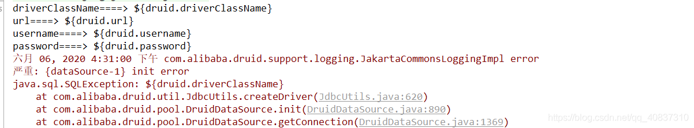
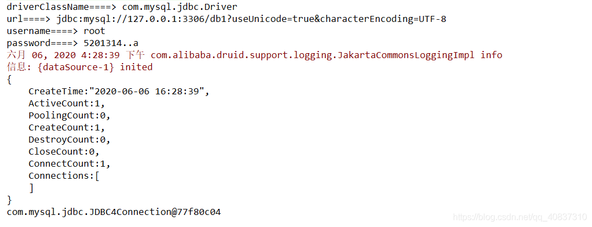

# Spring实战 - @PropertySource注解

参考文章：https://blog.csdn.net/qq_40837310/article/details/106587158

[toc]


## 定义

@PropertySource 注解用于指定资源文件读取的位置，它不仅能读取 properties 文件，也能读取 xml 文件，并且通过 YAML 解析器，配合自定义PropertySourceFactory 实现解析 YAML 文件。

源码：

```java
@Target(ElementType.TYPE) // 注意：只能用在类上
@Retention(RetentionPolicy.RUNTIME)
@Documented
@Repeatable(PropertySources.class)
public @interface PropertySource {
	/**
	 * 指定资源名称，如果为空，就根据基础资源的描述生成
	 */
	String name() default "";

	/**
	 * 指定资源路径
	 * 可以是 classpath:/xxx/xxxx
	 * 也可以是 file:/xxx/xxx/xx
	 */
	String[] value();

	/**
	 * 是否忽略资源不存在的情况，如果不忽略，当资源不存在时就报错（默认不忽略）
	 * （此属性时spring4.0以后出现的）
	 */
	boolean ignoreResourceNotFound() default false;

	/**
	 * 指定资源文件的编码格式，如果不指定就使用文件默认的
	 * （此注解是spring4.3以后出现的）
	 */
	String encoding() default "";

	/**
	 * 指定资源工厂，如果不指定，就使用默认的资源工厂
	 */
	Class<? extends PropertySourceFactory> factory() default PropertySourceFactory.class;
}


```


## 使用方式

<u>此注解在 Spring4.3 之前与 Spring4.3 及之后使用的方式不一样。</u>

**错误 Demo：**

>   -   资源文件
>
>   ```properties
>   druid.driverClassName=com.mysql.jdbc.Driver
>   druid.url=jdbc:mysql://127.0.0.1:3306/hello?useUnicode=true&characterEncoding=UTF-8
>   druid.username=root
>   druid.password=123456
>   ```
>
>   -   配置类
>
>   ```java
>   @Configuration
>   @ComponentScan(basePackages = "propertysourcedemo")
>   public class SpringConfig {
>   
>       //通过SPEL表达式注入属性
>       @Value("${druid.driverClassName}")
>       private String driverClassName;
>   
>       @Value("${druid.url}")
>       private String url;
>   
>       @Value("${druid.username}")
>       private String username;
>   
>       @Value("${druid.password}")
>       private String password;
>   
>       //注册Druid数据源连接池
>       @Bean
>       public DruidDataSource druidDataSource(){
>           System.out.println("driverClassName====> " + driverClassName);
>           System.out.println("url====> " + url);
>           System.out.println("username====> " + username);
>           System.out.println("username====> " + username);
>           DruidDataSource druidDataSource = new DruidDataSource();
>           druidDataSource.setDriverClassName(driverClassName);
>           druidDataSource.setUrl(url);
>           druidDataSource.setUsername(username);
>           druidDataSource.setPassword(password);
>           return druidDataSource;
>       }
>   }
>   ```
>
>   -   测试类
>
>   ```java
>   public class PropertySourceDemoTest {
>   
>       private AnnotationConfigApplicationContext context = new AnnotationConfigApplicationContext(SpringConfig.class);
>   
>       @Test
>       public void PropertySourceDemoTest() throws SQLException {
>           //从容器中获取数据源
>           DruidDataSource druidDataSource = (DruidDataSource) context.getBean("druidDataSource");
>           //获取数据库连接
>           Connection connection = druidDataSource.getConnection();
>           System.out.println(druidDataSource);
>           System.out.println(connection);
>           connection.close();
>       }
>   }
>   ```
>
>   运行结果：
>
>   
>
>   错误分析：
>
>   由于没有指定资源文件，Spring 处理 SPEL 表达式的时候不知道要去哪里找 druid.driverClassName、druid.url、druid.username、druid.password 的值进行属性注入，于是直接将 key 作为解析成字面量进行注入，从而导致了异常。


**问题解决：**

>   -   Spring 4.3 之前版本
>
>   Spring 4.3 之前，除了使用 @PropertySource 注解指定资源文件的位置，还要手动注册一个资源文件解析器 PropertySourcesPlaceholderConfigurer 到 IOC 容器中。如果使用 Bean 注解注册资源文件解析器，方法必须是 static 方法。
>
>   ```java
>   @Configuration
>   @PropertySource(value = "classpath:daoconfig/datasource-config.properties") // 指定资源文件位置
>   public class PropertyConfig {
>   
>       @Bean
>       public static PropertySourcesPlaceholderConfigurer propertySourcesPlaceholderConfigurer(){
>           return new PropertySourcesPlaceholderConfigurer(); //资源文件解析器：Spring4.3 之前必须手动创建
>       }
>   }
>   ```
>
>   执行测试代码：
>
>   
>
>   
>
>   -   Spring 4.3 及之后版本
>
>   Spring 4.3 开始，可以不手动注册资源文件解析器，Spring 默认使用 DefaultPropertySourceFactory 进行解析。但需要注意的是，DefaultPropertySourceFactory  无法解析 YAML 文件，对此可以自己实现解析器，也可以使用第三方解析器：
>
>   第三方解析器：
>
>   ```xml
>    <dependency>
>       <groupId>org.yaml</groupId>
>       <artifactId>snakeyaml</artifactId>
>       <version>1.23</version>
>   </dependency>
>   ```
>
>   自定义解析器：
>
>   ```java
>   public class YAMLPropertySourceFactory implements PropertySourceFactory {
>       @Override
>       public org.springframework.core.env.PropertySource<?> createPropertySource(String name, EncodedResource encodedResource) throws IOException {
>           //创建一个YAML解析工厂。
>           YamlPropertiesFactoryBean factory = new YamlPropertiesFactoryBean();
>           //设置资源。
>           factory.setResources(encodedResource.getResource());
>   
>           //获取解析后的Properties对象
>           Properties properties = factory.getObject();
>           //返回。此时不能像默认工厂那样返回ResourcePropertySource对象 ，要返回他的父类PropertiesPropertySource对象。
>           return name != null ? new PropertiesPropertySource(name, properties) :
>                   new PropertiesPropertySource(encodedResource.getResource().getFilename(),properties);
>       }
>   }
>   ```
>
>   ```java
>   @Configuration
>   // 使用自定义工厂
>   @PropertySource(value = "classpath:daoconfig/datasource-config.yaml",factory = YAMLPropertySourceFactory.class)
>   public class PropertyConfig {
>   }
>   ```

