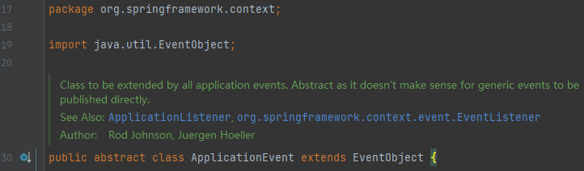
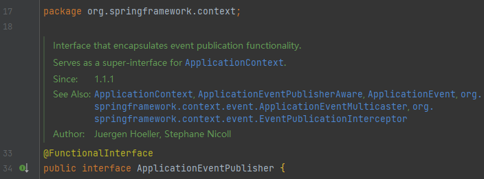
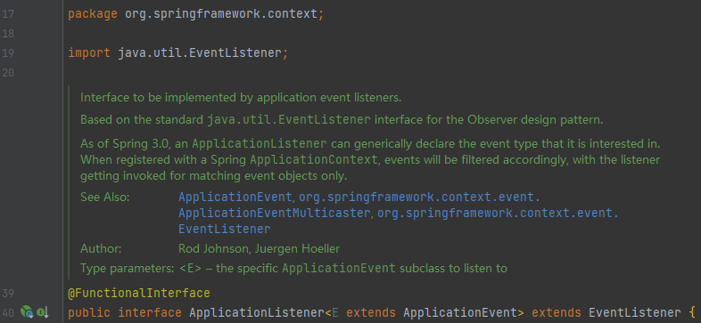
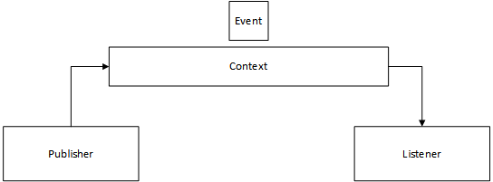
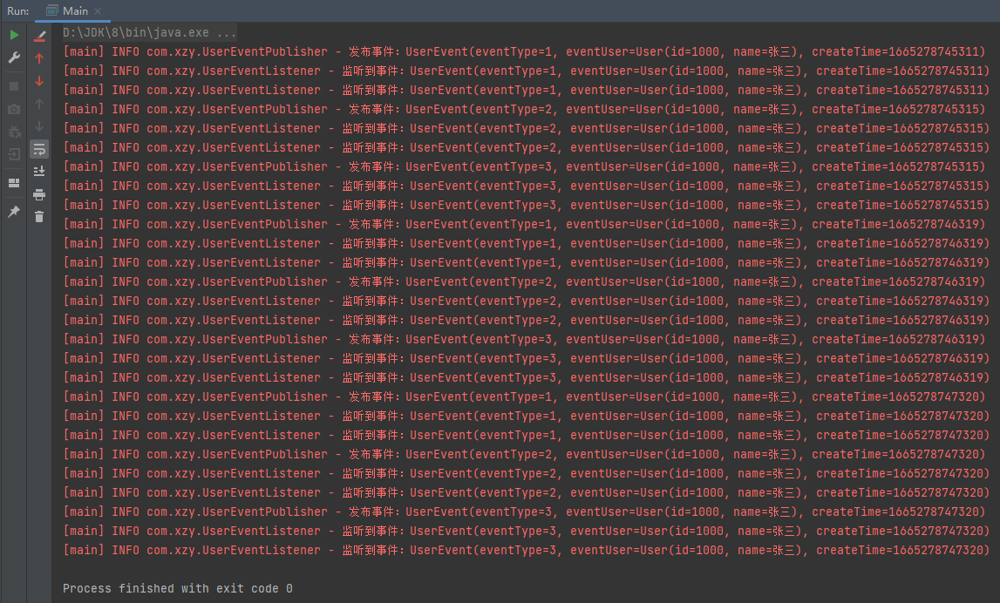
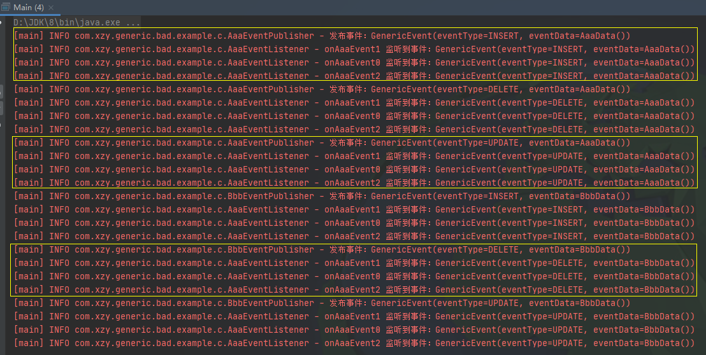
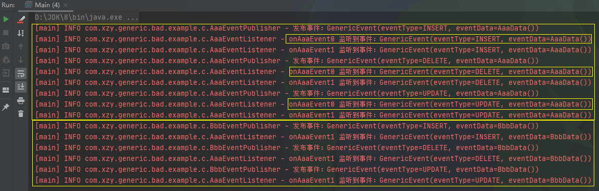

# Spring 事件机制


[toc]


## 一、理论说明

Spring 的事件机制基于`观察者模式`实现，借助 Spring 的事件机制可以实现以下效果：

-   模块间的解耦
-   对同一事件可以根据需要增减处理方式，并且处理过程不会干扰主流程（完美的遵循了开闭原则）

>   **观察者模式：**观察者模式建立一种对象与对象之间的依赖关系。当一个对象（称之为：<u>观察目标</u>）发生改变时，它将主动通知其他对象（称之为：<u>观察者</u>），这些被通知对象将做出相应的反应。一个观察目标可以有多个观察者，而这些观察者之间相互独立，可以根据需要进行增减，这就使得系统更加易于扩展。


相关类：

-   ApplicationEvent：自定义事件的时候可以实现这个抽象类

    

    

-   ApplicationEventPublisher：Spring 的 ApplicationContext 默认实现了这个接口，用于在上下文内发布事件

    

-   ApplicationListener：自定义事件监听器的时候可以实现这个接口

    





## 二、实战演示


### 2.1 简单事件

自定义事件：

```java
package com.xzy;

import lombok.Getter;
import lombok.ToString;
import org.springframework.context.ApplicationEvent;

/**
 * 自定义事件
 *
 * @author xzy.xiao
 * @date 2022/10/8  18:57
 */
@Getter
@ToString
public class UserEvent extends ApplicationEvent {

    // ==================== constant ====================

    public static final int ET_INSERT = 1;
    public static final int ET_DELETE = 2;
    public static final int ET_UPDATE = 3;

    // ==================== field ====================

    /**
     * 事件类型
     */
    private final int eventType;
    /**
     * 发起事件的用户
     */
    private final User eventUser;
    /**
     * 事件创建时间
     */
    private final Long createTime;

    // ==================== constructor ====================

    public UserEvent(int eventType, User eventUser) {
        super(eventUser);
        this.eventType = eventType;
        this.eventUser = eventUser;
        this.createTime = System.currentTimeMillis();
    }
}
```

事件发布器：

```java
package com.xzy;

import org.slf4j.Logger;
import org.slf4j.LoggerFactory;
import org.springframework.context.ApplicationContext;

/**
 * {@link UserEvent} 事件发布器
 *
 * @author xzy.xiao
 * @date 2022/10/8  19:09
 */
public class UserEventPublisher {
    private static final Logger logger = LoggerFactory.getLogger(UserEventPublisher.class);

    public static void sendInsertEvent(ApplicationContext applicationContext) {
        UserEvent userEvent = new UserEvent(UserEvent.ET_INSERT, new User(1000L, "张三"));
        logger.info("发布事件：{}", userEvent);
        applicationContext.publishEvent(userEvent);
    }

    public static void sendDeleteEvent(ApplicationContext applicationContext) {
        UserEvent userEvent = new UserEvent(UserEvent.ET_DELETE, new User(1000L, "张三"));
        logger.info("发布事件：{}", userEvent);
        applicationContext.publishEvent(userEvent);
    }

    public static void sendUpdateEvent(ApplicationContext applicationContext) {
        UserEvent userEvent = new UserEvent(UserEvent.ET_UPDATE, new User(1000L, "张三"));
        logger.info("发布事件：{}", userEvent);
        applicationContext.publishEvent(userEvent);
    }
}
```

事件监听器：

```java
package com.xzy;

import org.slf4j.Logger;
import org.slf4j.LoggerFactory;
import org.springframework.context.ApplicationListener;

/**
 * {@link UserEvent} 事件监听器
 *
 * @author xzy.xiao
 * @date 2022/10/8  19:09
 */
public class UserEventListener implements ApplicationListener<UserEvent> {
    Logger logger = LoggerFactory.getLogger(UserEventListener.class);

    /**
     * Handle an application event.
     *
     * @param event the event to respond to
     */
    @Override
    public void onApplicationEvent(UserEvent event) {
        logger.info("监听到事件：{}", event);
        // TODO:
    }
}
```

演示效果：

```java
public static void main(String[] args) throws Exception {
    // 创建容器
    AnnotationConfigApplicationContext applicationContext = new AnnotationConfigApplicationContext();

    // 注册事件监听器
    applicationContext.registerBean("userEventListener1", UserEventListener.class); // Note：事件会被所有相关监听器监听到
    applicationContext.registerBean("userEventListener2", UserEventListener.class);
    applicationContext.refresh();

    // 发布事件
    for (int i = 0; i < 3; i++) {
        UserEventPublisher.sendInsertEvent(applicationContext);
        UserEventPublisher.sendDeleteEvent(applicationContext);
        UserEventPublisher.sendUpdateEvent(applicationContext);

        Thread.sleep(1000);
    }

}
```



-   一个事件可以有多个监听器，各个监听器相互独立
-   事件必须发布在监听器所在的上下文


### 2.2 泛型事件


#### 2.2.1 冗余的模板事件

也许项目刚开始的时候系统中只有一个自定义事件：

```java
@Getter
@ToString
class AaaEvent extends ApplicationEvent {

    private final OperationType eventType; // 事件类型
    private final AaaData eventData; // 携带的数据

    public AaaEvent(Object source, OperationType eventType, AaaData eventData) {...}
}
```

但是随着项目不断迭代，系统中出现了许多相似的“模板型”事件：

```java
@Getter
@ToString
class BbbEvent extends ApplicationEvent {
    private final OperationType eventType; // 事件类型
    private final BbbData eventData; // 携带的数据

    public BbbEvent(Object source, OperationType eventType, BbbData eventData) {...}
}
```

此时可以考虑重新设计通用的事件，消除冗余的代码。


#### 2.2.2 简单的通用事件

在 Java 提供泛型特性之前，可以借助 Object + Class 设计通用事件：

```java
@Getter
@ToString
class GenericEvent extends ApplicationEvent {

    private final OperationType eventType;
    private final Object eventData; // 携带的数据
    private final Class<?> clazz; // 数据的类型

    public GenericEvent(Object source, OperationType eventType, Object eventData, Class<?> clazz) {...}
}
```

```java
@EventListener
public void onAaaEvent(GenericEvent genericEvent) {

    Class<?> clazz = genericEvent.getClazz(); // 不够优雅，不够方便
    if (clazz == AaaData.class) {
        AaaData aaaData = (AaaData) clazz.cast(genericEvent.getEventData());
        ...
    }
}

@EventListener
public void onBbbEvent(GenericEvent genericEvent) {

    Class<?> clazz = genericEvent.getClazz();
    if (clazz == BbbData.class) {
        BbbData bbbData = (BbbData) clazz.cast(genericEvent.getEventData());
        ...
    }
}
```

Java 推出泛型特性以后，应该优先考虑借助泛型来实现通用事件，因为泛型比 Object 更优雅，更方便，更安全。


#### 2.2.3 优雅的通用事件


也许你会想当然的设计出这样的泛型事件：

```java
@Getter
@ToString
public class GenericEvent<T> extends ApplicationEvent {

    private final OperationType eventType;
    private final T eventData; // 携带的数据


    public GenericEvent(Object source, OperationType eventType, T eventData) {...}
}
```

并且预期 Spring 会根据 eventData 的具体类型将不同的事件通知给各个 Listener：

```java
@EventListener
public void onAaaEvent0(GenericEvent<AaaData> genericEvent) {
    logger.info("onAaaEvent0 监听到事件：{}", genericEvent);
    ...
}

@EventListener
public void onAaaEvent1(GenericEvent<Object> genericEvent) {
    logger.info("onAaaEvent2 监听到事件：{}", genericEvent);
    ...
}

@EventListener
public void onAaaEvent2(GenericEvent<?> genericEvent) {
    logger.info("onAaaEvent1 监听到事件：{}", genericEvent);
    ...
}
```

然而最终的结果却出乎你的意料——Listener 会受到所有类型的 GenericEvent，不管内部的 eventData 到底是什么类型：



其实在 Spring 中定义泛型事件并不复杂，只需要注意一点小细节：

```java
@Getter
@ToString
public class GenericEvent<T> extends ApplicationEvent implements ResolvableTypeProvider {


    private final OperationType eventType;
    private final T eventData;


    public GenericEvent(Object source, OperationType eventType, T eventData) {...}

    /**
     * Return the {@link ResolvableType} describing this instance
     * (or {@code null} if some sort of default should be applied instead).
     */
    @Override
    public ResolvableType getResolvableType() {
        return ResolvableType.forClassWithGenerics(
                this.getClass(),
                ResolvableType.forClass(this.eventData.getClass())
        );
    }
}
```

是的，只需要实现 ResolvableTypeProvider 接口即可。下面是测试效果：



可以看到：

1.   onAaaEvent0(GenericEvent<AaaData>)这个 Listener 只监听到了 eventData 类型为 AaaData 的事件
2.   onAaaEvent1(GenericEvent<Object>)这个 Listener 监听到了所有 evenData 类型的事件
3.   onAaaEvent2(GenericEvent<?>)这个 Listener 没有监听到任何事件


上面的结果1，2比较好理解，但是结果3有点奇怪，下面将从源码层面探究 Spring 到底是如何将事件分发到各个 Listener 的。


##### 2.2.3.1 源码探究

