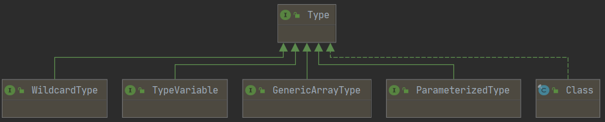
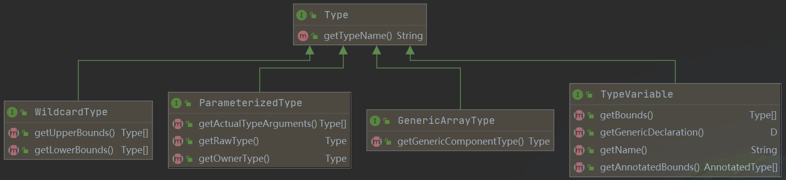

# 工具类 ResolvableType

[TOC]


## 一、Java 中的 Type

官方说明：“Type is the <u>common superinterface for all types</u> in the Java programming language. These include raw types, parameterized types, array types, type variables and primitive types.”

Type 的子接口以及实现类：



-   ParameterizedType

    ```java
    @Slf4j
    class AaaTest {
        private Map<String, Integer> map;
    
        public static void main(String[] args) throws NoSuchFieldException {
            Field field = AaaTest.class.getDeclaredField("map");
            Type genericType = field.getGenericType();
    
            /*
             * ParameterizedType：参数化类型，例如List<T>，Set<T>，Map<K,V>
             */
            if (genericType instanceof ParameterizedType) {
                ParameterizedType parameterizedType = (ParameterizedType) genericType;
    
                /*
                 * 获取外部类的Type信息：以 Map.Entry 为例，它的外部类就是 Map
                 */
                Type ownerType = parameterizedType.getOwnerType();
                log.info(String.valueOf(ownerType));
    
                /*
                 * 获取原始类型信息：
                 *     List<Integer> => List
                 *     Set<Integer> => Set
                 *     Map<String,Integer> => Map
                 */
                Type rawType = parameterizedType.getRawType();
                log.info(String.valueOf(rawType));
    
                /*
                 * 获取类型参数信息：
                 *     List<Integer> => [Integer]
                 *     Set<Integer> => [Integer]
                 *     Map<String,Integer> => [String,Integer]
                 */
                Type[] actualTypeArguments = parameterizedType.getActualTypeArguments();
                log.info(String.valueOf(Arrays.asList(actualTypeArguments)));
            }
        }
    }
    ```

-   TypeVariable

    ```java
    @Slf4j
    class BbbTest<K, V extends Number & Serializable> {
        private Map<K, V> map;
    
        public static void main(String[] args) throws NoSuchFieldException {
            Field field = BbbTest.class.getDeclaredField("map");
            Type genericType = field.getGenericType();
    
            /*
             * ParameterizedType：参数化类型，例如List<T>，Set<T>，Map<K,V>
             */
            if (genericType instanceof ParameterizedType) {
                ParameterizedType parameterizedType = (ParameterizedType) genericType;
    
                Type[] actualTypeArguments = parameterizedType.getActualTypeArguments();
                for (Type actualTypeArgument : actualTypeArguments) {
    
                    /*
                     * TypeVariable：类型变量，指的是List<T>，Map<K,V>中的T，K，V
                     */
                    if (actualTypeArgument instanceof TypeVariable) {
                        TypeVariable typeVariable = (TypeVariable) actualTypeArgument;
    
                        /*
                         * 获取类型变量的上届：也就是申明泛型的时候 extends 右边的东西，如果没有指定则是 Object
                         */
                        Type[] bounds = typeVariable.getBounds();
                        log.info(String.valueOf(Arrays.asList(bounds)));
    
                        /*
                         * 获取类型变量在源码中的名字：“T”，“K”，“V”
                         */
                        String name = typeVariable.getName();
                        log.info(name);
    
                        /*
                         * 获取类型变量的载体：
                         *     BbbTest<K, V extends Number & Serializable> => K,V 的载体就是 class com.xzy.java.bbb.BbbTest
                         */
                        GenericDeclaration genericDeclaration = typeVariable.getGenericDeclaration();
                        log.info(String.valueOf(genericDeclaration));
                    }
                }
            }
        }
    }
    ```

-   GenericArrayType

    ```java
    @Slf4j
    public class CccTest<T> {
        T[] array1;
        List<T>[] array2;
        T[][][] array3;
    
        public static void main(String[] args) throws NoSuchFieldException {
            Field field = CccTest.class.getDeclaredField("array1");
            Type genericType = field.getGenericType();
    
            /*
             * GenericArrayType：泛型数组，例如T[]
             */
            if (genericType instanceof GenericArrayType) {
                GenericArrayType genericArrayType = (GenericArrayType) genericType;
    
                /*
                 * 获取数组元素的类型信息：
                 *     T[] => T                是 TypeVariable
                 *     List<T>[] => List<T>    是 GenericArrayType
                 *     T[][][] => T[]][]       是 GenericArrayType
                 */
                Type genericComponentType = genericArrayType.getGenericComponentType();
                log.info(String.valueOf(genericComponentType));
                log.info(genericArrayType.getClass().toString());
            }
        }
    }
    ```

## 二、Spring 中的 ResolvableType

ResolvableType 是 Spring 中解析泛型信息的一个工具类，它封装了 Type，使得泛型信息的解析变得更加简单。


### 2.1 对比 ResolvableType 与 Type

要解析的类：

```java
public class GenericClass {
   private HashMap<String, List<Integer>> field;
}
```

使用 Type 解析：

```java
private static void analysisByJDK() throws NoSuchFieldException {
    Field field = GenericClass.class.getDeclaredField("field");
    ParameterizedType fieldType = (ParameterizedType) field.getGenericType();
    Type[] argType = fieldType.getActualTypeArguments();
    log.info("解析HashMap<String, List<Integer>>中的HashMap：{}", fieldType.getRawType());
    log.info("解析HashMap<String, List<Integer>>中的HashMap的父类型：{}", ((Class) fieldType.getRawType()).getSuperclass());
    log.info("解析HashMap<String, List<Integer>>中的String：{}", ((Class) argType[0]));
    log.info("解析HashMap<String, List<Integer>>中的List<Integer>：{}", ((ParameterizedType) argType[1]));
    log.info("解析HashMap<String, List<Integer>>中的List：{}", ((ParameterizedType) argType[1]).getRawType());
    log.info("解析HashMap<String, List<Integer>>中的Integer：{}", ((Class) ((ParameterizedType) argType[1]).getActualTypeArguments()[0]));
}
```

使用 ResolvableType 解析：

```java
private static void analysisBySpring() throws NoSuchFieldException {
    Field field = GenericClass.class.getDeclaredField("field");
    ResolvableType fieldResolvableType = ResolvableType.forField(field);
    log.info("解析HashMap<String, List<Integer>>中的HashMap：{}", fieldResolvableType.getRawClass());
    log.info("解析HashMap<String, List<Integer>>中的HashMap的父类型：{}", fieldResolvableType.getSuperType().getRawClass());
    log.info("解析HashMap<String, List<Integer>>中的HashMap的父类型：{}", fieldResolvableType.getSuperType());
    log.info("解析HashMap<String, List<Integer>>中的String：{}", fieldResolvableType.getGeneric(0).resolve());
    log.info("解析HashMap<String, List<Integer>>中的List<Integer>：{}", fieldResolvableType.getGeneric(1));
    log.info("解析HashMap<String, List<Integer>>中的List：{}", fieldResolvableType.getGeneric(1).resolve());
    log.info("解析HashMap<String, List<Integer>>中的Integer：{}", fieldResolvableType.getGeneric(1, 0));
}
```

处理结果：

```
========== Type ==========
[main] INFO com.xzy.spring.aaa.GenericClass - 解析HashMap<String, List<Integer>>中的HashMap：class java.util.HashMap
[main] INFO com.xzy.spring.aaa.GenericClass - 解析HashMap<String, List<Integer>>中的HashMap的父类型：class java.util.AbstractMap
[main] INFO com.xzy.spring.aaa.GenericClass - 解析HashMap<String, List<Integer>>中的String：class java.lang.String
[main] INFO com.xzy.spring.aaa.GenericClass - 解析HashMap<String, List<Integer>>中的List<Integer>：java.util.List<java.lang.Integer>
[main] INFO com.xzy.spring.aaa.GenericClass - 解析HashMap<String, List<Integer>>中的List：interface java.util.List
[main] INFO com.xzy.spring.aaa.GenericClass - 解析HashMap<String, List<Integer>>中的Integer：class java.lang.Integer
========== ResolvableType ==========
[main] INFO com.xzy.spring.aaa.GenericClass - 解析HashMap<String, List<Integer>>中的HashMap：class java.util.HashMap
[main] INFO com.xzy.spring.aaa.GenericClass - 解析HashMap<String, List<Integer>>中的HashMap的父类型：class java.util.AbstractMap
[main] INFO com.xzy.spring.aaa.GenericClass - 解析HashMap<String, List<Integer>>中的HashMap的父类型：java.util.AbstractMap<java.lang.String, java.util.List<java.lang.Integer>>
[main] INFO com.xzy.spring.aaa.GenericClass - 解析HashMap<String, List<Integer>>中的String：class java.lang.String
[main] INFO com.xzy.spring.aaa.GenericClass - 解析HashMap<String, List<Integer>>中的List<Integer>：java.util.List<java.lang.Integer>
[main] INFO com.xzy.spring.aaa.GenericClass - 解析HashMap<String, List<Integer>>中的List：interface java.util.List
[main] INFO com.xzy.spring.aaa.GenericClass - 解析HashMap<String, List<Integer>>中的Integer：java.lang.Integer
```

Type 最麻烦的地方就是各种方法分散在子接口中，使用前需要先进行类型判断、强制类型转换，既不方便又容易出错。相比之下，ResolvableType 统一封装了各种方法，用起来方便很多。




### 2.2 创建 ResolvableType


### 2.3 使用 ResolvableType