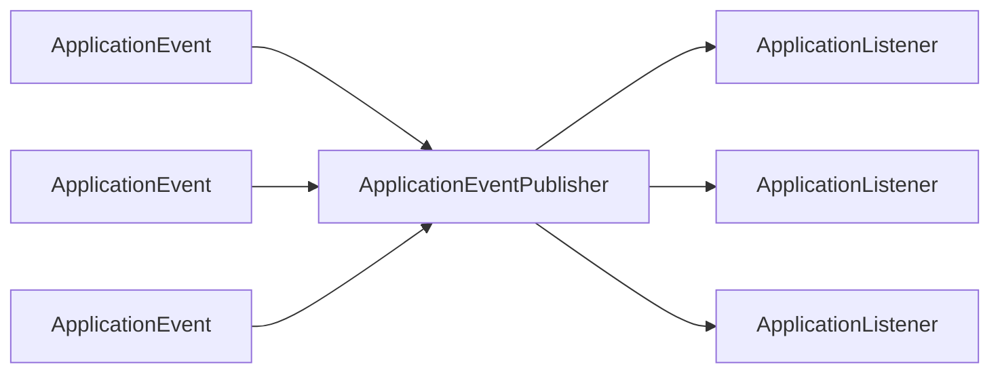
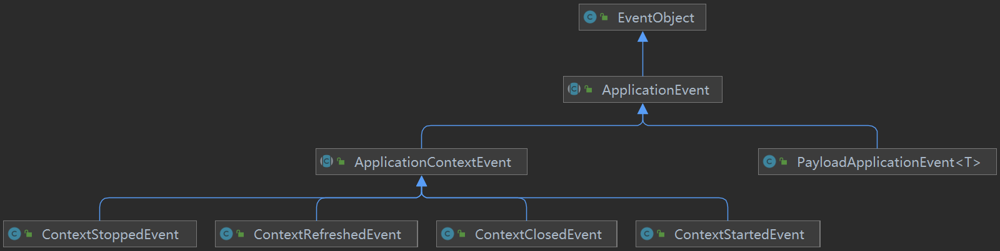
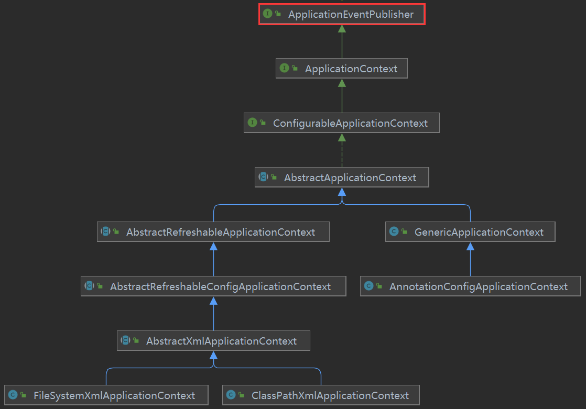

# Spring 事件机制底层原理分析

[TOC]

## 1. 什么是 Spring 事件机制？

Spring 事件机制是 Spring 框架中的一个重要部分，负责处理应用程序中各个组件之间的消息传递。该机制基于观察者模式实现，允许应用程序中的各个组件注册监听器，以便在发生某些事件时及时得到通知并采取相应的行动。

在 Spring 中，事件源和监听器都是基于接口实现的，应用程序中的任何对象都可以作为事件源或监听器的实现类。在向应用程序中注册监听器时，开发人员可以指定要监听的事件类型，从而使监听器只接收与其相关的事件通知。

相比于其他编程模型（如Servlet、JSP等），Spring 事件机制具有更高的灵活性和可扩展性。它可以轻松地与其他 Spring 组件（如 AOP、事务管理等）结合使用，从而实现更为复杂的业务逻辑处理。同时，由于 Spring 事件机制基于标准的观察者模式实现，因此也易于理解和使用。


## 2. Spring 事件机制的核心组件




### （1）事件对象

```java
package org.springframework.context;

import java.util.EventObject;

/**
 * Class to be extended by all application events. Abstract as it
 * doesn't make sense for generic events to be published directly.
 *
 * @author Rod Johnson
 * @author Juergen Hoeller
 * @see org.springframework.context.ApplicationListener
 * @see org.springframework.context.event.EventListener
 */
public abstract class ApplicationEvent extends EventObject {

   /** use serialVersionUID from Spring 1.2 for interoperability. */
   private static final long serialVersionUID = 7099057708183571937L;

   /** System time when the event happened. */
   private final long timestamp;


   /**
    * Create a new {@code ApplicationEvent}.
    * @param source the object on which the event initially occurred or with
    * which the event is associated (never {@code null})
    */
   public ApplicationEvent(Object source) {
      super(source);
      this.timestamp = System.currentTimeMillis();
   }


   /**
    * Return the system time in milliseconds when the event occurred.
    */
   public final long getTimestamp() {
      return this.timestamp;
   }

}
```

Spring 事件机制中的事件对象是用于描述事件本身的组件，它通常包含了事件源对象、事件类型、事件发生时间等属性。在 Spring 框架中，事件对象主要由 `ApplicationEvent` 及其派生类来实现。在 ApplicationEvent 中，有一个 source 属性用于表示事件源对象，通过继承 ApplicationEvent 类，我们可以方便地定义自己的事件对象。

下面是一个示例代码：

```java
public class CustomEvent extends ApplicationEvent {
    private final String message;

    public CustomEvent(Object source, String message) {
        super(source);
        this.message = message;
    }

    public String getMessage() {
        return message;
    }
}
```

<u>需要注意的是，事件对象应该是不可变的，这是为了保证事件对象在传递时的可靠性。</u>




常见的 ApplicationEvent 子类包括 `ContentRefreshedEvent`（当应用上下文被初始化或刷新时发布）、`ContextStartedEvent`（当应用上下文启动时发布）、`ContextStoppedEvent`（当应用上下文停止时发布）、`ContextClosedEvent`（当应用上下文被关闭时发布）以及自定义事件。这些事件能够有效的监听应用程序的生命周期并在需要时执行适当的操作。


### （2）事件监听器

```java
package org.springframework.context;

import java.util.EventListener;

/**
 * Interface to be implemented by application event listeners.
 *
 * <p>Based on the standard {@code java.util.EventListener} interface
 * for the Observer design pattern.
 *
 * <p>As of Spring 3.0, an {@code ApplicationListener} can generically declare
 * the event type that it is interested in. When registered with a Spring
 * {@code ApplicationContext}, events will be filtered accordingly, with the
 * listener getting invoked for matching event objects only.
 *
 * @author Rod Johnson
 * @author Juergen Hoeller
 * @param <E> the specific {@code ApplicationEvent} subclass to listen to
 * @see org.springframework.context.ApplicationEvent
 * @see org.springframework.context.event.ApplicationEventMulticaster
 * @see org.springframework.context.event.EventListener
 */
@FunctionalInterface
public interface ApplicationListener<E extends ApplicationEvent> extends EventListener {

   /**
    * Handle an application event.
    * @param event the event to respond to
    */
   void onApplicationEvent(E event);

}
```

Spring 事件机制中的事件监听器是用于监听和处理各种事件的组件。为了自定义监听器，可实现 `ApplicationListener` 接口或者使用 `@EventListener` 注解。其中 ApplicationListener 接口具有泛型参数，可以指定需要监听的事件类型，而 @EventListener 注解可以将监听器注册到 Spring 容器中，并根据方法参数的事件类型自动绑定到事件发布器。

下面是一个代码示例：

```java
import org.springframework.context.ApplicationEvent;
import org.springframework.context.ApplicationListener;
import org.springframework.context.annotation.AnnotationConfigApplicationContext;
import org.springframework.context.event.EventListener;
import org.springframework.stereotype.Component;

@Component
public class CustomEventListener implements ApplicationListener<ApplicationEvent> { // 基于接口定义监听器

    @Override
    public void onApplicationEvent(ApplicationEvent event) {
        System.out.println("CustomEventListener received event: " + event.toString());
    }

    @EventListener // 基于注解定义监听器
    public void handleCustomEvent(CustomEvent event) {
        System.out.println("EventListener received custom event: " + event.toString());
    }

    public static void main(String[] args) {
        AnnotationConfigApplicationContext context = new AnnotationConfigApplicationContext();
        context.register(CustomEventListener.class);
        context.refresh();

        context.publishEvent(new CustomEvent("custom event message"));

        context.close();
    }
}

class CustomEvent extends ApplicationEvent {
    private String message;

    public CustomEvent(String message) {
        super(message);
        this.message = message;
    }

    public String getMessage() {
        return message;
    }
}
```

在上述代码中，首先我们定义了一个实现了 ApplicationListener 接口的 CustomEventListener 类，该类可以监听所有的 ApplicationEvent 事件。同时，我们使用了 @EventListener 注解定义了一个 handleCustomEvent 方法，该方法可以监听自定义的 CustomEvent 事件。在 main 方法中，我们使用 AnnotationConfigApplicationContext 启动 Spring 上下文，并发送一个 CustomEvent 事件。在程序运行过程中，我们会观察到 CustomEventListener 会分别接收到两个事件，并打印相关日志。


### （3）事件发布器

```java
package org.springframework.context;

/**
 * Interface that encapsulates event publication functionality.
 *
 * <p>Serves as a super-interface for {@link ApplicationContext}.
 *
 * @author Juergen Hoeller
 * @author Stephane Nicoll
 * @since 1.1.1
 * @see ApplicationContext
 * @see ApplicationEventPublisherAware
 * @see org.springframework.context.ApplicationEvent
 * @see org.springframework.context.event.ApplicationEventMulticaster
 * @see org.springframework.context.event.EventPublicationInterceptor
 */
@FunctionalInterface
public interface ApplicationEventPublisher {

   /**
    * Notify all <strong>matching</strong> listeners registered with this
    * application of an application event. Events may be framework events
    * (such as ContextRefreshedEvent) or application-specific events.
    * <p>Such an event publication step is effectively a hand-off to the
    * multicaster and does not imply synchronous/asynchronous execution
    * or even immediate execution at all. Event listeners are encouraged
    * to be as efficient as possible, individually using asynchronous
    * execution for longer-running and potentially blocking operations.
    * @param event the event to publish
    * @see #publishEvent(Object)
    * @see org.springframework.context.event.ContextRefreshedEvent
    * @see org.springframework.context.event.ContextClosedEvent
    */
   default void publishEvent(ApplicationEvent event) {
      publishEvent((Object) event);
   }

   /**
    * Notify all <strong>matching</strong> listeners registered with this
    * application of an event.
    * <p>If the specified {@code event} is not an {@link ApplicationEvent},
    * it is wrapped in a {@link PayloadApplicationEvent}.
    * <p>Such an event publication step is effectively a hand-off to the
    * multicaster and does not imply synchronous/asynchronous execution
    * or even immediate execution at all. Event listeners are encouraged
    * to be as efficient as possible, individually using asynchronous
    * execution for longer-running and potentially blocking operations.
    * @param event the event to publish
    * @since 4.2
    * @see #publishEvent(ApplicationEvent)
    * @see PayloadApplicationEvent
    */
   void publishEvent(Object event);

}
```

Spring 事件机制中的事件发布器是负责将事件对象发送给事件监听器的组件。当事件发布器发布事件后，会通知所有的对应事件监听器，让它们进行相应的处理。通过事件发布器，可以实现不同模块间的协作，当一个模块发生了某种变化，可以发布对应的事件，并将这个变化通知给其他模块，从而实现模块之间的解耦。

在 Spring 中通常会使用 `ApplicationContext` 作为事件发布器。因为 ApplicationContext 继承了 ApplicationEventPublisher，所以具备发布事件的能力：




在 Spring 中，事件发布器可以是同步的，也可以是异步的，具体可以根据业务需求进行选择。异步事件发布器可以提高应用程序的性能和用户体验，因为它能够在后台线程中进行处理。

下面是一个代码示例：

```java
@Component
public class MyEventPublisher {

  @Autowired
  private ApplicationEventPublisher eventPublisher;

  @Async
  public void publishEvent(String message){
      MyCustomEvent event = new MyCustomEvent(this, message);
      eventPublisher.publishEvent(event);
  }
}
```

在上述代码中，MyEventPublisher 使用了 @Async 注解标记的异步方法来发布事件，即使这个方法被调用，也不会阻塞调用者的线程。


## 3. 事件发布器的实现原理

AnnotationConfigApplicationContext 是目前最常用的事件发布器，下面基于它来分析 Spring 事件机制的工作流程。

### 管理事件监听器

AnnotationConfigApplicationContext 会在执行 refresh() 方法的过程中找出并管理上下文中所有的事件监听器，为后续传递事件对象做准备。

refresh() 方法的相关代码：

```java
public abstract class AbstractApplicationContext extends DefaultResourceLoader implements ConfigurableApplicationContext {
    ...
	@Override
	public void refresh() throws BeansException, IllegalStateException {
		synchronized (this.startupShutdownMonitor) {
            ...

			try {
                
                 ...

				// 1.初始化事件广播器
				initApplicationEventMulticaster();

                 ...

				// 2.找出并管理上下文中通过ApplicationListener接口定义的事件监听器
				registerListeners();

				// 3.找出并管理上下文中通过@EventListener注解定义的事件监听器
				finishBeanFactoryInitialization(beanFactory);

                 ...
			}
            
            ...
		}
	}    
}
```

步骤说明：

1.   initApplicationEventMulticaster()

     执行本方法是为了获取一个 `ApplicationEventMulticaster` 实例。关于 ApplicationEventMulticaster 下文会详细分析，目前只需要知道 Spring 利用 ApplicationEventMulticaster 实例来管理事件监听器以及传递事件对象。

     initApplicationEventMulticaster 方法的相关代码：

     ```java
     public abstract class AbstractApplicationContext extends DefaultResourceLoader implements ConfigurableApplicationContext {
         
     	/** Helper class used in event publishing. */
     	@Nullable
     	private ApplicationEventMulticaster applicationEventMulticaster;
         
     	/**
     	 * Name of the ApplicationEventMulticaster bean in the factory.
     	 * If none is supplied, a default SimpleApplicationEventMulticaster is used.
     	 * @see org.springframework.context.event.ApplicationEventMulticaster
     	 * @see org.springframework.context.event.SimpleApplicationEventMulticaster
     	 */
     	public static final String APPLICATION_EVENT_MULTICASTER_BEAN_NAME = "applicationEventMulticaster";
         
     	/**
     	 * Initialize the ApplicationEventMulticaster.
     	 * Uses SimpleApplicationEventMulticaster if none defined in the context.
     	 * @see org.springframework.context.event.SimpleApplicationEventMulticaster
     	 */
     	protected void initApplicationEventMulticaster() {
     		ConfigurableListableBeanFactory beanFactory = getBeanFactory();
             
              // A.尝试从上下文寻找ApplicationEventMulticaster实例
     		if (beanFactory.containsLocalBean(APPLICATION_EVENT_MULTICASTER_BEAN_NAME)) {
     			this.applicationEventMulticaster = beanFactory.getBean(APPLICATION_EVENT_MULTICASTER_BEAN_NAME, ApplicationEventMulticaster.class);
     		}
              // B.自己创建ApplicationEventMulticaster实例
     		else {
     			this.applicationEventMulticaster = new SimpleApplicationEventMulticaster(beanFactory);
     			beanFactory.registerSingleton(APPLICATION_EVENT_MULTICASTER_BEAN_NAME, this.applicationEventMulticaster);
     		}
     	}
     }
     ```

     可以看到，Spring 会先尝试从上下文寻找 ApplicationEventMulticaster 实例，找得到就直接用，找不到就自己创建。

     

2.   registerListeners()

     执行本方法是为了找出上下文中通过实现 ApplicationListener 接口定义的事件监听器。

     registerListeners 方法的相关代码：

     ```java
     public abstract class AbstractApplicationContext extends DefaultResourceLoader implements ConfigurableApplicationContext {
         
     	/**
     	 * Add beans that implement ApplicationListener as listeners.
     	 * Doesn't affect other listeners, which can be added without being beans.
     	 */
     	protected void registerListeners() {
             
              ...
     
              // 从上下文中找出所有通过实现ApplicationListener接口定义的事件监听器
     		String[] listenerBeanNames = getBeanNamesForType(ApplicationListener.class, true, false);
     		for (String listenerBeanName : listenerBeanNames) {
                  // 将事件监听器交给ApplicationEventMulticaster管理
     			getApplicationEventMulticaster().addApplicationListenerBean(listenerBeanName);
     		}
     
     	    ...
     	}
     }
     ```

     可以看到，Spring 利用 getBeanNamesForType 方法找出实现了 ApplicationListener 接口的 Bean，然后把它们的名称交给 ApplicationEventMulticaster。

     

3.   finishBeanFactoryInitialization(beanFactory)

     `EventListenerMethodProcessor` 是 Spring 中负责处理 @EventListener 注解的组件。因为 EventListenerMethodProcessor 实现了 SmartInitializingSingleton 接口，所以 finishBeanFactoryInitialization 方法最终会触发 EventListenerMethodProcessor 的 preInstantiateSingletons 方法，接着 EventListenerMethodProcessor 会找出上下文中通过 @EventListener 注解定义的监听器。后文会详细分析 EventListenerMethodProcessor 的处理过程。

     

     相关代码：

     ```java
     public abstract class AbstractApplicationContext extends DefaultResourceLoader implements ConfigurableApplicationContext {
     
     	/**
     	 * Finish the initialization of this context's bean factory,
     	 * initializing all remaining singleton beans.
     	 */
     	protected void finishBeanFactoryInitialization(ConfigurableListableBeanFactory beanFactory) {
              ...
     
     		// Instantiate all remaining (non-lazy-init) singletons.
     		beanFactory.preInstantiateSingletons();
     	}    
     }
     ```

     ```java
     public class DefaultListableBeanFactory extends AbstractAutowireCapableBeanFactory implements ConfigurableListableBeanFactory, BeanDefinitionRegistry, Serializable {
     	@Override
     	public void preInstantiateSingletons() throws BeansException {
              ...
     		List<String> beanNames = new ArrayList<>(this.beanDefinitionNames);
              ...
     		// Trigger post-initialization callback for all applicable beans...
     		for (String beanName : beanNames) {
     			Object singletonInstance = getSingleton(beanName);
     			if (singletonInstance instanceof SmartInitializingSingleton) {
     				SmartInitializingSingleton smartSingleton = (SmartInitializingSingleton) singletonInstance;
                       ...
                           // 触发EventListenerMethodProcessor的afterSingletonsInstantiated方法
     					smartSingleton.afterSingletonsInstantiated();
     				 ...
     			}
     		}
     	}    
     }
     ```

     ```java
     public class EventListenerMethodProcessor implements SmartInitializingSingleton, ApplicationContextAware, BeanFactoryPostProcessor {
     	@Override
     	public void afterSingletonsInstantiated() {
     		...
     	}
     }
     ```


除了靠 Spring 自己寻找上下文中的事件监听器，开发者还可以直接调用 addApplicationListener 方法添加事件监听器。

调用 addApplicationListene 方法的相关代码：

```java
public class Main {
    public static void main(String[] args) {
        AnnotationConfigApplicationContext applicationContext = new AnnotationConfigApplicationContext();
        applicationContext.addApplicationListener(new XxxListener());
    }
}
```

addApplicationListene 方法的底层源码：

```java
public abstract class AbstractApplicationContext extends DefaultResourceLoader implements ConfigurableApplicationContext {
    
	/** Helper class used in event publishing. */
	@Nullable
	private ApplicationEventMulticaster applicationEventMulticaster;
    
    @Override
	public void addApplicationListener(ApplicationListener<?> listener) {
		...
			this.applicationEventMulticaster.addApplicationListener(listener);
		...
	}
}
```

可以看到，最终事件监听器还是被交给 ApplicationEventMulticaster 管理。


### 传递事件对象

调用 publishEvent 方法发布事件的代码：

```java
public class Main {

    public static void main(String[] args) {
        AnnotationConfigApplicationContext applicationContext = new AnnotationConfigApplicationContext();
        applicationContext.refresh();
        // 发布事件
        applicationContext.publishEvent(new CustomEvent(...));
        applicationContext.publishEvent(new Date());
    }
}

public class CustomEvent extends ApplicationEvent {...}
```

AnnotationConfigApplicationContext 传递事件对象的相关代码：

```java
public abstract class AbstractApplicationContext extends DefaultResourceLoader implements ConfigurableApplicationContext {

	/**
	 * Publish the given event to all listeners.
	 * <p>Note: Listeners get initialized after the MessageSource, to be able
	 * to access it within listener implementations. Thus, MessageSource
	 * implementations cannot publish events.
	 * @param event the event to publish (may be application-specific or a
	 * standard framework event)
	 */
	@Override
	public void publishEvent(ApplicationEvent event) {
		publishEvent(event, null);
	}
    
    
	/**
	 * Publish the given event to all listeners.
	 * <p>Note: Listeners get initialized after the MessageSource, to be able
	 * to access it within listener implementations. Thus, MessageSource
	 * implementations cannot publish events.
	 * @param event the event to publish (may be an {@link ApplicationEvent}
	 * or a payload object to be turned into a {@link PayloadApplicationEvent})
	 */
	@Override
	public void publishEvent(Object event) {
		publishEvent(event, null);
	}
    
    
	/**
	 * Publish the given event to all listeners.
	 * @param event the event to publish (may be an {@link ApplicationEvent}
	 * or a payload object to be turned into a {@link PayloadApplicationEvent})
	 * @param eventType the resolved event type, if known
	 * @since 4.2
	 */
	protected void publishEvent(Object event, @Nullable ResolvableType eventType) {
		...

		// Decorate event as an ApplicationEvent if necessary
		ApplicationEvent applicationEvent;
		if (event instanceof ApplicationEvent) {
			applicationEvent = (ApplicationEvent) event;
		}
		else {
             // 如果event不是ApplicationEvent类型的事件，先将其装饰成PayloadApplicationEvent然后再发布
			applicationEvent = new PayloadApplicationEvent<>(this, event);
			if (eventType == null) {
				eventType = ((PayloadApplicationEvent<?>) applicationEvent).getResolvableType(); // 获取event的类型信息
			}
		}

         ...
             // 利用ApplicationEventMulticaster发布事件
			getApplicationEventMulticaster().multicastEvent(applicationEvent, eventType);
		...

		// 到父容器发布事件
		if (this.parent != null) {
			if (this.parent instanceof AbstractApplicationContext) {
				((AbstractApplicationContext) this.parent).publishEvent(event, eventType);
			}
			else {
				this.parent.publishEvent(event);
			}
		}
	}
}
```

基于上述源码中可以获得几条信息：

1.   Spring 从 4.2 版本开始，支持发布非 ApplicationEvent 类型的事件对象。Spring 的处理方式是先将其封装成一个 `PayloadApplicationEvent` 实例，然后再发布。PayloadApplicationEvent 是一个泛型类，它的泛型参数代表内部封装的事件对象的类型。PayloadApplicationEvent 实现了 `ResolvableTypeProvider` 接口，Spring 会利用接口中 getResolvableType 方法获取 PayloadApplicationEvent 实例的泛型信息，并以此判断要将事件分发给哪些监听器。

     PayloadApplicationEvent 的源码：

     ```java
     package org.springframework.context;
     
     import org.springframework.core.ResolvableType;
     import org.springframework.core.ResolvableTypeProvider;
     import org.springframework.util.Assert;
     
     /**
      * An {@link ApplicationEvent} that carries an arbitrary payload.
      *
      * <p>Mainly intended for internal use within the framework.
      *
      * @author Stephane Nicoll
      * @since 4.2
      * @param <T> the payload type of the event
      */
     @SuppressWarnings("serial")
     public class PayloadApplicationEvent<T> extends ApplicationEvent implements ResolvableTypeProvider {
     
        private final T payload;
     
     
        /**
         * Create a new PayloadApplicationEvent.
         * @param source the object on which the event initially occurred (never {@code null})
         * @param payload the payload object (never {@code null})
         */
        public PayloadApplicationEvent(Object source, T payload) {
           super(source);
           Assert.notNull(payload, "Payload must not be null");
           this.payload = payload;
        }
     
     
        @Override
        public ResolvableType getResolvableType() {
           return ResolvableType.forClassWithGenerics(getClass(), ResolvableType.forInstance(getPayload()));
        }
     
        /**
         * Return the payload of the event.
         */
        public T getPayload() {
           return this.payload;
        }
     
     }
     ```

     使用 PayloadApplicationEvent 的示例：

     ```java
     @Slf4j
     public class PayloadEventListener {
     
         @EventListener
         public void stringPayloadEventListener(PayloadApplicationEvent<String> event) {
             log.info("received string payload event：{}", event.getPayload());
         }
     
         @EventListener
         public void integerPayloadEventListener(PayloadApplicationEvent<Integer> event) {
             log.info("received integer payload event：{}", event.getPayload());
         }
     
         public static void main(String[] args) {
             AnnotationConfigApplicationContext applicationContext = new AnnotationConfigApplicationContext();
             applicationContext.register(PayloadEventListener.class);
             applicationContext.refresh();
     
             applicationContext.publishEvent("hello world!");
             applicationContext.publishEvent(1024);
         }
     }
     ```

     

2.   Spring 最终会通过 ApplicationEventMulticaster 实例发布事件。相关原理的分析放在后文。

3.   在当前上下文发布事件后，会继续到父级上下文发布事件。


## 4. 事件广播器的实现原理

```java
package org.springframework.context.event;

import org.springframework.context.ApplicationEvent;
import org.springframework.context.ApplicationListener;
import org.springframework.core.ResolvableType;
import org.springframework.lang.Nullable;

/**
 * Interface to be implemented by objects that can manage a number of
 * {@link ApplicationListener} objects and publish events to them.
 *
 * <p>An {@link org.springframework.context.ApplicationEventPublisher}, typically
 * a Spring {@link org.springframework.context.ApplicationContext}, can use an
 * {@code ApplicationEventMulticaster} as a delegate for actually publishing events.
 *
 * @author Rod Johnson
 * @author Juergen Hoeller
 * @author Stephane Nicoll
 * @see ApplicationListener
 */
public interface ApplicationEventMulticaster {

   /**
    * Add a listener to be notified of all events.
    * @param listener the listener to add
    */
   void addApplicationListener(ApplicationListener<?> listener);

   /**
    * Add a listener bean to be notified of all events.
    * @param listenerBeanName the name of the listener bean to add
    */
   void addApplicationListenerBean(String listenerBeanName);

   /**
    * Remove a listener from the notification list.
    * @param listener the listener to remove
    */
   void removeApplicationListener(ApplicationListener<?> listener);

   /**
    * Remove a listener bean from the notification list.
    * @param listenerBeanName the name of the listener bean to remove
    */
   void removeApplicationListenerBean(String listenerBeanName);

   /**
    * Remove all listeners registered with this multicaster.
    * <p>After a remove call, the multicaster will perform no action
    * on event notification until new listeners are registered.
    */
   void removeAllListeners();

   /**
    * Multicast the given application event to appropriate listeners.
    * <p>Consider using {@link #multicastEvent(ApplicationEvent, ResolvableType)}
    * if possible as it provides better support for generics-based events.
    * @param event the event to multicast
    */
   void multicastEvent(ApplicationEvent event);

   /**
    * Multicast the given application event to appropriate listeners.
    * <p>If the {@code eventType} is {@code null}, a default type is built
    * based on the {@code event} instance.
    * @param event the event to multicast
    * @param eventType the type of event (can be {@code null})
    * @since 4.2
    */
   void multicastEvent(ApplicationEvent event, @Nullable ResolvableType eventType);

}
```

ApplicationEventMulticaster 是 Spring 事件机制中一个重要的接口，它的内部定义了一系列管理事件监听器以及发布事件对象的方法。上文已经提到，ApplicationContext 最终使用 ApplicationEventMulticaster 实例管理事件监听器和传递事件对象。如果开发者没有指定，Spring 会自动创建一个 SimpleApplicationEventMulticaster 实例。

下面基于源码分析 SimpleApplicationEventMulticaster 的实现原理。

### 管理事件监听器

其中一个 addApplicationListener 方法的相关源码：

```java
public abstract class AbstractApplicationEventMulticaster implements ApplicationEventMulticaster, BeanClassLoaderAware, BeanFactoryAware {
    
    private final ListenerRetriever defaultRetriever = new ListenerRetriever(false);
    
	@Override
	public void addApplicationListener(ApplicationListener<?> listener) {
		...
	     this.defaultRetriever.applicationListeners.add(listener);
		...		
	}    
    
    /**
     * Helper class that encapsulates a specific set of target listeners,
     * allowing for efficient retrieval of pre-filtered listeners.
     * <p>An instance of this helper gets cached per event type and source type.
     */
    private class ListenerRetriever {
       ...
       public final Set<ApplicationListener<?>> applicationListeners = new LinkedHashSet<>();
       ...
    }    
}
```

可以看到，SimpleApplicationEventMulticaster 底层其实是用 Set 来存储事件监听器的。


### 传递事件对象

SimpleApplicationEventMulticaster 中发布事件对象的主要代码：

```java
public class SimpleApplicationEventMulticaster extends AbstractApplicationEventMulticaster {

    @Nullable
	private Executor taskExecutor;
    
	/**
	 * Set a custom executor (typically a {@link org.springframework.core.task.TaskExecutor})
	 * to invoke each listener with.
	 * <p>Default is equivalent to {@link org.springframework.core.task.SyncTaskExecutor},
	 * executing all listeners synchronously in the calling thread.
	 * <p>Consider specifying an asynchronous task executor here to not block the
	 * caller until all listeners have been executed. However, note that asynchronous
	 * execution will not participate in the caller's thread context (class loader,
	 * transaction association) unless the TaskExecutor explicitly supports this.
	 * @see org.springframework.core.task.SyncTaskExecutor
	 * @see org.springframework.core.task.SimpleAsyncTaskExecutor
	 */
	public void setTaskExecutor(@Nullable Executor taskExecutor) {
		this.taskExecutor = taskExecutor;
	}
    
	/**
	 * Return the current task executor for this multicaster.
	 */
	@Nullable
	protected Executor getTaskExecutor() {
		return this.taskExecutor;
	}
    
	@Override
	public void multicastEvent(final ApplicationEvent event, @Nullable ResolvableType eventType) {
		ResolvableType type = (eventType != null ? eventType : resolveDefaultEventType(event));
         // 尝试获取线程池
		Executor executor = getTaskExecutor();
         // 找出监听该事件的事件监听器，逐个发送事件对象
		for (ApplicationListener<?> listener : getApplicationListeners(event, type)) {
			if (executor != null) {
                 // A：由线程池执行事件监听器的处理逻辑
				executor.execute(() -> invokeListener(listener, event));
			}
			else {
                 // B：在当前线程执行事件监听器的处理逻辑
				invokeListener(listener, event);
			}
		}
	}
}
```

从上面的代码可以看出：开发者可以为 SimpleApplicationEventMulticaster 实例传入线程池，后续由线程池执行各个监听器的处理逻辑。如果没有指定线程池，就直接在当前线程执行监听器的处理逻辑，此时如果抛出异常，事件就没法传递到后面的监听器。


getApplicationListeners 方法相关源码：

```java
public abstract class AbstractApplicationEventMulticaster implements ApplicationEventMulticaster, BeanClassLoaderAware, BeanFactoryAware {
    
    final Map<ListenerCacheKey, ListenerRetriever> retrieverCache = new ConcurrentHashMap<>(64);
    
	/**
	 * Return a Collection of ApplicationListeners matching the given
	 * event type. Non-matching listeners get excluded early.
	 * @param event the event to be propagated. Allows for excluding
	 * non-matching listeners early, based on cached matching information.
	 * @param eventType the event type
	 * @return a Collection of ApplicationListeners
	 * @see org.springframework.context.ApplicationListener
	 */
	protected Collection<ApplicationListener<?>> getApplicationListeners(ApplicationEvent event, ResolvableType eventType) {

		Object source = event.getSource();
		Class<?> sourceType = (source != null ? source.getClass() : null);
		ListenerCacheKey cacheKey = new ListenerCacheKey(eventType, sourceType);

		// A：从缓存中查找事件对应的监听器
		ListenerRetriever retriever = this.retrieverCache.get(cacheKey);
		if (retriever != null) {
			return retriever.getApplicationListeners();
		}

		...
				...
                 // B：找出监听器，并添加缓存
				retriever = new ListenerRetriever(true);
				Collection<ApplicationListener<?>> listeners = retrieveApplicationListeners(eventType, sourceType, retriever);
				this.retrieverCache.put(cacheKey, retriever);
				return listeners;
		...
	}
}
```

```java
public abstract class AbstractApplicationEventMulticaster implements ApplicationEventMulticaster, BeanClassLoaderAware, BeanFactoryAware {
    private final ListenerRetriever defaultRetriever = new ListenerRetriever(false);
    
	/**
	 * Actually retrieve the application listeners for the given event and source type.
	 * @param eventType the event type
	 * @param sourceType the event source type
	 * @param retriever the ListenerRetriever, if supposed to populate one (for caching purposes)
	 * @return the pre-filtered list of application listeners for the given event and source type
	 */
	private Collection<ApplicationListener<?>> retrieveApplicationListeners( ResolvableType eventType, @Nullable Class<?> sourceType, @Nullable ListenerRetriever retriever) {

		List<ApplicationListener<?>> allListeners = new ArrayList<>();
		
		// 遍历所有监听器，找出监听指定事件的监听器
         Set<ApplicationListener<?>> listeners = new LinkedHashSet<>(this.defaultRetriever.applicationListeners);
		for (ApplicationListener<?> listener : listeners) {
			if (supportsEvent(listener, eventType, sourceType)) { // 判断监听器是否监听指定事件
				if (retriever != null) {
					retriever.applicationListeners.add(listener);
				}
				allListeners.add(listener);
			}
		}

		...

         // 对监听器进行排序
		AnnotationAwareOrderComparator.sort(allListeners);
		if (retriever != null && retriever.applicationListenerBeans.isEmpty()) {
			retriever.applicationListeners.clear();
			retriever.applicationListeners.addAll(allListeners);
		}
		return allListeners;
	}
    
    /**
     * Helper class that encapsulates a specific set of target listeners,
     * allowing for efficient retrieval of pre-filtered listeners.
     * <p>An instance of this helper gets cached per event type and source type.
     */
    private class ListenerRetriever {
       ...
       public final Set<ApplicationListener<?>> applicationListeners = new LinkedHashSet<>();
       ...
    }    
}
```

从上面的代码可以看出，SimpleApplicationEventMulticaster 会去遍历存储事件监听器的 Set，找出监听指定事件的监听器，最后还会对它们进行排序。为了避免重复遍历，第一次遍历的结果会被缓存，后续直接查询缓存。


supportsEvent 方法相关源码：

```java
public abstract class AbstractApplicationEventMulticaster implements ApplicationEventMulticaster, BeanClassLoaderAware, BeanFactoryAware {
    
	/**
	 * Determine whether the given listener supports the given event.
	 * <p>The default implementation detects the {@link SmartApplicationListener}
	 * and {@link GenericApplicationListener} interfaces. In case of a standard
	 * {@link ApplicationListener}, a {@link GenericApplicationListenerAdapter}
	 * will be used to introspect the generically declared type of the target listener.
	 * @param listener the target listener to check
	 * @param eventType the event type to check against
	 * @param sourceType the source type to check against
	 * @return whether the given listener should be included in the candidates
	 * for the given event type
	 */
	protected boolean supportsEvent(ApplicationListener<?> listener, ResolvableType eventType, @Nullable Class<?> sourceType) {

        // 监听器会被封装成GenericApplicationListener实例，方便解析
		GenericApplicationListener smartListener = (listener instanceof GenericApplicationListener ?
				(GenericApplicationListener) listener : new GenericApplicationListenerAdapter(listener));
		return (smartListener.supportsEventType(eventType) && smartListener.supportsSourceType(sourceType));
	}
}
```

```java
/**
 * {@link GenericApplicationListener} adapter that determines supported event types
 * through introspecting the generically declared type of the target listener.
 *
 * @author Juergen Hoeller
 * @author Stephane Nicoll
 * @since 3.0
 * @see org.springframework.context.ApplicationListener#onApplicationEvent
 */
public class GenericApplicationListenerAdapter implements GenericApplicationListener, SmartApplicationListener {
    
	/**
	 * Create a new GenericApplicationListener for the given delegate.
	 * @param delegate the delegate listener to be invoked
	 */
	@SuppressWarnings("unchecked")
	public GenericApplicationListenerAdapter(ApplicationListener<?> delegate) {
		this.delegate = (ApplicationListener<ApplicationEvent>) delegate; // 监听器本身
		this.declaredEventType = resolveDeclaredEventType(this.delegate); // 监听的事件
	}
    
    // 解析监听的事件
    @Nullable
	private static ResolvableType resolveDeclaredEventType(ApplicationListener<ApplicationEvent> listener) {
		ResolvableType declaredEventType = resolveDeclaredEventType(listener.getClass());
		...
		return declaredEventType;
	}
    
    @Nullable
	static ResolvableType resolveDeclaredEventType(Class<?> listenerType) {
		ResolvableType eventType = eventTypeCache.get(listenerType);
		if (eventType == null) {
             // 借助ResolvableType中的方法解析ApplicationListener的泛型信息，即监听的事件
			eventType = ResolvableType.forClass(listenerType).as(ApplicationListener.class).getGeneric();
			eventTypeCache.put(listenerType, eventType);
		}
		return (eventType != ResolvableType.NONE ? eventType : null);
	}
    
    @Override
	@SuppressWarnings("unchecked")
	public boolean supportsEventType(ResolvableType eventType) {
		...
			return (this.declaredEventType == null || this.declaredEventType.isAssignableFrom(eventType));
		...
	}
}
```

从上面的代码可以看到，最终利用 Spring 中解析泛型信息的工具类 ResolvableType 解析出定义 ApplicationListener 时指定的泛型参数，即监听的事件。

## 5. @EventListener 的处理过程

Spring 事件机制中通过 @EventListener 注解定义的监听器由 `EventListenerMethodProcessor` 负责处理。由于实现了 SmartInitializingSingleton 接口，EventListenerMethodProcessor 的 afterInstantiateSingletons 方法会在 ApplicationContext 指定 refresh 方法时被调用。

调用链：

-   org.springframework.context.support.AbstractApplicationContext#refresh

    -   org.springframework.context.support.AbstractApplicationContext#finishBeanFactoryInitialization

        -   org.springframework.beans.factory.support.DefaultListableBeanFactory#preInstantiateSingletons
            -   org.springframework.context.event.EventListenerMethodProcessor#afterSingletonsInstantiated

        

EventListenerMethodProcessor 相关代码：

```java
/**
 * Registers {@link EventListener} methods as individual {@link ApplicationListener} instances.
 * Implements {@link BeanFactoryPostProcessor} (as of 5.1) primarily for early retrieval,
 * avoiding AOP checks for this processor bean and its {@link EventListenerFactory} delegates.
 *
 * @author Stephane Nicoll
 * @author Juergen Hoeller
 * @since 4.2
 * @see EventListenerFactory
 * @see DefaultEventListenerFactory
 */
public class EventListenerMethodProcessor implements SmartInitializingSingleton, ApplicationContextAware, BeanFactoryPostProcessor {
    
    @Override
	public void afterSingletonsInstantiated() {
		ConfigurableListableBeanFactory beanFactory = this.beanFactory;
		String[] beanNames = beanFactory.getBeanNamesForType(Object.class);
		for (String beanName : beanNames) {
            ...
					try {
                          // 解析
						processBean(beanName, type);
					}...
				}
			}
		}
	}
    
	private void processBean(final String beanName, final Class<?> targetType) {
		if (!this.nonAnnotatedClasses.contains(targetType) &&
				AnnotationUtils.isCandidateClass(targetType, EventListener.class) &&
				!isSpringContainerClass(targetType)) {

             // 找出Bean中标注了@EventListener的方法
			Map<Method, EventListener> annotatedMethods = null;
			try {
				annotatedMethods = MethodIntrospector.selectMethods(targetType,
						(MethodIntrospector.MetadataLookup<EventListener>) method ->
								AnnotatedElementUtils.findMergedAnnotation(method, EventListener.class));
			}
             ...
			else {
				// Non-empty set of methods
				ConfigurableApplicationContext context = this.applicationContext;
				List<EventListenerFactory> factories = this.eventListenerFactories;
				for (Method method : annotatedMethods.keySet()) {
					for (EventListenerFactory factory : factories) {
						if (factory.supportsMethod(method)) {
							Method methodToUse = AopUtils.selectInvocableMethod(method, context.getType(beanName));
                              // 为方法创建代理类
							ApplicationListener<?> applicationListener = factory.createApplicationListener(beanName, targetType, methodToUse);
							if (applicationListener instanceof ApplicationListenerMethodAdapter) {
								((ApplicationListenerMethodAdapter) applicationListener).init(context, this.evaluator);
							}
							context.addApplicationListener(applicationListener);
							break;
						}
					}
				}
			}
		}
	}    
}
```

创建代理类的相关代码：

```java
/**
 * Default {@link EventListenerFactory} implementation that supports the
 * regular {@link EventListener} annotation.
 *
 * <p>Used as "catch-all" implementation by default.
 *
 * @author Stephane Nicoll
 * @since 4.2
 */
public class DefaultEventListenerFactory implements EventListenerFactory, Ordered {

   private int order = LOWEST_PRECEDENCE;


   public void setOrder(int order) { this.order = order;}

   @Override
   public int getOrder() { return this.order;}


   @Override
   public boolean supportsMethod(Method method) { return true; }

   @Override
   public ApplicationListener<?> createApplicationListener(String beanName, Class<?> type, Method method) {
      return new ApplicationListenerMethodAdapter(beanName, type, method);
   }

}
```

```java
/**
 * {@link GenericApplicationListener} adapter that delegates the processing of
 * an event to an {@link EventListener} annotated method.
 *
 * <p>Delegates to {@link #processEvent(ApplicationEvent)} to give subclasses
 * a chance to deviate from the default. Unwraps the content of a
 * {@link PayloadApplicationEvent} if necessary to allow a method declaration
 * to define any arbitrary event type. If a condition is defined, it is
 * evaluated prior to invoking the underlying method.
 *
 * @author Stephane Nicoll
 * @author Juergen Hoeller
 * @author Sam Brannen
 * @since 4.2
 */
public class ApplicationListenerMethodAdapter implements GenericApplicationListener {
	private final String beanName;
	private final Method method;
	private final Method targetMethod;
	private final AnnotatedElementKey methodKey;
	private final List<ResolvableType> declaredEventTypes;
	private final String condition;
	private final int order;
	private ApplicationContext applicationContext;
	private EventExpressionEvaluator evaluator;    
    
    public ApplicationListenerMethodAdapter(String beanName, Class<?> targetClass, Method method) {
		this.beanName = beanName;
		this.method = BridgeMethodResolver.findBridgedMethod(method);
		...
		EventListener ann = AnnotatedElementUtils.findMergedAnnotation(this.targetMethod, EventListener.class);
         // 监听的事件
		this.declaredEventTypes = resolveDeclaredEventTypes(method, ann);
		...
	}
}
```

代理类处理事件的相关代码：

```java
/**
 * {@link GenericApplicationListener} adapter that delegates the processing of
 * an event to an {@link EventListener} annotated method.
 *
 * <p>Delegates to {@link #processEvent(ApplicationEvent)} to give subclasses
 * a chance to deviate from the default. Unwraps the content of a
 * {@link PayloadApplicationEvent} if necessary to allow a method declaration
 * to define any arbitrary event type. If a condition is defined, it is
 * evaluated prior to invoking the underlying method.
 *
 * @author Stephane Nicoll
 * @author Juergen Hoeller
 * @author Sam Brannen
 * @since 4.2
 */
public class ApplicationListenerMethodAdapter implements GenericApplicationListener {
    
    @Override
	public void onApplicationEvent(ApplicationEvent event) {
		processEvent(event);
	}
    
    
	/**
	 * Process the specified {@link ApplicationEvent}, checking if the condition
	 * matches and handling a non-null result, if any.
	 */
	public void processEvent(ApplicationEvent event) {
		Object[] args = resolveArguments(event);
		if (shouldHandle(event, args)) {
             // 调用被@EventListener标注的方法
			Object result = doInvoke(args);
			...
		}
	}
    
    
	/**
	 * Invoke the event listener method with the given argument values.
	 */
	@Nullable
	protected Object doInvoke(Object... args) {
		Object bean = getTargetBean();
		...
		try {
             // 调用被@EventListener标注的方法
			return this.method.invoke(bean, args);
		}...
	}
}
```
