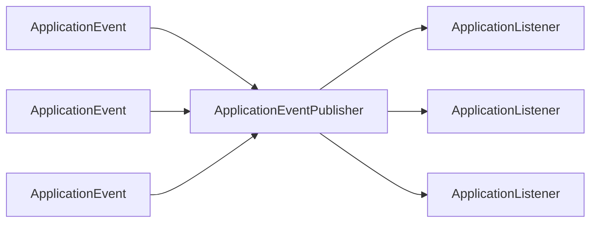
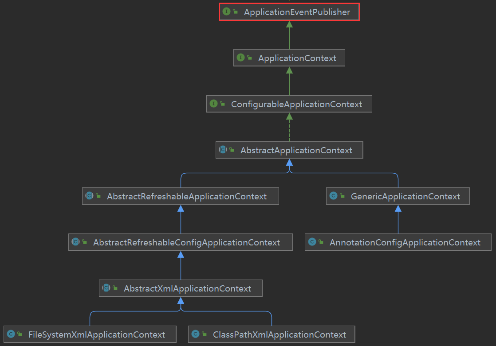
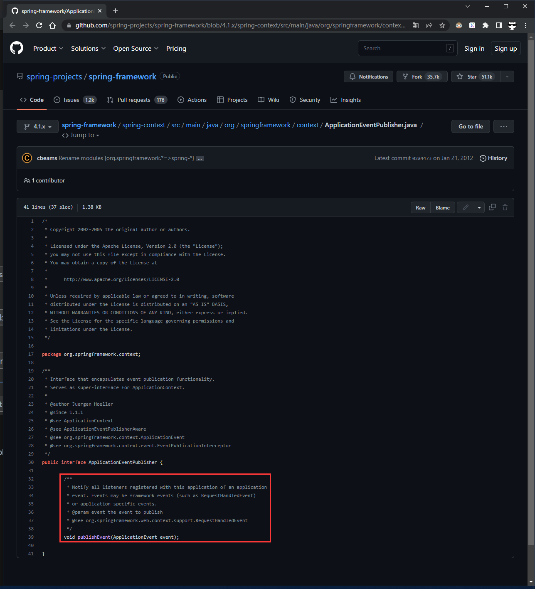
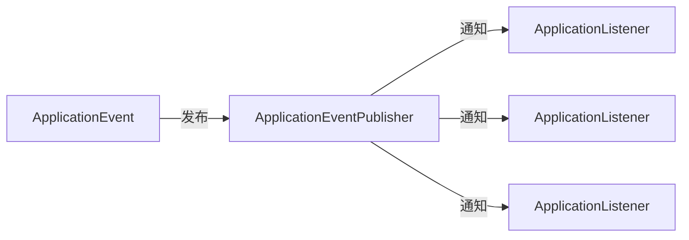
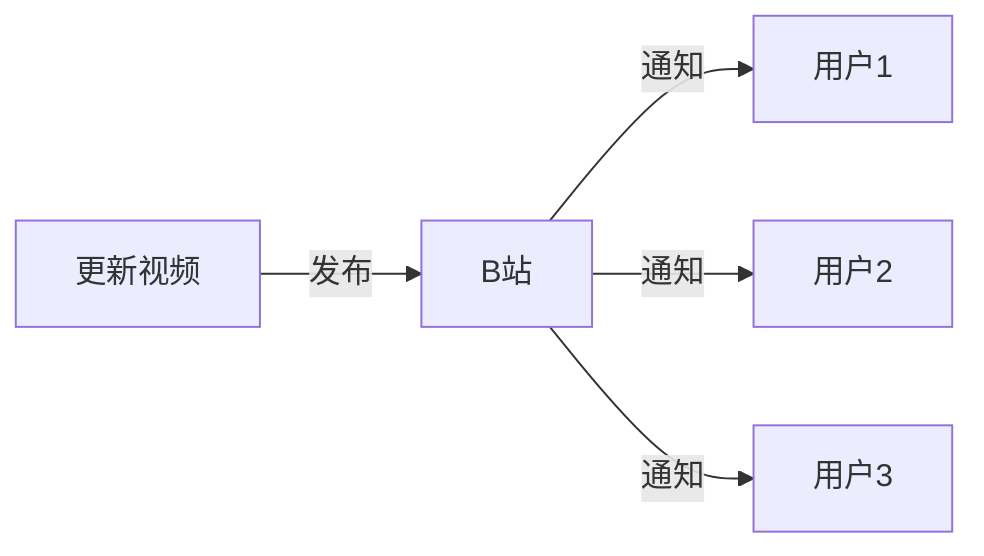

# Spring 事件机制源码探究

>   参考文章：http://t.csdn.cn/IK9aR


[TOC]


本文主要分析下列问题：

-   什么是观察者模式？Spring 的事件机制与观察者模式有什么关系？
-   Spring 的事件机制有哪些核心组件？
-   Spring 是如何管理监听器的？
-   Spring 是如何发布事件的？


## 一、观察者模式

观察者模式（Observer Pattern）也称监听模式、发布-订阅模式、从属模式。观察者模式属于行为型模式的一种，它定义了一种一对多的依赖关系，让多个观察者对象同时监听某一个主题对象。这个主题对象在状态变化时，会通知所有的观察者对象，使他们能够自动更新自己。

观察者模式结构图：


JAVA 提供了两套观察者模式的实现方案：

1.   基于 Observable、Observer。Observable 代表被观察对象，Observer 代表观察对象。

2.   基于 EventObject、EventListener。EventObject 代表被观察对象，EventListener 代表观察对象。


## 二、Spring 事件机制

Spring 的事件机制基于 EventObject/EventListener 方案


### 2.1 核心组件

在 Spring 的事件机制中有几个核心组件，它们是 Spring 事件机制中最基础、最抽象的部分，是 Spring 对事件处理流程进行抽象的结果：*发布器负责把事件传递给监听器*

基于核心组件，Spring 扩充了各种具体的实现细节：

1.   如何管理监听器？
2.   如何判断监听器监听的是哪种事件？
3.   如何将事件传递给监听器？




下面先大概说明一下这几个核心组件：


#### （1）ApplicationEvent

Spring 中所有的事件都要实现 ApplicationEvent

```java
// Class to be extended by all application events.
...
public abstract class ApplicationEvent extends EventObject {
   ...
}
```


Spring 中重要的 ApplicationEvent 子类：


-   `ApplicationContextEvent`：上下文生命周期中发布的事件
    -   `ContextStoppedEvent`：停止上下文
    -   `ContextRefreshedEvent`：刷新上下文
    -   `ContextClosedEvent`：关闭上下文
    -   `ContextStartedEvent`：启动上下文
-   `PayloadApplicationEvent`：从4.2版本开始，Spring 支持发布非 ApplicationEvent 类型的事件——Spring 会先将其封装成 PayloadApplicationEvent 实例，然后发布


#### （2）ApplicationListener

Spring 中所有的监听器都要实现 ApplicationListener。监听器会指明自己关注的是什么事件，在该事件发生时监听器会收到通知，然后执行监听器的处理逻辑。

```java
// Interface to be implemented by application event listeners.
// Based on the standard  java.util.EventListener interface for the Observer design pattern
...
@FunctionalInterface
public interface ApplicationListener<E extends ApplicationEvent> extends EventListener {
   ...
   // 处理事件
   void onApplicationEvent(E event);
}
```


Spring 中有两种方式定义监听器：

1.   基于接口

     ```java
     @Component
     public class MyListener implements ApplicationListener<MyEvent> {
         @Override
         public void onApplicationEvent(MyEvent myEvent){...}
     }
     ```

2.   基于注解

     ```java
     @Configuration
     public class ListenerConfig {
         
         @EventListener
         public void handleMyEvent(MyEvent myEvent){...}
     }
     ```


*（后文会基于源码来分析 Spring 到底是如何处理这两种方式定义的监听器）*


#### （3）ApplicationEventPublisher

ApplicationEventPublisher 是 Spring 事件机制中非常关键的部分，因为事件机制最核心的功能就是发布事件，而 ApplicationEventPublisher 就是负责发布事件的！

```java
// Interface that encapsulates event publication functionality.
// Serves as a super-interface for ApplicationContext.

@FunctionalInterface
public interface ApplicationEventPublisher {

   // 发布事件：事件会被传递给关心该事件的监听器
   default void publishEvent(ApplicationEvent event) {
      publishEvent((Object) event);
   }

   // 发布事件
   void publishEvent(Object event);

}
```


ApplicationEventPublisher 是 ApplicationContext 的父类：




上文在介绍 PayloadApplicationEvent 的时候说过：*“从4.2版本开始，Spring 支持发布非 ApplicationEvent 类型的事件”*。那么为什么4.2版本之前不支持发布呢？看看 [4.1版本 ApplicationEventPublisher](https://github.com/spring-projects/spring-framework/blob/4.1.x/spring-context/src/main/java/org/springframework/context/ApplicationEventPublisher.java) 的源码秒懂了：



*（后面会基于源码分析 Spring 是怎么做到支持发布非 ApplicationEvent 类型的事件的）*


### 2.2 底层源码

Spring 中不同的 ApplicationContent 子类对事件机制的实现会有所不用，下面基于当前最为常用的 `AnnotationConfigApplicationContext` 进行源码分析。






Spring 事件机制的工作流程说白了就两步：

1.   ApplicationContent 发现并管理所有监听器。*类似于B站会记录各个用户关注了哪些UP主*
2.   ApplicationContent 收到事件，然后把事件传递给关注它的监听器。*类似于UP主更新视频后B站会通知关注了该UP主的用户。*


#### 2.2.1 如何管理监听器？

先来分析事件处理流程的第一步，即 ApplicationContext 是如何发现和管理监听器的。Spring 中有基于接口和基于注解两种方式定义监听器，Spring 对这两类监听器有着不用的管理流程，下面会分别进行说明。


##### 2.2.1.1 基于接口定义的监听器是怎么注册的？


总的来说，ApplicationContent 有两种方式发现基于接口定义的监听器：

1.   像注册普通 Bean 一样注册监听器，然后由 ApplicationContext 扫描 Bean 并发现其中的监听器

     ```java
     applicationContext.registerBean("xxxEventListener", XxxEventListener.class); // 略去 @Component、@Bean 等注册 Bean 的方式
     ```

2.   主动到 ApplicationContent 注册监听器

     ```java
     applicationContext.addApplicationListener(new XxxEventListener());
     ```


下面开始查看相关源码：

```java
public abstract class AbstractApplicationContext extends DefaultResourceLoader implements ConfigurableApplicationContext {
    
    @Override
	public void refresh() throws BeansException, IllegalStateException {
                 ...

				// 1、Initialize event multicaster for this context.
				initApplicationEventMulticaster();

                 ...

				// 2、Check for listener beans and register them.
				registerListeners();

                 ...
	}
    
}
```

##### Step1：initApplicationEventMulticaster()

```java
public abstract class AbstractApplicationContext extends DefaultResourceLoader implements ConfigurableApplicationContext {
    
	/**
	 * Name of the ApplicationEventMulticaster bean in the factory.
	 * If none is supplied, a default SimpleApplicationEventMulticaster is used.
	 * @see org.springframework.context.event.ApplicationEventMulticaster
	 * @see org.springframework.context.event.SimpleApplicationEventMulticaster
	 */
	public static final String APPLICATION_EVENT_MULTICASTER_BEAN_NAME = "applicationEventMulticaster";
    
	/** Helper class used in event publishing. */
	@Nullable
	private ApplicationEventMulticaster applicationEventMulticaster;
    
    
	/**
	 * Initialize the ApplicationEventMulticaster.
	 * Uses SimpleApplicationEventMulticaster if none defined in the context.
	 * @see org.springframework.context.event.SimpleApplicationEventMulticaster
	 */
	protected void initApplicationEventMulticaster() {
		ConfigurableListableBeanFactory beanFactory = getBeanFactory();
		if (beanFactory.containsLocalBean(APPLICATION_EVENT_MULTICASTER_BEAN_NAME)) {
             // 如果上下文中已经存在名为applicationEventMulticaster的ApplicationEventMulticastere实例，如果存在则使用
			this.applicationEventMulticaster = beanFactory.getBean(APPLICATION_EVENT_MULTICASTER_BEAN_NAME, ApplicationEventMulticaster.class);
             ...
		}
		else {
             // 如果不存在，则创建一个SimpleApplicationEventMulticaster实例
			this.applicationEventMulticaster = new SimpleApplicationEventMulticaster(beanFactory);
			beanFactory.registerSingleton(APPLICATION_EVENT_MULTICASTER_BEAN_NAME, this.applicationEventMulticaster);
			...
		}
	}
}
```

首先，ApplicationContent 会去获取一个 `ApplicationEventMulticaster` 实例来辅助自己管理监听器以及分发事件。

如果上下文中有现成的 ApplicationEventMulticaster 实例，则直接使用这个实例，如果不存在则自己创建一个 `SimpleApplicationEventMulticaster` 实例*（后文会详细分析 ApplicationEventMulticaster 和 SimpleApplicationEventMulticaster）*


##### Step2：registerListeners()


##### 2.2.1.2 基于注解定义的监听器是怎么注册的？


##### 2.2.1.3 注册的监听是怎么移除的？


#### 2.2.2 如何发布事件？

接着分析事件处理流程的第二部，即 ApplicationContext 是如何将事件分发到监听器的。


#### 2.2.3 补充说明

##### ApplicationEventMulticaster & SimpleApplicationEventMulticaster
