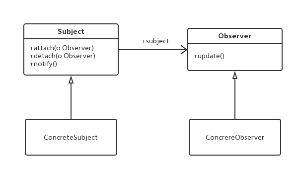
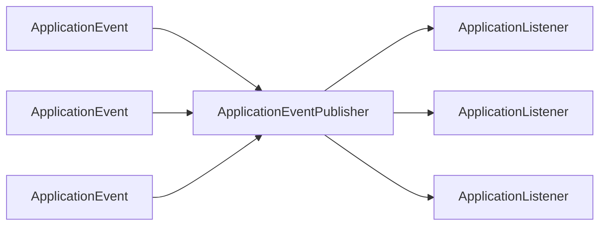
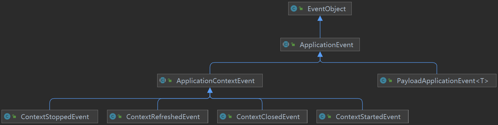

# Spring 事件机制源码探究

>   参考文章：http://t.csdn.cn/IK9aR


[TOC]

## 一、观察者模式

观察者模式（Observer Pattern）也称监听模式、发布-订阅模式、从属模式。观察者模式属于行为型模式的一种，它定义了一种一对多的依赖关系，让多个观察者对象同时监听某一个主题对象。这个主题对象在状态变化时，会通知所有的观察者对象，使他们能够自动更新自己。

观察者模式结构图：



JAVA 中存在两套观察者模式的实现方案：

1.   基于 Observable、Observer。Observable 代表被观察对象，Observer 代表观察对象。

     ```java
     class MyObservable extends Observable {
         
         @Override
         protected synchronized void setChanged() {
             super.setChanged();
         }
     }
     ```

     ```java
     @Slf4j
     public class MyObserver implements Observer {
         @Override
         public void update(Observable o, Object arg) {
             log.info("观察到 {} 的状态发生改变 {}", o, arg);
         }
     }
     ```

     ```java
     @Slf4j
     class Main {
         public static void main(String[] args) {
             // 事件源
             MyObservable observable = new MyObservable();
     
             // 事件监听器
             MyObserver observer = new MyObserver();
     
             // 在事件源上添加监听器
             observable.addObserver(observer);
     
             // 事件源对外发布通知
             for (int i = 0; i < 3; i++) {
                 observable.setChanged();
                 observable.notifyObservers(i);
             }
         }
     }
     ```

2.   基于 EventObject、EventListener。EventObject 代表被观察对象，EventListener 代表观察对象。


## 二、Spring 事件机制

Spring 的事件机制基于 JAVA 的 EventObject、EventListener。


### 2.1 核心组件

Spring 事件机制中有几个核心组件，它们是 Spring 对事件处理流程进行抽象的结果：





#### （1）事件：ApplicationEvent

Spring 中所有的事件都要实现 ApplicationEvent。

```java
// Class to be extended by all application events.
...
public abstract class ApplicationEvent extends EventObject {
   ...
}
```


Spring 中主要的 ApplicationEvent 子类：



-   `ApplicationContextEvent`：上下文生命周期中发布的事件
    -   `ContextStoppedEvent`：停止上下文
    -   `ContextRefreshedEvent`：刷新上下文
    -   `ContextClosedEvent`：关闭上下文
    -   `ContextStartedEvent`：启动上下文
-   `PayloadApplicationEvent`：从4.2版本开始，Spring支持发布非 ApplicationEvent 类型的事件——Spring 会先将其封装成 PayloadApplicationEvent 实例，然后发布


#### （2）事件监听：ApplicationListener

Spring 中所有的监听器都要实现 ApplicationListener。监听器需要指明自己关心的事件，Spring 会在该事件发布时通知监听器，监听器收到通知后执行自己的处理逻辑。

```java
// Interface to be implemented by application event listeners.
// Based on the standard  java.util.EventListener interface for the Observer design pattern
...
@FunctionalInterface
public interface ApplicationListener<E extends ApplicationEvent> extends EventListener {
   ...
   
   // 处理事件
   void onApplicationEvent(E event);
}
```


有两种方式定义监听器：

1.   基于接口

     ```java
     @Component
     public class MyListener implements ApplicationListener<MyEvent> {
         @Override
         public void onApplicationEvent(MyEvent myEvent){...}
     }
     ```

2.   基于注解

     ```java
     @Configuration
     public class ListenerConfig {
         
         @EventListener
         public void handleMyEvent(MyEvent myEvent){...}
     }
     ```

     由 `EventListenerMethodProcessor` 对 `@EventListener` 标注的方法进行处理，为它们创建对应的 ApplicationListener 实例。


#### （3）事件发布：ApplicationEventPublisher

ApplicationEventPublisher 用于发布事件——将事件传递给所有关注它的监听器。ApplicationEventPublisher 是 ApplicationContext 的父接口。

```java
// Interface that encapsulates event publication functionality.
// Serves as a super-interface for ApplicationContext.

@FunctionalInterface
public interface ApplicationEventPublisher {

   // 发布事件：事件会被传递给关心该事件的监听器
   default void publishEvent(ApplicationEvent event) {
      publishEvent((Object) event);
   }

   void publishEvent(Object event);

}
```


### 2.2 底层源码


#### （1）监听器管理


#### （2）事件发布
