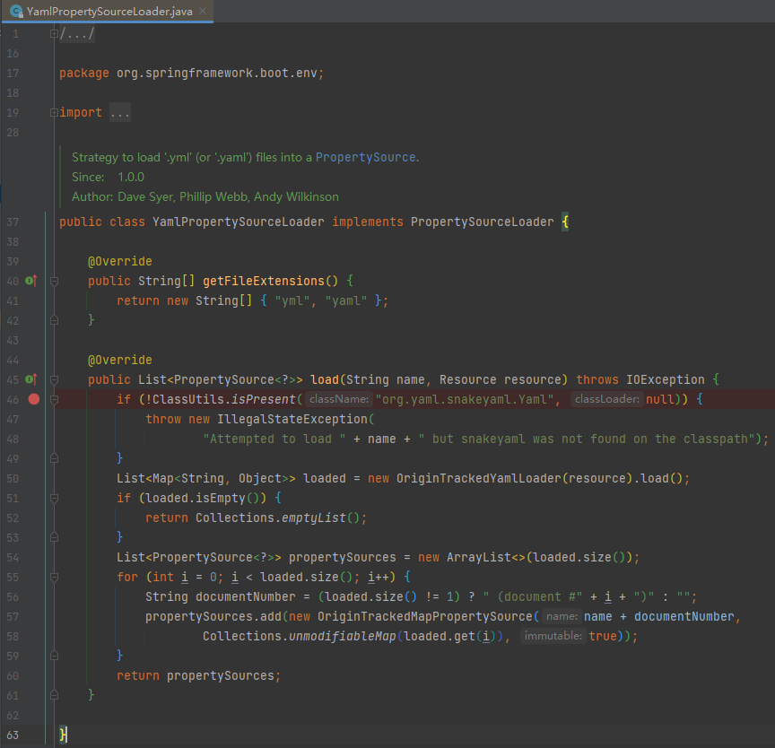

# Spring Boot 配置文件：bootstrap.yaml 与 application.yaml

## 加载顺序

1.   bootstrap.yaml
2.   application.yaml
3.   application-xxx.yaml

>   验证：yaml、yml 配置文件由 YamlPropertySourceLoader 处理，可以在此 DEBUG 以验证配置文件的加载顺序
>
>   
>
>   参考资料：https://blog.csdn.net/weixin_43843104/article/details/110131011

## 总结

1.   bootstrap.yaml 是先加载的配置文件，一般用于存储系统级的配置信息，例如，配置中心信息
2.   如果在这些配置文件中存在同名的属性，后加载的值会覆盖先加载的值