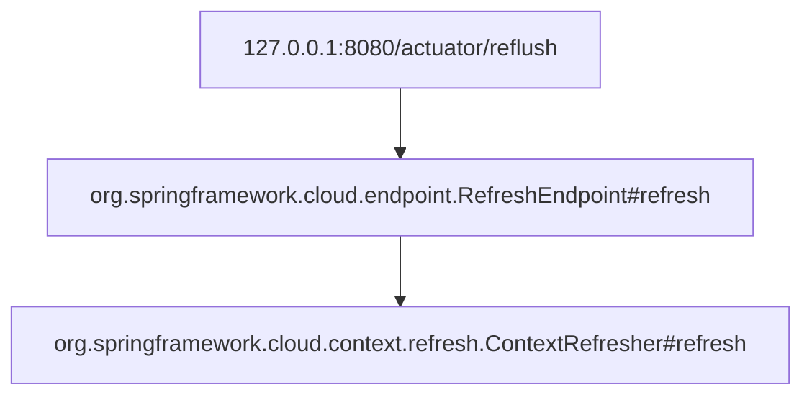
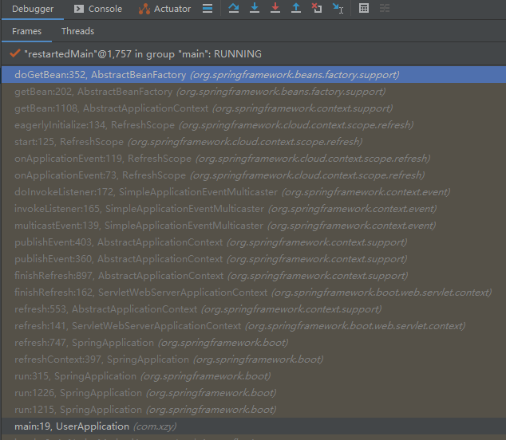
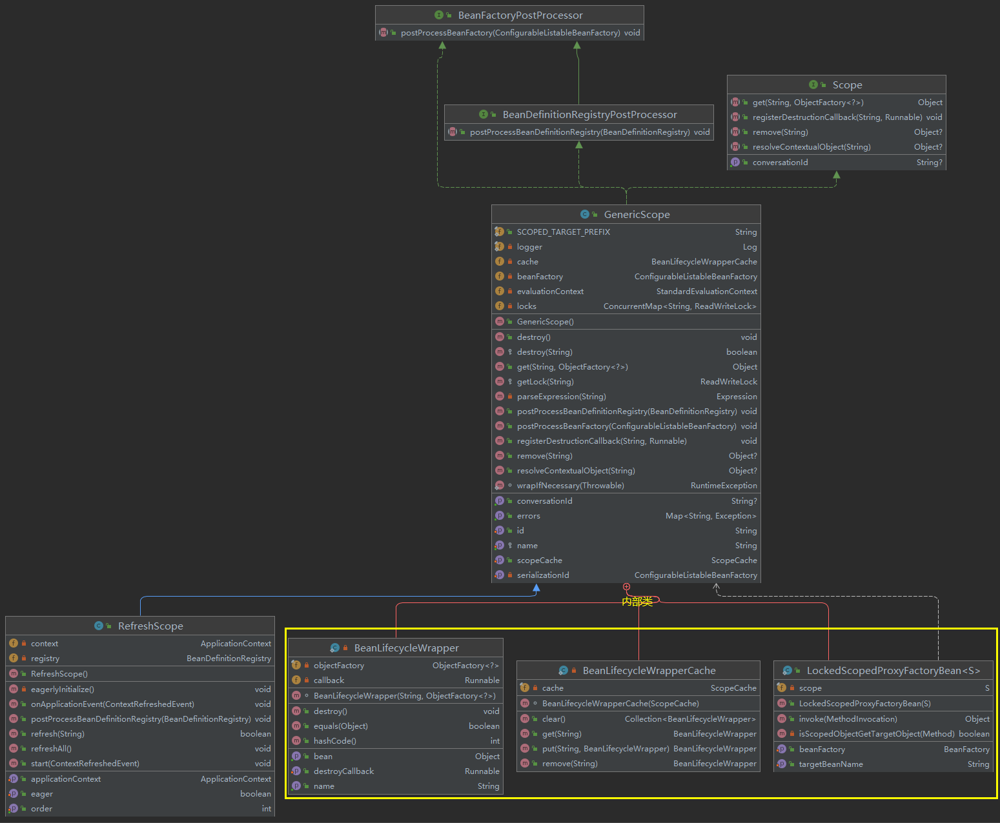
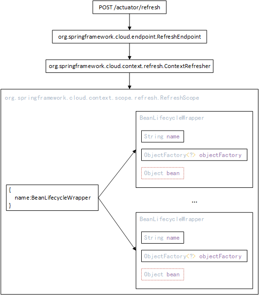

# 基于 Endpoint 和 @Scope 的热刷机制

---

## 前言

微服务系统使用 Config 作为配置中心的时候存在一个问题：Config Client 会在启动的时候从 Config Server 拉取一次配置信息，之后如果配置发生改变，必须重启 Config Client 以刷新配置（详细内容见：[Config 实战 - 客户端重启刷新配置.md](../Config/Config 实战 - 客户端重启刷新配置.md)）上述问题，可以通过引入 Actuator 得到解决（详细内容见：[Config 实战 - 客户端手动刷新配置.md](../Config/Config 实战 - 客户端手动刷新配置.md)），究其原理，其实是 Spring Cloud 基于 Endpoint 和 @Scope 构建了一套热刷机制：





```java
package org.springframework.cloud.endpoint;

...
    
@Endpoint(id = "refresh")
public class RefreshEndpoint {

   private ContextRefresher contextRefresher;
    
   ...

   @WriteOperation
   public Collection<String> refresh() {
      Set<String> keys = this.contextRefresher.refresh();
      return keys;
   }

}
```

```java
package org.springframework.cloud.context.refresh;

...


public class ContextRefresher {

    ...
    
  	public synchronized Set<String> refresh() {
		Set<String> keys = refreshEnvironment();
		this.scope.refreshAll();
		return keys;
	}

    ...
}
```

## 正文


### 一、RefreshEndpoint


RefreshEndpoint 的主要作用就是提供一个入口：（关于自定义 Endpoint 见：[Actuator 实战 - 02 - 自定义 Endpoint.md](../Actuator/Actuator 实战 - 02 - 自定义 Endpoint.md)）

1.   Actuator 会根据 RefreshEndpoint 类的定义自动生成一个外界能够访问的 HTTP 接口 —— POST /`base-path`/refresh
2.   只要通过配置文件启用并暴露 RefreshEndpoint，外部就可以调用该 HTTP 接口
3.   该 HTTP 接口被调用后，将会调用 ContextRefresher 类的 refresh 方法，从这里真正开始执行热刷机制的处理流程 ⭐


### 二、ContextRefresher

refresh 方法主要做了2件事：

1.   刷新环境
2.   刷新Bean


```java
public class ContextRefresher {

    ...
    
  	public synchronized Set<String> refresh() {
         // 1.刷新环境
		Set<String> keys = refreshEnvironment();
         // 2.刷新Bean
		this.scope.refreshAll();
         // 3.返回变更的环境参数
		return keys;
	}

    ...
}
```


#### 1、刷新环境

```java
public class ContextRefresher {

    private ConfigurableApplicationContext context;

    public synchronized Set<String> refreshEnvironment() {
       // 1.找出当前Environment中允许刷新的参数，以及它们当前的值
       Map<String, Object> before = extract(this.context.getEnvironment().getPropertySources());
       // 2.使用最新的环境信息生成新的Environment
       addConfigFilesToEnvironment();
       // 3.通过比较得出有哪些参数的值被更新
       Set<String> keys = changes(before,extract(this.context.getEnvironment().getPropertySources())).keySet();
       // 4.发布一个EnvironmentChangeEvent事件，相关的监听器开始执行各自的处理逻辑
       this.context.publishEvent(new EnvironmentChangeEvent(this.context, keys));
       // 5.返回变更的环境参数
       return keys;
    }
}
```


#### 2、刷新 Bean ⭐

---

##### 知识回顾

###### @Scope

正式讲解 Bean 的刷新流程前，有必要先回顾一下 Spring 的 @Scope 注解：

-   @Scope 注解用于设置 Bean 在 Spring 上下文中的作用域

    例：设置一个单例 Bean

    ```java
    @Scope(scopeName = "singleton")
    @Component
    public class UserService {
        ...
    }
    ```

-   @Scope 注解的定义：

    ```java
    package org.springframework.context.annotation;
    
    ...
    
    @Target({ElementType.TYPE, ElementType.METHOD})
    @Retention(RetentionPolicy.RUNTIME)
    @Documented
    public @interface Scope {
    
       @AliasFor("scopeName")
       String value() default "";
    
       @AliasFor("value")
       String scopeName() default "";
    
       ScopedProxyMode proxyMode() default ScopedProxyMode.DEFAULT;
    
    }
    ```

-   Spring 如何处理 @Scope 注解（简略）：⭐

    1.   生命周期开始后，Spring 会先为每个 Bean 生成一个关联的 BeanDefinition。BeanDefinition 记录了 Bean 的所有定义信息，包括作用域：

         ```java
         package org.springframework.beans.factory.support;
         ...
         @SuppressWarnings("serial")
         public abstract class AbstractBeanDefinition extends BeanMetadataAttributeAccessor implements BeanDefinition, Cloneable {
            
             ...
             
         	String SCOPE_SINGLETON = ConfigurableBeanFactory.SCOPE_SINGLETON;
         	String SCOPE_PROTOTYPE = ConfigurableBeanFactory.SCOPE_PROTOTYPE;
             
             @Nullable
         	private String scope = SCOPE_DEFAULT;
             
         	@Override
         	public void setScope(@Nullable String scope) { this.scope = scope; }
         
         	@Override
         	@Nullable
         	public String getScope() { return this.scope; }
         
         	@Override
         	public boolean isSingleton() { return SCOPE_SINGLETON.equals(this.scope) || SCOPE_DEFAULT.equals(this.scope); }
         
         	@Override
         	public boolean isPrototype() { return SCOPE_PROTOTYPE.equals(this.scope); }
         
             ...
         }
         ```

    2.   最终，Spring 会根据 BeanDefinition 去处理 Bean，此时 @Scope 开始起作用：

         

         

         

         ```java
         package org.springframework.beans.factory.support;
         
         ...
         
         public abstract class AbstractBeanFactory extends FactoryBeanRegistrySupport implements ConfigurableBeanFactory {
             
         	@SuppressWarnings("unchecked")
         	protected <T> T doGetBean(final String name, @Nullable final Class<T> requiredType, @Nullable final Object[] args, boolean typeCheckOnly) throws BeansException {
                 ...
         
         		final RootBeanDefinition mbd = getMergedLocalBeanDefinition(beanName);
         
                  ...
         
         				// singleton 作用域的处理逻辑
         				if (mbd.isSingleton()) {
         					...
         				}
                          // prototype 作用域的处理逻辑
         				else if (mbd.isPrototype()) {
         					...
         				}
                          // 其他作用域的处理逻辑
         				else {
                               ...
                          }
                          
         		...
                     
         		return (T) bean;
         	} 
         }
         ```

-   Spring 如何处理 @Scope 注解（详细）：⭐

    ```java
    package org.springframework.beans.factory.support;
    
    ...
    
    public abstract class AbstractBeanFactory extends FactoryBeanRegistrySupport implements ConfigurableBeanFactory {
        
        ...
        
        
    	/** Map from scope identifier String to corresponding Scope. */
    	private final Map<String, Scope> scopes = new LinkedHashMap<>(8);
        
        // 注册 Scope
        @Override
    	public void registerScope(String scopeName, Scope scope) {
    		if (SCOPE_SINGLETON.equals(scopeName) || SCOPE_PROTOTYPE.equals(scopeName)) {
    			throw new IllegalArgumentException("Cannot replace existing scopes 'singleton' and 'prototype'"); // Spring 提供的两个作用域，不允许替换
    		}
            
    		Scope previous = this.scopes.put(scopeName, scope);
    		...
    	}
            
    
    	@SuppressWarnings("unchecked")
    	protected <T> T doGetBean(final String name, @Nullable final Class<T> requiredType, @Nullable final Object[] args, boolean typeCheckOnly) throws BeansException {
            ...
    
    		final RootBeanDefinition mbd = getMergedLocalBeanDefinition(beanName);
    
             ...
    
    				// singleton 作用域的处理逻辑
    				if (mbd.isSingleton()) {
    					...
    				}
                     // prototype 作用域的处理逻辑
    				else if (mbd.isPrototype()) {
    					...
    				}
                     // 其他作用域的处理逻辑
    				else {
                          
                          // 1.定位Scope
                          String scopeName = mbd.getScope();
    					final Scope scope = this.scopes.get(scopeName);
                          ...
                          // 2.向Scope移交Bean的处理流程
    					Object scopedInstance = scope.get(beanName, () -> {
                              ...
    						return createBean(beanName, mbd, args);
    					});
    					bean = getObjectForBeanInstance(scopedInstance, name, beanName, mbd);
                         ...
    
                     }
                     
    		...
                
    		return (T) bean;
    	} 
    }
    ```

    Spring 内定了两种作用域：单例（singleton）、原型（prototype）。除此之外，我们可以通过实现 Scope 接口来创建自己的作用域，并且通过 Spring 提供的 registerScope 方法将作用域注册到 Spring 上下文，然后我们就可以使用自定义的作用域来标识某个 Bean，最终 Spring 就会将这个 Bean 的处理流程移交到我们自定义的作用域。<u>后文要说的 Spring Cloud 的热刷机制，就是通过自定义一个 ReflushScope 来实现的。</u>

    

    Scope 接口的定义：

    ```java
    package org.springframework.beans.factory.config;
    
    ...
    
    public interface Scope {
    
       /**
        * Return the object with the given name from the underlying scope,
        */
       Object get(String name, ObjectFactory<?> objectFactory);
    
       /**
        * Remove the object with the given {@code name} from the underlying scope.
        */
       @Nullable
       Object remove(String name);
    
       ...
    
    }
    ```


###### @RefreshScope

@RefreshScope 其实是一个复合注解：

```java
package org.springframework.cloud.context.config.annotation;

...

/**
 * Convenience annotation to put a <code>@Bean</code> definition in
 * {@link org.springframework.cloud.context.scope.refresh.RefreshScope refresh scope}.
 * Beans annotated this way can be refreshed at runtime and any components that are using
 * them will get a new instance on the next method call, fully initialized and injected
 * with all dependencies.
 *
 * @author Dave Syer
 *
 */
@Target({ ElementType.TYPE, ElementType.METHOD })
@Retention(RetentionPolicy.RUNTIME)
@Scope("refresh")
@Documented
public @interface RefreshScope {

   /**
    * @see Scope#proxyMode()
    * @return proxy mode
    */
   ScopedProxyMode proxyMode() default ScopedProxyMode.TARGET_CLASS;

}
```

Spring Cloud 自定义并向上下文注册了一个自定义的作用域——RefreshScope

```java
package org.springframework.cloud.context.scope.refresh;

...

/**
 * <p>
 * A Scope implementation that allows for beans to be refreshed dynamically at runtime
 * (see {@link #refresh(String)} and {@link #refreshAll()}). If a bean is refreshed then
 * the next time the bean is accessed (i.e. a method is executed) a new instance is
 * created. All lifecycle methods are applied to the bean instances, so any destruction
 * callbacks that were registered in the bean factory are called when it is refreshed, and
 * then the initialization callbacks are invoked as normal when the new instance is
 * created. A new bean instance is created from the original bean definition, so any
 * externalized content (property placeholders or expressions in string literals) is
 * re-evaluated when it is created.
 * </p>
 *
 * <p>
 * Note that all beans in this scope are <em>only</em> initialized when first accessed, so
 * the scope forces lazy initialization semantics. The implementation involves creating a
 * proxy for every bean in the scope, so there is a flag
 * {@link #setProxyTargetClass(boolean) proxyTargetClass} which controls the proxy
 * creation, defaulting to JDK dynamic proxies and therefore only exposing the interfaces
 * implemented by a bean. If callers need access to other methods, then the flag needs to
 * be set (and CGLib must be present on the classpath). Because this scope automatically
 * proxies all its beans, there is no need to add <code>&lt;aop:auto-proxy/&gt;</code> to
 * any bean definitions.
 * </p>
 *
 * <p>
 * The scoped proxy approach adopted here has a side benefit that bean instances are
 * automatically {@link Serializable}, and can be sent across the wire as long as the
 * receiver has an identical application context on the other side. To ensure that the two
 * contexts agree that they are identical, they have to have the same serialization ID.
 * One will be generated automatically by default from the bean names, so two contexts
 * with the same bean names are by default able to exchange beans by name. If you need to
 * override the default ID, then provide an explicit {@link #setId(String) id} when the
 * Scope is declared.
 * </p>
 *
 * @author Dave Syer
 * @since 3.1
 *
 */
@ManagedResource
public class RefreshScope extends GenericScope implements ApplicationContextAware,ApplicationListener<ContextRefreshedEvent>, Ordered {
          ...
}
```

RefreshScope 类的注释给出了一些重要信息：⭐

1.   RefreshScope 主要用于实现在 Spring 应用运行时动态的刷新其中的 Bean。==如果某个 Bean 被刷新了，下次访问这个 Bean 的时候将会创建一个新的 Bean==。
2.   RefreshScope 就像一个容器，存储了所有支持热刷的 Bean。在 RefreshScope 中，这些 Bean 都是==懒加载==的 —— RefreshScope 会在 Bean 第一次被调用的时候创建一个==代理对象==


RefreshScope 创建Bean、缓存Bean、获取Bean的过程：

1.   Spring 移交向 RefreshScope 移交 Bean 的处理流程：

     ```java
     package org.springframework.beans.factory.support;
     
     ...
     
     public abstract class AbstractBeanFactory extends FactoryBeanRegistrySupport implements ConfigurableBeanFactory {
         
         ...
     
     	@SuppressWarnings("unchecked")
     	protected <T> T doGetBean(final String name, @Nullable final Class<T> requiredType, @Nullable final Object[] args, boolean typeCheckOnly) throws BeansException {
             ...
     
     		final RootBeanDefinition mbd = getMergedLocalBeanDefinition(beanName);
     
              ...
     
     				// singleton 作用域的处理逻辑
     				if (mbd.isSingleton()) {
     					...
     				}
                      // prototype 作用域的处理逻辑
     				else if (mbd.isPrototype()) {
     					...
     				}
                      // 其他作用域的处理逻辑
     				else {
                           
                           // 1.定位Scope
                           String scopeName = mbd.getScope();
     					final Scope scope = this.scopes.get(scopeName);
                           ...
                           // 2.向Scope移交Bean的处理流程
     					Object scopedInstance = scope.get(beanName, () -> {
                               ...
     						return createBean(beanName, mbd, args);
     					});
     					bean = getObjectForBeanInstance(scopedInstance, name, beanName, mbd);
                          ...
     
                      }
                      
     		...
                 
     		return (T) bean;
     	} 
     }
     ```

2.   RefreshScope 调用从 GenericScope 继承到的 get 方法：

     

     

     

     ```java
     
     package org.springframework.cloud.context.scope;
     
     ...
     
     public class GenericScope implements Scope, BeanFactoryPostProcessor, BeanDefinitionRegistryPostProcessor, DisposableBean {
        // 本质是一个Map：beanName -> BeanLifecycleWrapper
        private BeanLifecycleWrapperCache cache = new BeanLifecycleWrapperCache(new StandardScopeCache());
        
        ...
         
        @Override
        public Object get(String name, ObjectFactory<?> objectFactory) {
           // 1.创建一个存储Bean的“容器”
           BeanLifecycleWrapper value = this.cache.put(name,new BeanLifecycleWrapper(name, objectFactory));
           ...
           // 2.从容器中获取Bean
           return value.getBean();
        }
     
        ...
     }
     ```

     get 方法主要执行了两个操作：

     1.   创建一个存储 Bean 的容器
     2.   从容器中获取 Bean

     

     BeanLifecycleWrapper 是 GenericScope  中的一个内部类，主要用于记录 Bean 相关的信息，同时也用于缓存创建好的 Bean。从 getBean 的实现可以看出，Bean 是懒加载的——创建 BeanLifecycleWrapper 的时候并没有马上创建 Bean 的实例，只要第一次调用 getBean 的时候才开始创建：

     ```java
     /**
      * Wrapper for a bean instance and any destruction callback (DisposableBean etc.) that
      * is registered for it. Also decorates the bean to optionally guard it from
      * concurrent access (for instance).
      *
      * @author Dave Syer
      *
      */
     private static class BeanLifecycleWrapper {
     
        private final String name;
     
        private final ObjectFactory<?> objectFactory; // 用于创建Bean，从doGetBean传入
     
        private Object bean; // 缓存！
     
        private Runnable callback;
     
        BeanLifecycleWrapper(String name, ObjectFactory<?> objectFactory) {
           this.name = name;
           this.objectFactory = objectFactory;
        }
     
       ...
     
        // 获取 Bean
        public Object getBean() {
           // 如果 Bean 不存在则创建 Bean —— 懒加载
           if (this.bean == null) {
               ...
               this.bean = this.objectFactory.getObject();
           }
           return this.bean;
        }
     
        // 销毁 Bean
        public void destroy() {
           ...
           this.bean = null;
        }
     
        ...
     
     }
     ```

     ⭐ BeanLifecycleWrapper 中还有一个 destroy 方法，它的主要作用就是清除 BeanLifecycleWrapper 中的 Bean 缓存，然后下次调用 getBean 方法的时候就会因为无法从缓存获取 Bean 而创建新的 Bean

---

##### 刷新 Bean

回顾完 @Scope 以及 @RefreshScope 的内容后，接着讲 ContextRefresher：

```java
public class ContextRefresher {

    ...
    
    private RefreshScope scope;

	public ContextRefresher(ConfigurableApplicationContext context, RefreshScope scope) {
		this.context = context;
		this.scope = scope;
	}
        
  	public synchronized Set<String> refresh() {
         // 1.刷新环境
		Set<String> keys = refreshEnvironment();
         // 2.刷新Bean
		this.scope.refreshAll();
         // 3.返回变更的环境参数
		return keys;
	}

    ...
}
```

环境信息刷新完毕后，接着就是调用 RefreshScope 的 refreshAll 方法：

```java
package org.springframework.cloud.context.scope.refresh;

...

@ManagedResource
public class RefreshScope extends GenericScope implements ApplicationContextAware,ApplicationListener<ContextRefreshedEvent>, Ordered {
    ...
              
	public void refreshAll() {
		super.destroy();
		this.context.publishEvent(new RefreshScopeRefreshedEvent());
	}
}
```

最终将调用从 GenericScope 继承到的 destroy 方法：

```java

package org.springframework.cloud.context.scope;

...

public class GenericScope implements Scope, BeanFactoryPostProcessor, BeanDefinitionRegistryPostProcessor, DisposableBean {
    // 本质是一个Map：beanName -> BeanLifecycleWrapper
    private BeanLifecycleWrapperCache cache = new BeanLifecycleWrapperCache(new StandardScopeCache());
   
   ...

   @Override
   public void destroy() {
      Collection<BeanLifecycleWrapper> wrappers = this.cache.clear();
      ...
	  for (BeanLifecycleWrapper wrapper : wrappers) {
          ...
          wrapper.destroy();
          ...
	  }
   }  
    
   @Override
   public Object get(String name, ObjectFactory<?> objectFactory) {
      // 1.创建一个存储Bean的“容器”
      BeanLifecycleWrapper value = this.cache.put(name,new BeanLifecycleWrapper(name, objectFactory));
      ...
      // 2.从容器中获取Bean
      return value.getBean();
   }
   ...
}
```

destroy 方法的主要工作：遍历所有 BeanLifecycleWrapper ，调用他们的 destroy 方法。

关于 BeanLifecycleWrapper，前面已经说的很清楚了，它就像是一个容器，装有 Bean 相关的一些信息，最重要的是，它内部还有一个缓存，用于存储创建好的 Bean。GenericScope 调用 BeanLifecycleWrapper 的 getBean 方法时，BeanLifecycleWrapper 回先到缓存查看是否有创建好的 Bean，如果有则直接返回这个 Bean，如果没有则当场创建一个 Bean，添加到缓存，然后返回这个 Bean。而 destroy 的作用，其实就是清除 BeanLifecycleWrapper 中的缓存，这样下次调用 getBean 方法的时候就会重新创建 Bean。


