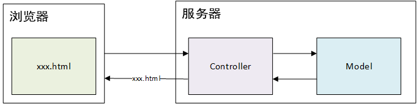

# 1. SpringMVC简介

## 1.1 MVC

### 什么是MVC？

MVC 是一种软件结构思想，指的是将软件按照模型层、视图层、控制层进行划分

-   M：Model，模型层，指工程中的 JavaBean，作用是<u>处理数据</u>
-   V：View，视图层，指工程中的 html、jsp等，作用是<u>展示数据、与用户交互</u>
-   C：Controller，控制层，指工程中的 servlet，作用是<u>接收和响应请求</u>

### MVC的工作流程？

1.   用户通过 View 发送请求到服务器；
2.   在服务器，请求被 Controller 接收，Controller 调用相应的 Model 处理请求；
3.   Model 开始处理请求，处理完毕后将结果返回 Controller
4.   Controller 根据 Model 返回的结果，找到对应的 View，渲染数据后响应给客户端

## 1.2 SpringMVC

### 什么是SpringMVC？

-   SpringMVC 是 Spring 的一个子项目

-   SpringMVC 是 Spring 为表述层开发提供的一整套完备的解决方案。在表述层框架历经 Strust、WebWork、Strust2 等诸多产品的历代更迭之后，目前业界普遍选择了 SpringMVC 作为 Java EE 项目表述层开发的**首选方案**。

    >   注：三层架构分为表述层（或表示层）、业务逻辑层、数据访问层，表述层表示前台页面和后台servlet

### SpringMVC有什么特点？

-   Spring 家族的原生产品，与 Spring 无缝衔接
-   基于原生 **Servlet**，通过功能强大的**前端控制器 DispatchServlet** 对请求和响应进行统一处理
-   表述层各细分领域需要解决的问题**全方位覆盖**，提供**全面解决方案**
-   内部组件化程度高，可插拔式组件——**即插即用**，想要什么功能配置相应组件即可
-   **性能卓著**，尤其适合现代大型、超大型互联网项目要求