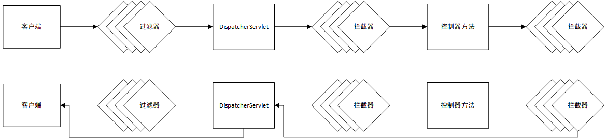
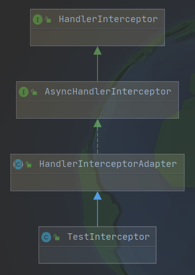

# 10. 拦截器

SpringMVC 中的拦截器用于拦截控制器方法的执行




## 1、创建拦截器

创建拦截器需要实现 HandlerInterceptor 接口，或者继承 HandlerInterceptorAdaptor 类。



HandlerInterceptor 接口中定义了3个方法：

-   preHandler()：调用控制器方法前先执行 preHandler() 方法。如果方法返回 true，则继续调用控制器方法；如果方法返回 false，则终止调用控制器方法。
-   postHandler()：控制器方法执行完成后执行 postHander() 方法。
-   afterComplation()：处理完视图和模型数据，渲染视图完毕之后执行afterComplation()

```java
@Slf4j
public class TestInterceptor extends HandlerInterceptorAdapter {

    @Override
    public boolean preHandle(HttpServletRequest request, HttpServletResponse response, Object handler) throws Exception {
        /*
         * 返回true：放行对控制器放的调用
         * 返回false：终止对控制器方法的调用
         */

        if (Math.random() > 0.5) {
            log.info("preHandle...放行");
            return true;
        } else {
            log.info("preHandle...终止");
            return false;
        }
    }

    @Override
    public void postHandle(HttpServletRequest request, HttpServletResponse response, Object handler, ModelAndView modelAndView) throws Exception {
        log.info("postHandle...");
        super.postHandle(request, response, handler, modelAndView);
    }

    @Override
    public void afterCompletion(HttpServletRequest request, HttpServletResponse response, Object handler, Exception ex) throws Exception {
        log.info("afterCompletion...");
        super.afterCompletion(request, response, handler, ex);
    }

    @Override
    public void afterConcurrentHandlingStarted(HttpServletRequest request, HttpServletResponse response, Object handler) throws Exception {
        log.info("afterConcurrentHandlingStarted...");
        super.afterConcurrentHandlingStarted(request, response, handler);
    }
}
```


## 2、配置拦截器

```java
@Configuration
public class InterceptorConfig implements WebMvcConfigurer {

    @Override
    public void addInterceptors(InterceptorRegistry registry) {
        // 配置拦截器
        registry.addInterceptor(new TestInterceptor())
                // 需要拦截的路径
                .addPathPatterns("/test_e/*")
                // 直接放行的路径
                .excludePathPatterns("*/ignore/*");
    }
}
```


## 3、多个拦截器的执行顺序

-   若每个拦截器的 preHandler() 都返回 true

    此时多个拦截器的执行顺序与拦截器在配置类中的配置顺序有关——先配置的拦截器的 preHandler 先执行，但 afterCompletion() 方法后执行：

    ```
    拦截器A的preHandler()
        拦截器B的preHandler()
            拦截器C的preHandler()
                拦截器D的preHandler()
                    ...
                    
                    ...
                拦截器D的afterCompletion()        
            拦截器C的afterCompletion()
        拦截器B的afterCompletion()
    拦截器A的afterCompletion()
    ```

    

-   若某个拦截器的 preHandler() 返回了 false

    返回false的拦截器和它之前的拦截器的 preHandle() 会执行，postHandle()都不执行，返回false的拦截器之前的拦截器的afterComplation()会执行

