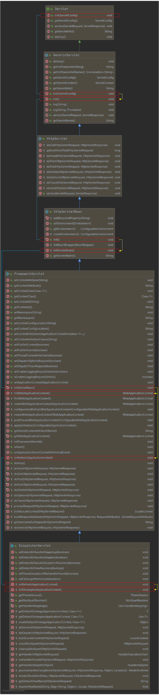

# 13. SpringMVC 执行流程

## 1、SpringMVC 常用组件

-   DispatcherServlet——前端控制器（由框架提供）

    作用：统一处理请求和响应，是整个流程控制的中心，由它调用其他组件处理客户端请求

    

-   HandlerMapping——处理器映射器（由框架提供）

    作用：根据请求的 url、method 等信息，查找处理请求的 handler

    

-   Handler——处理器（控制器方法）（由开发者提供）

    作用：在 DispatcherServlet 的控制下，对具体的请求进行处理

    

-   HandlerAdapter——处理器适配器（由框架提供）

    作用：通过 HandlerAdapter 对 handler 进行执行

    

-   ViewResolver——视图解析器（由框架提供）

    作用：进行视图解析，得到对应的视图，例如：ThymeleafView、InternalResourceView、RedirectView

    

-   View——视图

    作用：将模型数据通过页面展示给用户

## 2、DispatcherServlet 初始化

DispatcherServlet 本质上是一个 Servlet，因此天然遵循 Servlet 的生命周期，所以宏观上是 Servlet 生命周期来进行调度：

## 3、DispatcherServlet 调用组件处理请求

## 4、SpringMVC 的执行流程