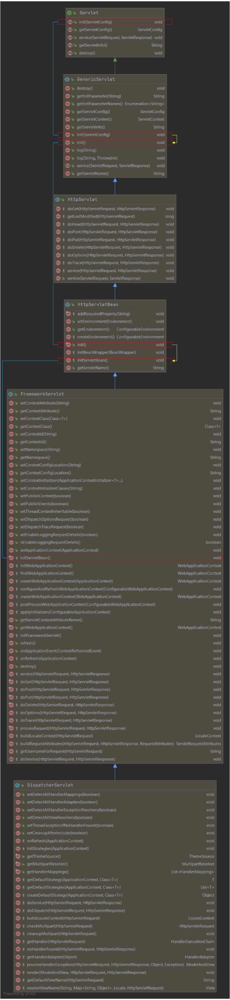
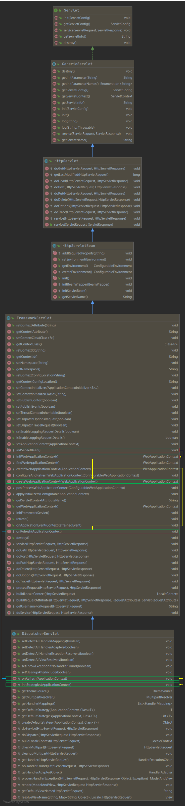
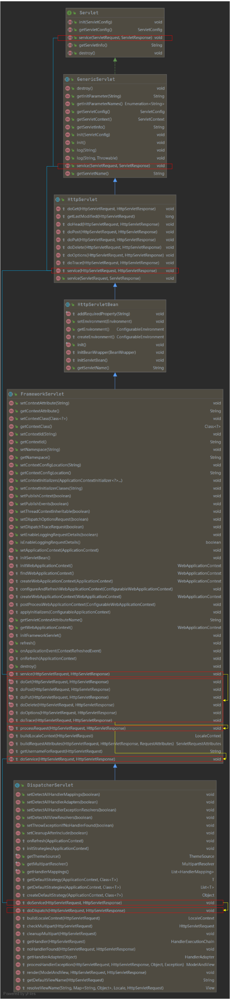

# 13. SpringMVC 执行流程


## 1、SpringMVC 常用组件


-   ==DispatcherServlet==——前端控制器（由框架提供）

    作用：统一处理请求和响应，是整个流程控制的中心，由它调用其他组件处理客户端请求

    

-   ==Handler==——处理器（控制器方法）（由开发者提供）

    作用：在 DispatcherServlet 的控制下，对具体的请求进行处理

    

-   ==HandlerMapping==——处理器映射器（由框架提供）

    作用：根据请求的 url、method 等信息，查找处理请求的 handler


-   ==HandlerAdapter==——处理器适配器（由框架提供）

    作用：通过 HandlerAdapter 对 handler 进行执行

    

-   ==View==——视图

    作用：将模型数据通过页面展示给用户

    

-   ==ViewResolver==——视图解析器（由框架提供）

    作用：进行视图解析，得到对应的视图，例如：ThymeleafView、InternalResourceView、RedirectView

    

## 2、DispatcherServlet 初始化


<u>DispatcherServlet 本质上是一个 Servlet</u>，因此天然遵循 Servlet 的生命周期，所以宏观上是 Servlet 生命周期来进行调度：



>   GetnericServlet 实现了 Servlet 接口中的 init(ServletConfig) 方法，并在该方法中调用了自定义的 init() 方法；
>
>   >   HttpServletBean 重写了 GenericServlet 中的 init()  方法，并在该方法中调用了自定义的 initServletBean() 方法；
>   >
>   >   >   FrameworkServlet 重写了 HttpServletBean 中的 initServletBean方法；

进入 initServletBean() 方法后，正式开始 DispatcherServlet 的初始化：



### a> 初始化 WebApplicationContext

```java
// 所在类：org.springframework.web.servlet.FrameworkServlet

protected WebApplicationContext initWebApplicationContext() {
   WebApplicationContext rootContext =
         WebApplicationContextUtils.getWebApplicationContext(getServletContext());
   WebApplicationContext wac = null;

   if (this.webApplicationContext != null) {
      // A context instance was injected at construction time -> use it
      wac = this.webApplicationContext;
      if (wac instanceof ConfigurableWebApplicationContext) {
         ConfigurableWebApplicationContext cwac = (ConfigurableWebApplicationContext) wac;
         if (!cwac.isActive()) {
            // The context has not yet been refreshed -> provide services such as
            // setting the parent context, setting the application context id, etc
            if (cwac.getParent() == null) {
               // The context instance was injected without an explicit parent -> set
               // the root application context (if any; may be null) as the parent
               cwac.setParent(rootContext);
            }
            configureAndRefreshWebApplicationContext(cwac);
         }
      }
   }
   if (wac == null) {
      // No context instance was injected at construction time -> see if one
      // has been registered in the servlet context. If one exists, it is assumed
      // that the parent context (if any) has already been set and that the
      // user has performed any initialization such as setting the context id
      wac = findWebApplicationContext();
   }
   if (wac == null) {
      // No context instance is defined for this servlet -> create a local one
      // 创建WebApplicationContest
      wac = createWebApplicationContext(rootContext);
   }

   if (!this.refreshEventReceived) {
      // Either the context is not a ConfigurableApplicationContext with refresh
      // support or the context injected at construction time had already been
      // refreshed -> trigger initial onRefresh manually here.
      synchronized (this.onRefreshMonitor) {
         // 刷新WebApplicationContext
         onRefresh(wac);
      }
   }

   if (this.publishContext) {
      // Publish the context as a servlet context attribute.
      String attrName = getServletContextAttributeName();
      getServletContext().setAttribute(attrName, wac);
   }

   return wac;
}
```


#### b1>  创建 WebApplicationContext

```java
// 所在类：org.springframework.web.servlet.FrameworkServlet

protected WebApplicationContext createWebApplicationContext(@Nullable ApplicationContext parent) {
    Class<?> contextClass = getContextClass();
    if (!ConfigurableWebApplicationContext.class.isAssignableFrom(contextClass)) {
        throw new ApplicationContextException(
            "Fatal initialization error in servlet with name '" + getServletName() +
            "': custom WebApplicationContext class [" + contextClass.getName() +
            "] is not of type ConfigurableWebApplicationContext");
    }
    // 通过反射创建 IOC 容器对象
    ConfigurableWebApplicationContext wac =
        (ConfigurableWebApplicationContext) BeanUtils.instantiateClass(contextClass);

    wac.setEnvironment(getEnvironment());
    // 设置父容器
    wac.setParent(parent);
    String configLocation = getContextConfigLocation();
    if (configLocation != null) {
        wac.setConfigLocation(configLocation);
    }
    configureAndRefreshWebApplicationContext(wac);

    return wac;
}
```

#### b2>  初始化 DispatcherServlet

FrameworkServlet 创建 WebApplicationContext 后，调用 onRefresh(wac) 方法刷新容器。 DispatcherServlet 继承自 FrameworkServlet 并重写了 onRefresh(wac) 方法，通过此方法完成 DispatcherServlet 各个组件的初始化工作：

```java
//所在类：org.springframework.web.servlet.DispatcherServlet

@Override
protected void onRefresh(ApplicationContext context) {
   initStrategies(context);
}

protected void initStrategies(ApplicationContext context) {
   initMultipartResolver(context);
   initLocaleResolver(context);
   initThemeResolver(context);
   initHandlerMappings(context);
   initHandlerAdapters(context);
   initHandlerExceptionResolvers(context);
   initRequestToViewNameTranslator(context);
   initViewResolvers(context);
   initFlashMapManager(context);
}
```


## 3、DispatcherServlet 调用组件处理请求



#### a> processRequest()

FrameworkServlet 重写了 HttpServlet 中的 service() 和 doXxx() 方法，这些方法调用了 FrameworkServlet 中定义的 processRequest(request,response)方法：

```java
// 所在类：org.springframework.web.servlet.FrameworkServlet

/**
 * Override the parent class implementation in order to intercept PATCH requests.
 */
@Override
protected void service(HttpServletRequest request, HttpServletResponse response)
      throws ServletException, IOException {

   HttpMethod httpMethod = HttpMethod.resolve(request.getMethod());
   if (httpMethod == HttpMethod.PATCH || httpMethod == null) {
      processRequest(request, response);
   }
   else {
      super.service(request, response);
   }
}

@Override
protected final void doGet(HttpServletRequest request, HttpServletResponse response)
      throws ServletException, IOException {
   processRequest(request, response);
}
```

>   1.   HttpServlet 中的 service() 方法会对请求类型进行判断，然后调用对应的 doXxx() 方法。
>
>   2.   HttpServlet 中支持的请求类型有：delete、head、get、options、post、put、tract，如果接收到不支持的请求类型则抛出异常。
>   3.   为了支持 patch 请求类型，FrameworkServlet 对 service() 方法进行了上述修改，避免抛出异常

```java
protected final void processRequest(HttpServletRequest request, HttpServletResponse response)
    throws ServletException, IOException {

    long startTime = System.currentTimeMillis();
    Throwable failureCause = null;

    LocaleContext previousLocaleContext = LocaleContextHolder.getLocaleContext();
    LocaleContext localeContext = buildLocaleContext(request);

    RequestAttributes previousAttributes = RequestContextHolder.getRequestAttributes();
    ServletRequestAttributes requestAttributes = buildRequestAttributes(request, response, previousAttributes);

    WebAsyncManager asyncManager = WebAsyncUtils.getAsyncManager(request);
    asyncManager.registerCallableInterceptor(FrameworkServlet.class.getName(), new RequestBindingInterceptor());

    initContextHolders(request, localeContext, requestAttributes);

    try {
		// 执行服务，doService()是一个抽象方法，在DispatcherServlet中进行了重写
        doService(request, response);
    }
    catch (ServletException | IOException ex) {
        failureCause = ex;
        throw ex;
    }
    catch (Throwable ex) {
        failureCause = ex;
        throw new NestedServletException("Request processing failed", ex);
    }

    finally {
        resetContextHolders(request, previousLocaleContext, previousAttributes);
        if (requestAttributes != null) {
            requestAttributes.requestCompleted();
        }
        logResult(request, response, failureCause, asyncManager);
        publishRequestHandledEvent(request, response, startTime, failureCause);
    }
}

/**
 * Subclasses must implement this method to do the work of request handling,
 * receiving a centralized callback for GET, POST, PUT and DELETE.
 * <p>The contract is essentially the same as that for the commonly overridden
 * {@code doGet} or {@code doPost} methods of HttpServlet.
 * <p>This class intercepts calls to ensure that exception handling and
 * event publication takes place.
 * @param request current HTTP request
 * @param response current HTTP response
 * @throws Exception in case of any kind of processing failure
 * @see javax.servlet.http.HttpServlet#doGet
 * @see javax.servlet.http.HttpServlet#doPost
 */
protected abstract void doService(HttpServletRequest request, HttpServletResponse response)
      throws Exception;
```


##### b> doService()

DispatcherServlet 实现了 FrameworkServlet 中定义的 doService() 抽象方法：

```java
// 所在类：org.springframework.web.servlet.DispatcherServlet

/**
 * Exposes the DispatcherServlet-specific request attributes and delegates to {@link #doDispatch}
 * for the actual dispatching.
 */
@Override
protected void doService(HttpServletRequest request, HttpServletResponse response) throws Exception {
   logRequest(request);

   // Keep a snapshot of the request attributes in case of an include,
   // to be able to restore the original attributes after the include.
   Map<String, Object> attributesSnapshot = null;
   if (WebUtils.isIncludeRequest(request)) {
      attributesSnapshot = new HashMap<>();
      Enumeration<?> attrNames = request.getAttributeNames();
      while (attrNames.hasMoreElements()) {
         String attrName = (String) attrNames.nextElement();
         if (this.cleanupAfterInclude || attrName.startsWith(DEFAULT_STRATEGIES_PREFIX)) {
            attributesSnapshot.put(attrName, request.getAttribute(attrName));
         }
      }
   }

   // Make framework objects available to handlers and view objects.
   request.setAttribute(WEB_APPLICATION_CONTEXT_ATTRIBUTE, getWebApplicationContext());
   request.setAttribute(LOCALE_RESOLVER_ATTRIBUTE, this.localeResolver);
   request.setAttribute(THEME_RESOLVER_ATTRIBUTE, this.themeResolver);
   request.setAttribute(THEME_SOURCE_ATTRIBUTE, getThemeSource());

   if (this.flashMapManager != null) {
      FlashMap inputFlashMap = this.flashMapManager.retrieveAndUpdate(request, response);
      if (inputFlashMap != null) {
         request.setAttribute(INPUT_FLASH_MAP_ATTRIBUTE, Collections.unmodifiableMap(inputFlashMap));
      }
      request.setAttribute(OUTPUT_FLASH_MAP_ATTRIBUTE, new FlashMap());
      request.setAttribute(FLASH_MAP_MANAGER_ATTRIBUTE, this.flashMapManager);
   }

   try {
      // 处理请求和响应
      doDispatch(request, response);
   }
   finally {
      if (!WebAsyncUtils.getAsyncManager(request).isConcurrentHandlingStarted()) {
         // Restore the original attribute snapshot, in case of an include.
         if (attributesSnapshot != null) {
            restoreAttributesAfterInclude(request, attributesSnapshot);
         }
      }
   }
}
```


###### c> doDispatch()

```java
// 所在类：org.springframework.web.servlet.DispatcherServlet

/**
 * Process the actual dispatching to the handler.
 * <p>The handler will be obtained by applying the servlet's HandlerMappings in order.
 * The HandlerAdapter will be obtained by querying the servlet's installed HandlerAdapters
 * to find the first that supports the handler class.
 * <p>All HTTP methods are handled by this method. It's up to HandlerAdapters or handlers
 * themselves to decide which methods are acceptable.
 * @param request current HTTP request
 * @param response current HTTP response
 * @throws Exception in case of any kind of processing failure
 */
protected void doDispatch(HttpServletRequest request, HttpServletResponse response) throws Exception {
   HttpServletRequest processedRequest = request;
  /*
   * 调用链。包含以下部分
   *     handler：负责处理请求的控制器方法
   *     interceptorList：处理控制器方法的拦截器集合
   *     interceptorIndex：拦截器索引，控制拦截器afterCompletion()方法的执行顺序
   */
   HandlerExecutionChain mappedHandler = null;
   boolean multipartRequestParsed = false;

   WebAsyncManager asyncManager = WebAsyncUtils.getAsyncManager(request);

   try {
      ModelAndView mv = null;
      Exception dispatchException = null;

      try {
         processedRequest = checkMultipart(request);
         multipartRequestParsed = (processedRequest != request);

         // Determine handler for the current request.
         // 获取调用链
         mappedHandler = getHandler(processedRequest);
         if (mappedHandler == null) {
            noHandlerFound(processedRequest, response);
            return;
         }

         // Determine handler adapter for the current request.
         // 通过控制器方法创建对应的处理器适配器，用于调用该控制器方法
         HandlerAdapter ha = getHandlerAdapter(mappedHandler.getHandler());

         // Process last-modified header, if supported by the handler.
         String method = request.getMethod();
         boolean isGet = "GET".equals(method);
         if (isGet || "HEAD".equals(method)) {
            long lastModified = ha.getLastModified(request, mappedHandler.getHandler());
            if (new ServletWebRequest(request, response).checkNotModified(lastModified) && isGet) {
               return;
            }
         }

         // 调用拦截器的preHandle()方法
         if (!mappedHandler.applyPreHandle(processedRequest, response)) {
            return;
         }

         // Actually invoke the handler.
         // 通过处理器适配器调用控制器方法，获得ModelAndView对象
         mv = ha.handle(processedRequest, response, mappedHandler.getHandler());

         if (asyncManager.isConcurrentHandlingStarted()) {
            return;
         }

         applyDefaultViewName(processedRequest, mv);
         // 调用拦截器的postHandle()方法
         mappedHandler.applyPostHandle(processedRequest, response, mv);
      }
      catch (Exception ex) {
         dispatchException = ex;
      }
      catch (Throwable err) {
         // As of 4.3, we're processing Errors thrown from handler methods as well,
         // making them available for @ExceptionHandler methods and other scenarios.
         dispatchException = new NestedServletException("Handler dispatch failed", err);
      }
      // 后续处理：处理模型数据和渲染视图
      processDispatchResult(processedRequest, response, mappedHandler, mv, dispatchException);
   }
   catch (Exception ex) {
      triggerAfterCompletion(processedRequest, response, mappedHandler, ex);
   }
   catch (Throwable err) {
      triggerAfterCompletion(processedRequest, response, mappedHandler,
            new NestedServletException("Handler processing failed", err));
   }
   finally {
      if (asyncManager.isConcurrentHandlingStarted()) {
         // Instead of postHandle and afterCompletion
         if (mappedHandler != null) {
            mappedHandler.applyAfterConcurrentHandlingStarted(processedRequest, response);
         }
      }
      else {
         // Clean up any resources used by a multipart request.
         if (multipartRequestParsed) {
            cleanupMultipart(processedRequest);
         }
      }
   }
}
```

###### d> processDispatchResult()

```java
// 所在类：org.springframework.web.servlet.DispatcherServlet

private void processDispatchResult(HttpServletRequest request, HttpServletResponse response,
      @Nullable HandlerExecutionChain mappedHandler, @Nullable ModelAndView mv,
      @Nullable Exception exception) throws Exception {

   boolean errorView = false;

   if (exception != null) {
      if (exception instanceof ModelAndViewDefiningException) {
         logger.debug("ModelAndViewDefiningException encountered", exception);
         mv = ((ModelAndViewDefiningException) exception).getModelAndView();
      }
      else {
         Object handler = (mappedHandler != null ? mappedHandler.getHandler() : null);
         mv = processHandlerException(request, response, handler, exception);
         errorView = (mv != null);
      }
   }

   // Did the handler return a view to render?
   if (mv != null && !mv.wasCleared()) {
      // 处理模型数据和渲染视图
      render(mv, request, response);
      if (errorView) {
         WebUtils.clearErrorRequestAttributes(request);
      }
   }
   else {
      if (logger.isTraceEnabled()) {
         logger.trace("No view rendering, null ModelAndView returned.");
      }
   }

   if (WebAsyncUtils.getAsyncManager(request).isConcurrentHandlingStarted()) {
      // Concurrent handling started during a forward
      return;
   }

   if (mappedHandler != null) {
      // Exception (if any) is already handled..
      // 调用拦截器的afterCompletion()
      mappedHandler.triggerAfterCompletion(request, response, null);
   }
}
```


## 4、SpringMVC 的工作流程

在 SpringMVC 中，Servlet  容器中只包含 DisparcherServlet 一个 Servlet，所有的请求都会被交给 DispatcherServlet 进行处理：

1.   DispatcherServlet 接收到请求
2.   DispatcherServlet 对请求 URL 进行解析，得到请求资源标识符（URI）
3.   DispatcherServlet 尝试查询 URI 对应的 Handler：
     -   a> Handler 不存在：进一步判断是否配置了 mvc:default-servlet-handler
         -   a> 没配置：抛出异常
         -   b> 有配置：调用default-servlet-handler
     -   b> Handler 存在：执行后继流程
4.   DispatcherServlet 根据 URI 从 HandlerMapping 获取该 Handler 的所有相关对象（包括该 Handler 以及对应的拦截器），并以 HandlerExecutionChain（执行链）的形式返回
5.   DispatcherServlet 根据 Handler 选择一个合适的 HandlerAdapter
6.   如果成功获得 HandlerAdapter，则调用拦截器的 preHandler() 方法。如果所有拦截器的 preHandler() 方法都返回 true 则继续向下执行
7.   提取 Request  中携带的参数，并以此调用 Handler 来处理请求。在向 Handler 传入参数的过程中，Spring 会根据你的配置做一些额外的工作
     -   HttpMessageConveter：将请求消息（如Json、xml等数据）转换成一个对象，将对象转换为指定的响应信息
     -   数据转换：对请求信息进行数据转换，例如，String转换为Integer、Double
     -   数据格式化：对请求信息进行格式化，例如，将字符串转换为格式化数字或日期
     -   数据验证：验证数据的有效性，例如，长度、格式，然后将验证结果存储到 BindingResult 或 Error 中
8.   Handler 处理完请求后，向 DispatcherServlet  返回一个 ModelAndView 对象
9.   调用拦截器的 postHendler() 方法
10.   根据返回的ModelAndView（此时会判断是否存在异常：如果存在异常，则执行HandlerExceptionResolver进行异常处理）选择一个适合的ViewResolver进行视图解析，根据Model和View，来渲染视图。
11.   渲染视图完毕执行拦截器的afterCompletion(…)方法
12.   将渲染结果返回给客户端

