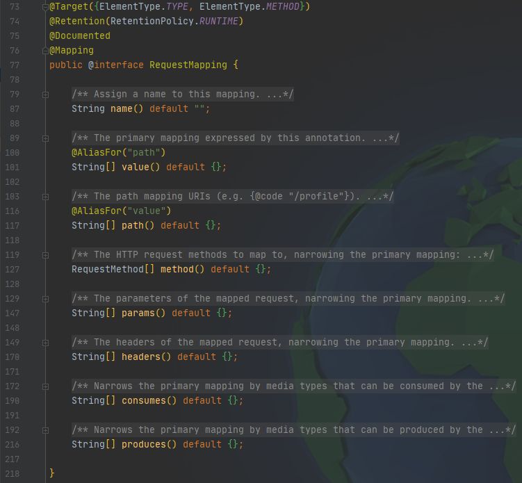

# @RequestMapping 注解


## 功能

@RequestMapping注解的作用就是将请求和处理请求的控制器方法关联起来，建立映射关系。SpringMVC 接收到请求后，就会通过映射关系找到对应的控制器方法来处理请求。


## 标识位置

```java
...
@Target({ElementType.TYPE, ElementType.METHOD})
public @interface RequestMapping {...}
```

-   标识类：设置映射请求的请求路径的初始信息

-   标识方法：设置映射请求请求路径的具体信息

```java
@Controller
@RequestMapping("/aaa")
public class XxxController {

	//此时请求映射所映射的请求的请求路径为：/aaa/bbb
    @RequestMapping("/bbb")
    public String xxx(){...}

}
```


## 属性




### 1、value 和 path 属性

-   value/path 属性用于建立**请求地址（URL）**与控制器方法的映射
-   value/path 属性是一个字符串类型的数组，这意味着可以建立**多个请求地址**与同一个控制器方法的映射
-   value/path 属性必须设置——至少通过请求地址创建映射


### 2、method 属性


### 3、params 属性


### 4、headers 属性

