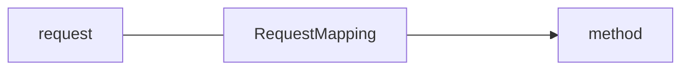

# 3. @RequestMapping 注解


## 3.1 功能

@RequestMapping注解的作用就是将请求和处理请求的控制器方法关联起来，建立映射关系。SpringMVC 接收到请求后，就会通过映射关系找到对应的控制器方法来处理请求。




## 3.2 标识位置

```java
...
@Target({ElementType.TYPE, ElementType.METHOD})
public @interface RequestMapping {...}
```

-   标识类：设置映射请求的请求路径的初始信息

-   标识方法：设置映射请求请求路径的具体信息

```java
@Controller
@RequestMapping("/aaa")
public class XxxController {

	//此时请求映射所映射的请求的请求路径为：/aaa/bbb
    @RequestMapping("/bbb")
    public String xxx(){...}

}
```


## 3.3 属性


### 1、value 和 path 属性

-   value/path 属性用于建立**请求地址（URL）**与控制器方法的映射
-   value/path 属性是一个字符串类型的数组，这意味着可以建立**多个请求地址**与同一个控制器方法的映射
-   value/path 属性必须设置——至少通过请求地址创建映射

```java
@Controller
@RequestMapping(path = "/test")
public class TestController {

    // 该方法负责处理 "/test/aaa" 地址的请求
    @RequestMapping(path = "/aaa")
    public String test1() {...}
    
    // 该方法负责处理 "/test/bbb"、"/test/ccc"、"/test/ddd" 地址的请求
    @RequestMapping(path = {"/bbb", "/ccc", "ddd"})
    public String test2() {...}

}
```

#### SpringMVC 支持 ant 风格的路径

-   ？：表示任意的单个字符

-   *：表示任意的0个或多个字符

-   \**：表示任意的一层或多层目录

    注意：在使用\**时，只能使用/**/xxx的方式


#### SpringMVC 支持路径中的占位符（重要）

原始方式：/deleteUser?id=1

rest方式：/deleteUser/1

SpringMVC路径中的占位符常用于RESTful风格中，当请求路径中将某些数据通过路径的方式传输到服务器中，就可以在相应的@RequestMapping注解的value属性中通过占位符{xxx}表示传输的数据，在通过@PathVariable注解，将占位符所表示的数据赋值给控制器方法的形参

```java
@RequestMapping("/testRest/{id}/{username}")
public String testRest(@PathVariable("id") String id, @PathVariable("username") String username){...}
```


### 2、method 属性

-   method 属性用于建立**请求方式**与控制器方法的映射
-   method 属性是一个字符串类型的数组，这意味着可以建立**多种请求方式**与同一个控制器方法的映射
-   method 属性不是必须的，在没有设置 method 属性的情况下仅通过 URL 来映射控制器方法

```java
@Controller
@RequestMapping(path = "/test")
public class TestController {

    @RequestMapping(path = "/aaa", method = {RequestMethod.GET, RequestMethod.PUT, RequestMethod.POST})
    public String test1() {...}

    @RequestMapping(path = {"/bbb", "/ccc", "ddd"}, method = RequestMethod.GET)
    public String test2() {...}

    @RequestMapping(path = "eee")
    public String test3() {...}

}
```

1> 对于需要指定请求方式的控制器方法，SpringMVC提供了更便捷的方式——@RequestMapping 的组合注解

-   @GetMapping、@PostMapping、@PutMapping、@DeleteMapping……

2> 常用的请求方式有 get、post、put、delete，但是目前浏览器只支持get和post，若在form表单提交时，为method设置了其他请求方式的字符串（put或delete），则按照默认的请求方式get处理。若要发送put和delete请求，则需要通过spring提供的过滤器HiddenHttpMethodFilter，在RESTful部分会讲到


### 3、params 属性（了解）

-   params 属性用于通过请求携带的参数来匹配控制器方法

-   params 属性是一个字符串数组，…

-   params 属性的字符串支持四种表达式

    | 表达方式     | 说明                               |
    | ------------ | ---------------------------------- |
    | param        | 要求携带param参数                  |
    | !param       | 要求不带param参数                  |
    | param=value  | 要求携带param参数，且值等于value   |
    | param!=value | 要求携带param参数，且值不等于value |

    ```java
    @Controller
    @RequestMapping(path = "/test")
    public class TestController {
    
        @RequestMapping(path = "/aaa", params = {"username","!password","age!=10"})
        public String test1() {...}
    
    }
    ```


### 4、headers 属性（了解）

-   headers 属性用于通过请求携带的请求头信息来匹配控制器方法
-   headers 属性是一个字符串数组，…
-   headers 属性的字符串支持四种表达式（与 params 相同）
