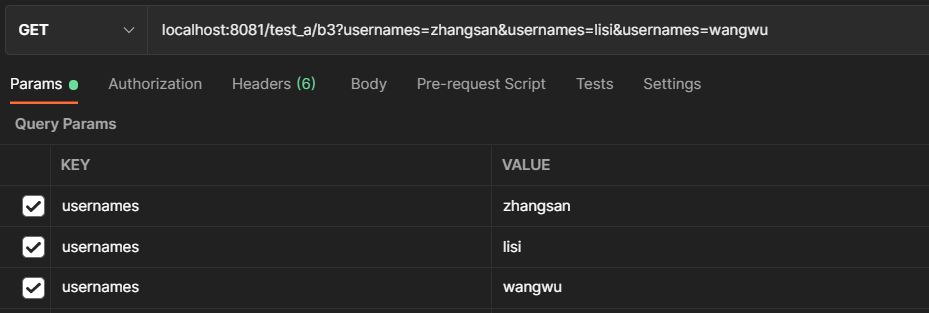
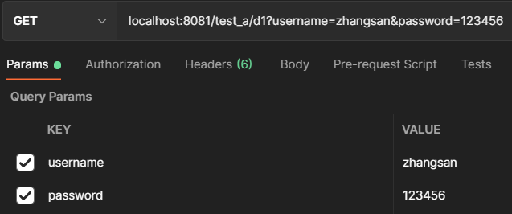

# 4. SpringMVC 获取请求参数

---

## 1、通过 ServletAPI 获取

将 HttpServletRequest 作为控制器方法的形参，此时 HttpServletRequest 类型的参数代表封装了当前请求的请求报文的对象。

通常不会采用这种直接操作 ServletAPI 的方式获取参数，因为 SpringMVC 通过封装提供了更简单的使用方式。

```java
@Slf4j
@RestController
@RequestMapping("/test_a")
public class TestController {

    /**
     * 通过ServletAPI获取
     */
    @GetMapping("/a")
    public void testParam1(HttpServletRequest request) {
        String username = request.getParameter("username");
        String password = request.getParameter("password");
        log.info("username={},password={}", username, password);
    }
}
```

另外，使用 ServletAPI 获取参数时，请注意对客户端是否传递了参数进行判断。如果客户端没有传递参数，getParameter() 方法的返回值是 null

```java
@GetMapping("/a")
public void testParam1(HttpServletRequest request) {
    Map<String, String[]> parameterMap = request.getParameterMap();
    if (parameterMap.containsKey("username") && parameterMap.containsKey("password")) {
        String username = request.getParameter("username");
        String password = request.getParameter("password");
        log.info("username={},password={}", username, password);
    }
}
```


## 2、通过控制器方法同名形参获取

在控制器方法参数列表位置，设置与请求参数同名的形参，当 DispatchServlet 接收到与控制器方法匹配的请求时，会将请求转发给控制器方法，并尝试通过请求参数为同名的形参赋值。

```java
@Slf4j
@RestController
@RequestMapping("/test_a")
public class TestController {

    /**
     * 通过同名形参获取参数
     */
    @GetMapping("/b")
    public void testParam2(String username, String password) {
        log.info("username={},password={}", username, password);
    }
}
```

注意：若请求所携带的请求参数中包含多个同名参数，此时控制器方法可以设置字符数组或者字符串类型的形参来接收参数。



```java
@GetMapping("/b2")
public void testParamB2(String[] usernames) {
    log.info("usernames={}", Arrays.toString(usernames));
}

@GetMapping("/b3")
public void testParamB3(String usernames) {
    log.info("usernames={}", usernames);
}
```

控制器输出：

-   usernames=[zhangsan, lisi, wangwu]
-   usernames=zhangsan,lisi,wangwu


## 3、@RequestParam

使用 @RequestParam 可以通过**请求参数**建立请求与控制器方法的映射关系

@RequestParam 的属性：

```java
public @interface RequestParam {

   @AliasFor("name")
   String value() default "";
    
   @AliasFor("value")
   String name() default "";

   boolean required() default true;
    
   String defaultValue() default ValueConstants.DEFAULT_NONE;

}
```

-   name/value：与控制器形参绑定的请求参数的名称
-   required：请求是否必须携带该请求参数。若设置为 true ，则当前请求必须携带指定的请求参数，如果没有传输该请求参数，且没有设置 defaultValue 属性，则抛出异常：Required String parameter 'xxx' is not present；若设置为 false ，则当前请求不是必须携带 value 所指定的请求参数，如果没有传输，则注解所标识的形参的值为 null
-   defaultValue：不管 required 属性值为 true 或 false，当 name/value 所指定的请求参数没有传输或传输的值为""时，使用默认值为形参赋值

```java
@GetMapping("/c1")
public void testParamC1(@RequestParam(name = "usn") String username,
                        @RequestParam(name = "pwd") String password,
                        @RequestParam(defaultValue = "m") String sex) {
    log.info("username={},password={},sex={}", username, password, sex);
}
```


## 4、@RequestHeader

使用 @RequestHeader 可以通过**请求头信息**建立请求与控制器方法的映射关系

@RequestHeader 的属性及用于与 @RequestParam 相同


## 5、@CookieValue

使用 @CookieValue 可以通过 **cookie 数据**建立请求与控制器方法的映射关系

@CookieValue 的属性及用于与 @RequestParam 相同


## 6、通过 POJO 获取请求

控制器方法可以设置实体类型的形参 ，如果请求携带的请求参数与实体中的属性同名，DispatchServlet 会为属性赋值。

控制器方法：

```java
@GetMapping("/d1")
public void testParamD1(UserDTO userDTO, String username, String password) {
    log.info("username={},password={}", username, password);
    log.info("userDTO={}", userDTO);
}
```

实体类：

```java
@Slf4j
@Getter
@ToString
public class UserDTO {
    private String username;
    private String password;
    private String sex;

    public UserDTO() { log.info("UserDTO()");}

    public void setUsername(String username) {
        this.username = username;
        log.info("setUsername(String username)");
    }

    public void setPassword(String password) {
        this.password = password;
        log.info("setPassword(String password)");
    }

    public void setSex(String sex) {
        this.sex = sex;
        log.info("setSex(String sex)");
    }
}
```

请求：



控制台：

```
2021-11-14 20:04:33.599  INFO 18264 --- [nio-8081-exec-1] com.xzy.domain.dto.UserDTO               : UserDTO()
2021-11-14 20:04:33.606  INFO 18264 --- [nio-8081-exec-1] com.xzy.domain.dto.UserDTO               : setPassword(String password)
2021-11-14 20:04:33.606  INFO 18264 --- [nio-8081-exec-1] com.xzy.domain.dto.UserDTO               : setUsername(String username)
2021-11-14 20:04:33.607  INFO 18264 --- [nio-8081-exec-1] com.xzy.controller.a.TestController      : username=zhangsan,password=123456
2021-11-14 20:04:33.608  INFO 18264 --- [nio-8081-exec-1] com.xzy.controller.a.TestController      : userDTO=UserDTO{username='zhangsan', password='123456', sex='null'}
```

1.   对于 POJO 形参，DispatcherServlet 会先调用【无参构造函数】，然后调用 Setter 方法
2.   如果控制器方法的参数列表中同时包含 POJO 形参和普通形参，DispatcherServlet 会同时为与请求参数同名的实体属性和普通形参赋值


