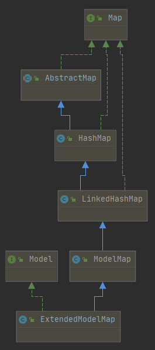

# 5. 域对象共享数据

>   SpringMVC域对象：
>
>   -   request
>   -   session
>   -   application


## 1、使用 ServletAPI 向 request 域对象共享数据

```java
@RequestMapping("/testServletAPI")
public String testServletAPI(HttpServletRequest request){
    request.setAttribute("testScope", "hello,servletAPI");
    return "success";
}
```


## 2、使用 ModelAndView 向 request 域对象共享数据

```java
@RequestMapping("/testModelAndView")
public ModelAndView testModelAndView(){
    /**
     * ModelAndView有Model和View的功能
     * Model主要用于向请求域共享数据
     * View主要用于设置视图，实现页面跳转
     */
    ModelAndView mav = new ModelAndView();
    //向请求域共享数据
    mav.addObject("testScope", "hello,ModelAndView");
    //设置视图，实现页面跳转
    mav.setViewName("success");
    return mav;
}
```


## 3、使用 Model 向 request 域对象共享数据

```java
@RequestMapping("/testModel")
public String testModel(Model model){
    model.addAttribute("testScope", "hello,Model");
    return "success";
}
```


## 4、使用 Map 向 request 域对象共享数据

```java
@RequestMapping("/testMap")
public String testMap(Map<String, Object> map){
    map.put("testScope", "hello,Map");
    return "success";
}
```


## 5、使用 ModelMap 向 request 域对象共享数据

```java
@RequestMapping("/testModelMap")
public String testModelMap(ModelMap modelMap){
    modelMap.addAttribute("testScope", "hello,ModelMap");
    return "success";
}
```


## *、Model、Map、ModelMap的关系

DispatchServlet 向 Model、Map、ModelMap 类型的形参传入的其实都是 BindingAwareModelMap 类型的参数：




## 6、向 session 域共享数据

```java
@RequestMapping("/testSession")
public String testSession(HttpSession session){
    session.setAttribute("testSessionScope", "hello,session");
    return "success";
}
```


## 7、向 application 域共享数据

```java
@RequestMapping("/testApplication")
public String testApplication(HttpSession session){
	ServletContext application = session.getServletContext();
    application.setAttribute("testApplicationScope", "hello,application");
    return "success";
}
```

