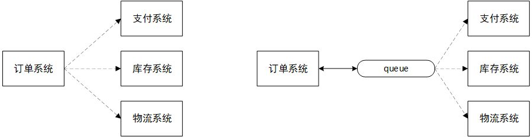

# RabbitMQ

---

## 1. 入门部分：消息队列

### 1.1 MQ

#### 1.1.1 MQ的含义

MQ（Message  Queue），从字面上可以看出，其本质是一个队列，具有“FIFO”的特点，只不过其存放的内容是Message而已。MQ是一种跨进程通信机制，用于上下游传递消息。在分布式系统中，MQ是一种十分常见的上下游“逻辑解耦+物理解耦”的消息中间件。使用了MQ之后，消息发送上游只需要依赖MQ，不需要依赖其他服务。

#### 1.1.2 MQ的作用

消息队列中间件是分布式系统中重要的组件，主要解决应用解耦、异步消息、流量削锋等问题，实现高性能、高可用、可伸缩和最终一致性架构。

1.   **应用解耦**

     以电商系统为例，应用中包含订单系统、库存系统、物流系统、支付系统。用户创建订单后，如果耦合调用库存系统、物流系统、支付系统，任何一个子系统出现故障，都会造成下单操作的失败。系统MQ后，系统间调用的问题会少很多，比如，物流系统发生故障，需要几分钟恢复，这几分钟内物流系统需要处理的订单会被缓存到MQ，用户的下单操作可以正常完成。当物流系统恢复正常，只需要从MQ取出订单，继续处理即可，下单的用户感受不到物流系统的故障，系统的可用性得到提升。

     

     

2.   **异步消息**

     有些服务间调用是异步的，例如A调用B，B需要很长时间执行，但是A需要知道B的执行结果。传统的解决方案有两种：① B提供查询接口，A每隔字段时间就调用一次查询接口，直到B执行完成；② A提供回调接口，B执行完成后调用接口通知A。两种方案都不优雅，使用MQ进行优化。

     

     

3.   **流量削峰**

     举个例子，如果订单系统每秒最多处理1w个订单，遇到促销活动系统每秒可能接收2w个订单，一般的处理手段：系统处理的订单数达到极限后，限制部分用户的下单操作。如果使用MQ：缓存所有订单请求至MQ，系统从MQ提取订单请求，这样做相当于把原来1秒内需要处理完的请求，变成用1段时间来处理。此时，部分用户的下单请求可能需要10多秒才能收到成功提示，但总比不能下单的体验好。

     >   如果观看抽奖或秒杀系统的请求监控曲线，你就会发现这类系统在活动开放的时间段内会出现一个波峰，而在活动未开放时，系统的请求量、机器负载一般都是比较平稳的。==为了节省机器资源，我们不可能时时都提供最大化的资源能力来支持短时间的高峰请求。==所以需要使用一些技术手段，来削弱瞬时的请求高峰，让系统吞吐量在高峰请求下保持可控。

#### 1.1.3 MQ的缺点

1.   系统可用性降低：依赖服务越多，服务越容易挂掉。需要考虑MQ瘫痪的情况
2.   系统复杂性提高：需要考虑消息丢失、消息重复消费、消息传递的顺序性
3.   业务一致性问题：主业务和从属业务一致性的处理

#### 1.1.4 MQ的分类

1.   ActiveMQ

     

2.   Kafka

     

3.   RocketMQ

     

4.   RabbitMQ

#### 1.1.5 MQ的选择

### 1.2 RabbitMQ

官方教程：https://www.rabbitmq.com/getstarted.html

#### 1.2.1 核心概念

-   生产者
-   交换机
-   队列
-   消费者

#### 1.2.2 工作模式

1.    "Hello World!"
2.    Work queues
3.    Publish/Subscribe
4.    Routing
5.    Topics
6.    RPC
7.    Publisher Confirms

#### 1.2.3 名词解释

-   **Brocker**

    概念来源于 Apache ActiveMQ，指MQ的服务端，帮你把消息从发送端传送到接收端。比如，你在系统上安装了RabbitMQ客户端，启动它，就是启动了一个Brocker。

    

-   **Connection、Channel**

    无论是生产者还是消费者，都需要和 RabbitMQ Broker 建立连接，这个连接就是一条 TCP 连接，也就是 Connection。一旦 TCP 连接建立起来，客户端紧接着可以创建一个 AMQP 信道（Channel），每个信道都会被指派一个唯一的 ID。信道是建立在 Connection 之上的==虚拟连接==，RabbitMQ 处理的每条 AMQP 指令都是通过信道完成的。

    >   我们完全可以使用 Connection 就能完成信道的工作，为什么还要引入信道呢？
    >
    >   对于操作系统而言，==建立和销毁 TCP 连接是非常昂贵的开销==，如果遇到使用高峰，性能瓶颈也随之显现。RabbitMQ 采用类似 NIO（Non-blocking I/O）的做法，选择 TCP 连接复用，不仅可以减少性能开销，同时也便于管理。每个线程把持一个信道，所以信道复用了 Connection 的 TCP 连接。同时 RabbitMQ  可以确保每个线程的私密性，就像拥有独立的连接一样。当每个信道的流量不是很大时，复用单一的 Connection  可以在产生性能瓶颈的情况下有效地节省 TCP 连接资源。但是信道本身的流量很大时，这时候多个信道复用一个 Connection  就会产生性能瓶颈，进而使整体的流量被限制了。此时就需要开辟多个 Connection，将这些信道均摊到这些 Connection  中，至于这些相关的调优策略需要根据业务自身的实际情况进行调节。

    

-   **Virtual host**

    出于多租户和安全因素考虑而设计，把AMQP的基础组件划分到一个虚拟的分组中，类似于网络中namespace的概念。可以为不同的用户划分不同的vhost，每个用户在自己的vhost创建exchange、queue等

    

-   **Exchange**

    

-   **Binding**

#### 1.2.4 安装

[RabbitMQ安装与使用.md](./实战/RabbitMQ安装与使用.md)

You need to have the RabbitMQ server installed to go through the tutorials, please see the [installation guide](https://www.rabbitmq.com/download.html) or use the [Docker image](https://registry.hub.docker.com/_/rabbitmq/).

## 2. 核心部分：工作模式

#### 2.1 简单模式："Hello World!"

#### 2.2 工作模式：Work queues

#### 2.3 发布订阅模式：Publish/Subscribe

#### 2.4 路由模式：Routing

#### 2.5 主题模式：Topics

#### 2.6 发布确认模式：Publisher Confirms

